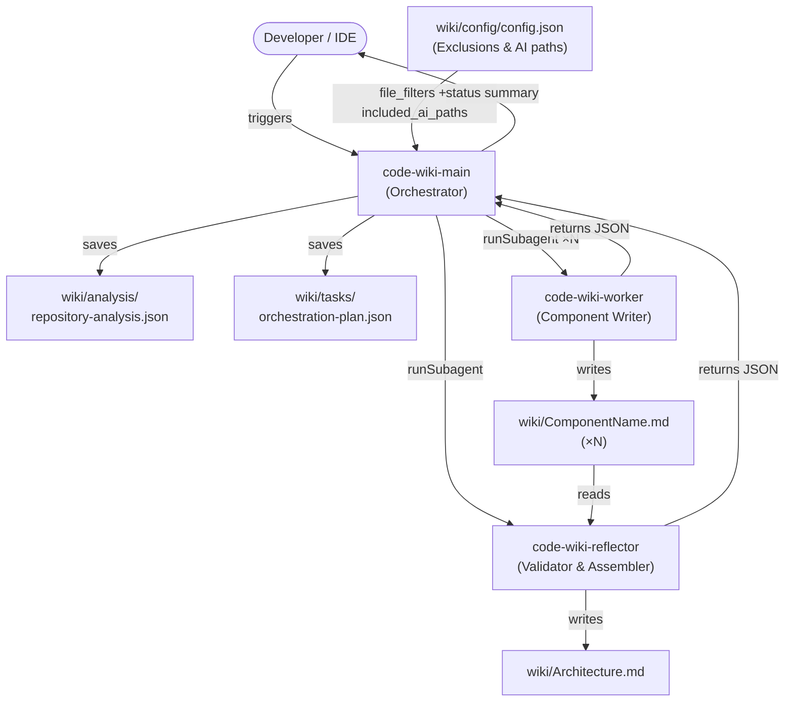
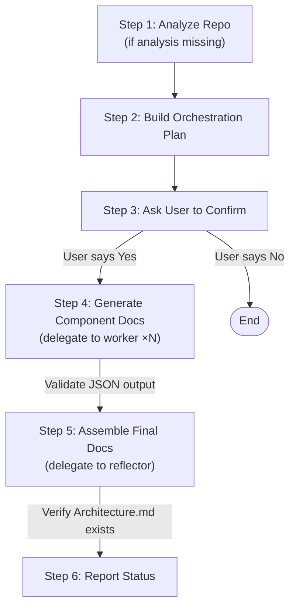

<details>
<summary>Relevant source files</summary>

- [.github/agents/code_wiki_main.agent.md](../.github/agents/code_wiki_main.agent.md)
- [.github/agents/code_wiki_worker.agent.md](../.github/agents/code_wiki_worker.agent.md)
- [.github/agents/code_wiki_reflector.agent.md](../.github/agents/code_wiki_reflector.agent.md)
- [wiki/config/config.json](../wiki/config/config.json)
</details>

# AIArtifacts

This component documents the AI customization artifacts shipped with the hermes-agent repository. The artifacts consist of three VS Code agent definition files (`.agent.md`) that implement a fully automated, multi-agent workflow for generating and assembling a technical wiki from a code repository. The workflow is self-contained: a main orchestrator coordinates two specialist subagents—one that documents individual components and one that validates and assembles a final architecture document.

All three agents target the same model (`Claude Sonnet 4.6`) and share an identical tool surface, enabling seamless delegation via the `runSubagent` tool. They communicate exclusively through structured JSON schemas, keeping concerns cleanly separated and making each agent independently testable.

---

## Artifact Inventory

| Agent File | Type | Description | Model | Purpose |
|---|---|---|---|---|
| [`code_wiki_main.agent.md`](../.github/agents/code_wiki_main.agent.md) | `agent` | `the entrypoint and orchestrates code repo wiki generation` | Claude Sonnet 4.6 | Top-level orchestrator: analyzes the repo, builds a plan, delegates component docs, and assembles the final output |
| [`code_wiki_worker.agent.md`](../.github/agents/code_wiki_worker.agent.md) | `agent` | `generates component-level wiki documentation` | Claude Sonnet 4.6 | Specialist writer: takes a single component description and produces a detailed Markdown wiki page |
| [`code_wiki_reflector.agent.md`](../.github/agents/code_wiki_reflector.agent.md) | `agent` | `validates, refines, and assembles final architecture documentation` | Claude Sonnet 4.6 | Quality and integration agent: validates all component docs, normalizes style, and writes `wiki/Architecture.md` |

All three agents share the same tool grants:

```
vscode, execute/getTerminalOutput, execute/runTask, execute/getTaskOutput,
execute/createAndRunTask, execute/runNotebookCell, execute/runInTerminal,
read, agent, edit, search, web, todo
```

Sources: [code_wiki_main.agent.md:5](../.github/agents/code_wiki_main.agent.md#L5), [code_wiki_worker.agent.md:5](../.github/agents/code_wiki_worker.agent.md#L5), [code_wiki_reflector.agent.md:5](../.github/agents/code_wiki_reflector.agent.md#L5)

---

## Architecture Diagram

The diagram below shows how the three agents communicate. The main orchestrator is the only entry point; the worker and reflector are never invoked directly by a user.



Sources: [code_wiki_main.agent.md:13-57](../.github/agents/code_wiki_main.agent.md#L13-L57), [code_wiki_main.agent.md:132-155](../.github/agents/code_wiki_main.agent.md#L132-L155)

---

## Agent Workflows

### code-wiki-main (Orchestrator)

The main agent executes a strict 6-step workflow and never produces documentation itself—all writing is delegated.



**Step 1 – Repository Analysis**: Scans structure using semantic/grep/file search, applies exclusions from `wiki/config/config.json`, identifies up to **10** logical components, and writes `wiki/analysis/repository-analysis.json`. During the AI artifacts pass it scans paths listed in `included_ai_paths` (e.g. `.github/agents`) and creates one component of `type: "ai_artifacts"`.

**Step 2 – Orchestration Plan**: Parses the analysis JSON and saves a lightweight `wiki/tasks/orchestration-plan.json` that maps component names to output file paths.

**Step 3 – User Confirmation**: Uses the `askQuestions` tool to present the plan and await explicit approval before writing any files.

**Step 4 – Component Documentation**: Iterates the orchestration plan, invoking `code-wiki-worker` once per component via `runSubagent`. Each call receives a typed `Component Documentation Input JSON`; the returned JSON is validated and any error halts the workflow.

**Step 5 – Final Assembly**: Invokes `code-wiki-reflector` via `runSubagent` with the full orchestration plan. After the call, the main agent verifies that `wiki/Architecture.md` physically exists before proceeding.

**Step 6 – Status Report**: Returns a summary with the list of generated files and any warnings.

Sources: [code_wiki_main.agent.md:13-57](../.github/agents/code_wiki_main.agent.md#L13-L57), [code_wiki_main.agent.md:59-76](../.github/agents/code_wiki_main.agent.md#L59-L76)

---

### code-wiki-worker (Component Writer)

The worker is a stateless, single-component documentation generator. It is invoked once per component and produces exactly one Markdown file.

**Inputs** (received as JSON):

| Field | Type | Description |
|---|---|---|
| `component_name` | string | PascalCase component identifier |
| `purpose` | string | One-line description of the component |
| `type` | `"code"` \| `"ai_artifacts"` | Selects the documentation template |
| `folders` | string[] | Source directories to analyse |
| `key_files` | string[] | Specific files to prioritise |
| `dependencies` | string[] | Other component names this depends on |
| `output_path` | `wiki/<name>.md` | Where to write the result |
| `repository_root` | string | Absolute path for file resolution |

The worker selects one of two document structures depending on `type`:

**Standard code component structure:**
1. Source files block (collapsible `<details>`)
2. Title + introduction
3. Architecture, data flow, API sections with Mermaid diagrams and tables
4. Line-numbered source citations
5. Summary

**AI artifact component structure** (used when `type == "ai_artifacts"` or key files match `*.agent.md`, `SKILL.md`, `.cursor/rules`, etc.):
1. Source files block
2. Title + introduction
3. Agents table (description, purpose, tools)
4. Rules list (scope, instructions)
5. Skills list (when to use, capabilities)
6. Prompts/instructions inventory
7. Source citations
8. Summary

**Output JSON**:
```json
{
  "component_name": "string",
  "output_file": "wiki/<name>.md",
  "status": "success|error",
  "error_message": "string (if error)"
}
```

Sources: [code_wiki_worker.agent.md:13-22](../.github/agents/code_wiki_worker.agent.md#L13-L22), [code_wiki_worker.agent.md:34-100](../.github/agents/code_wiki_worker.agent.md#L34-L100), [code_wiki_worker.agent.md:101-130](../.github/agents/code_wiki_worker.agent.md#L101-L130)

---

### code-wiki-reflector (Validator & Assembler)

The reflector runs after all component docs are written. Its three responsibilities—Validate, Normalize, Assemble—execute in sequence and must all succeed before `wiki/Architecture.md` is written.

**Validate** — checks that all components are documented, no dependencies are missing, referenced files exist under `repository_root`, and there are no placeholder or incomplete sections.

**Normalize** — standardises heading levels, code block fences, list styles, capitalization, file path notation, and tone across all component docs.

**Assemble** — writes `wiki/Architecture.md` containing:
- Executive summary (2-3 paragraphs including a note about AI artifact components)
- System overview (purpose, subsystems, entry points, deployment context)
- Full Mermaid architecture diagram
- Per-component summaries (name, purpose, 3-5 responsibility bullets, dependency list, link to detailed doc)
- Design decisions and system-wide patterns
- Appendices (glossary, tech stack, file structure, component index)

The reflector **must** create the file before returning its output JSON. The main agent verifies file existence after the call completes.

**Output JSON**:
```json
{
  "status": "success|error",
  "error_message": "string (if error)",
  "validation_warnings": ["warning 1"],
  "index": ["wiki/Architecture.md"]
}
```

Sources: [code_wiki_reflector.agent.md:33-80](../.github/agents/code_wiki_reflector.agent.md#L33-L80), [code_wiki_reflector.agent.md:99-115](../.github/agents/code_wiki_reflector.agent.md#L99-L115)

---

## Key Patterns

### JSON-Schema Handoff

All inter-agent communication passes through explicit, versioned JSON schemas. The main agent defines five schemas in its `# JSON SCHEMAS` section: Repository Analysis, Orchestration Plan, Component Input, Component Output, and Assembly Input/Output. This makes the interfaces self-documenting and allows each agent to validate its inputs before doing any work.

Sources: [code_wiki_main.agent.md:78-130](../.github/agents/code_wiki_main.agent.md#L78-L130)

### runSubagent Delegation

The main agent uses the `runSubagent` tool (part of the `agent` tool grant) to invoke worker and reflector agents with an explicit natural-language description:

```
runSubagent(
  description="Generate wiki documentation for [ComponentName] following all format requirements",
  input=<Component Documentation Input JSON>
)
```

This pattern ensures the subagent's full system prompt is active and avoids the main agent generating documentation content itself—a core rule stated explicitly in the prompt.

Sources: [code_wiki_main.agent.md:39-44](../.github/agents/code_wiki_main.agent.md#L39-L44), [code_wiki_main.agent.md:132-144](../.github/agents/code_wiki_main.agent.md#L132-L144)

### Type-Driven Documentation Templates

The `type` field on each component (`"code"` | `"ai_artifacts"`) switches the worker between two fully different documentation structures. This avoids code-documentation templates being applied to prompt/agent files, and vice versa. The type is detected during analysis (by scanning `included_ai_paths` for `.agent.md`, `SKILL.md`, rule files, etc.) and is passed through the JSON handoff unchanged.

Sources: [code_wiki_main.agent.md:22-26](../.github/agents/code_wiki_main.agent.md#L22-L26), [code_wiki_worker.agent.md:13-18](../.github/agents/code_wiki_worker.agent.md#L13-L18)

### Centralized Exclusion Configuration

All three agents read `wiki/config/config.json` for `file_filters.excluded_dirs` and `file_filters.excluded_files`. The `included_ai_paths` array in that config acts as an explicit allowlist that overrides exclusions for AI artifact directories, ensuring `.github/agents/` and similar paths are scanned even if they would otherwise be skipped.

```json
{
  "included_ai_paths": [".github/agents", ".github/skills", ".cursor/rules", ...],
  "file_filters": {
    "excluded_dirs": ["./.venv/", "./node_modules/", ...],
    "excluded_files": ["yarn.lock", "poetry.lock", ...]
  }
}
```

Sources: [wiki/config/config.json:1-10](../wiki/config/config.json#L1-L10), [code_wiki_main.agent.md:157-165](../.github/agents/code_wiki_main.agent.md#L157-L165)

### Component Scoping (≤10 Components)

The main agent explicitly scopes the repository analysis to **fewer than 10 components** to keep orchestration manageable and avoid excessively granular parallel workloads. This is enforced in both the Analysis Guidelines and the Workflow description.

Sources: [code_wiki_main.agent.md:15](../.github/agents/code_wiki_main.agent.md#L15), [code_wiki_main.agent.md:173](../.github/agents/code_wiki_main.agent.md#L173)

### Halt-on-Error Safety

The main agent validates each worker's returned JSON before proceeding to the next component. Any error status halts the entire workflow immediately, preventing a partially complete wiki from being assembled into a misleading architecture document.

Sources: [code_wiki_main.agent.md:44](../.github/agents/code_wiki_main.agent.md#L44), [code_wiki_main.agent.md:66-67](../.github/agents/code_wiki_main.agent.md#L66-L67)

---

## Usage Guide

### Invoking the Wiki Generation Workflow

Open the VS Code agent chat panel and invoke the `code-wiki-main` agent. The agent will prompt you for confirmation at Step 3 before writing any files, making it safe to run in any repository.

**Typical run sequence**:

```
Step 1/6: Checking for repository analysis...
Analysis not found. Scanning structure...
Found 8 components → Saved: wiki/analysis/repository-analysis.json

Step 2/6: Generating orchestration plan... ✓

Step 3/6: [ASK] Proceed with generating documentation for 8 components?

Step 4/6: Generating component documentation...
[1/8] CoreAgent... ✓
[2/8] GatewayPlatforms... ✓
...
[8/8] AIArtifacts... ✓

Step 5/6: Assembling architecture... ✓

Step 6/6: Complete
Generated: wiki/Architecture.md + 8 component docs
```

### Re-running on an Existing Repository

If `wiki/analysis/repository-analysis.json` already exists, Step 1 is skipped. Delete or rename that file to force a full re-analysis.

### Customizing Exclusions

Edit `wiki/config/config.json` to add directories or files to `file_filters.excluded_dirs` / `file_filters.excluded_files`. Add paths to `included_ai_paths` to ensure AI artifact directories are never excluded.

---

## Extension Points

### Adding a New Agent

1. Create `.github/agents/<name>.agent.md` with a YAML frontmatter block specifying `description`, `model`, and `tools`.
2. Write the system prompt in the body. Follow the existing convention of defining `# INPUT SCHEMA`, `# OUTPUT SCHEMA`, and `# CORE RULES` sections.
3. If the agent is a new subagent type, add a `runSubagent` invocation site in `code_wiki_main.agent.md` under `# AGENT COORDINATION`.
4. Update the JSON schema section in `code_wiki_main.agent.md` if new input/output fields are introduced.

Sources: [code_wiki_main.agent.md:132-155](../.github/agents/code_wiki_main.agent.md#L132-L155)

### Adding a New Documentation Template

The worker's document structure is controlled by the `type` field. To add a new type (e.g., `"api_spec"`):

1. Add a `type` value to the input schema in `code_wiki_main.agent.md` and `code_wiki_worker.agent.md`.
2. Add a corresponding document structure block under `# DOCUMENT STRUCTURE` in `code_wiki_worker.agent.md`.
3. Update the `included_ai_paths` detection logic in `code_wiki_main.agent.md` to auto-detect the new artifact kind during analysis.

Sources: [code_wiki_worker.agent.md:13-18](../.github/agents/code_wiki_worker.agent.md#L13-L18), [code_wiki_main.agent.md:22-26](../.github/agents/code_wiki_main.agent.md#L22-L26)

### Changing the Model

Each agent declares its model independently in its frontmatter. To upgrade all agents simultaneously, update the `model:` field in all three `.agent.md` files. The agents are currently pinned to `Claude Sonnet 4.6`.

Sources: [code_wiki_main.agent.md:3](../.github/agents/code_wiki_main.agent.md#L3), [code_wiki_worker.agent.md:3](../.github/agents/code_wiki_worker.agent.md#L3), [code_wiki_reflector.agent.md:3](../.github/agents/code_wiki_reflector.agent.md#L3)

### Overriding Tool Access

The `tools` array in each agent's frontmatter is the complete list of granted tools. Add or remove tool identifiers there to expand or restrict what each agent can do. For example, removing `web` from `code_wiki_worker` prevents the writer agent from fetching external resources.

Sources: [code_wiki_main.agent.md:5](../.github/agents/code_wiki_main.agent.md#L5), [code_wiki_worker.agent.md:5](../.github/agents/code_wiki_worker.agent.md#L5), [code_wiki_reflector.agent.md:5](../.github/agents/code_wiki_reflector.agent.md#L5)

---

## Summary

The three `.github/agents/` files implement a structured, multi-agent pipeline that converts a code repository into a polished technical wiki with no manual intervention beyond a single confirmation prompt. The main orchestrator enforces a strict separation of concerns: it never writes documentation itself, instead delegating all content generation to the worker (one invocation per component) and all quality control and final assembly to the reflector. JSON schemas at every handoff point keep the agents decoupled and independently replaceable. The `wiki/config/config.json` file provides a single place to tune exclusions and AI artifact scanning, making the workflow adaptable to any repository structure.
