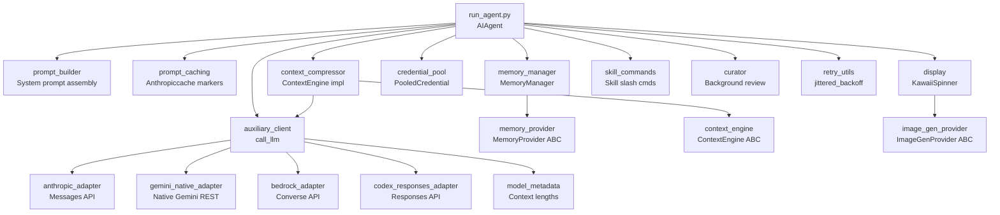
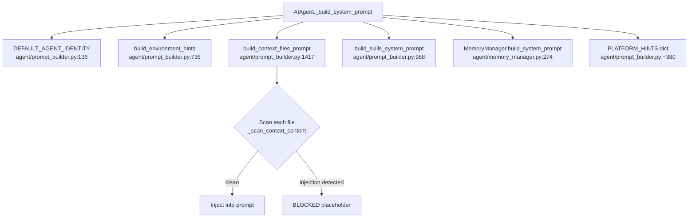
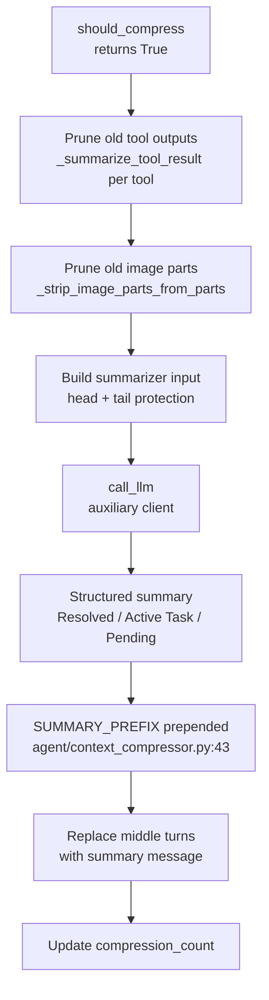
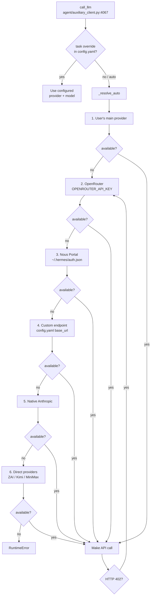
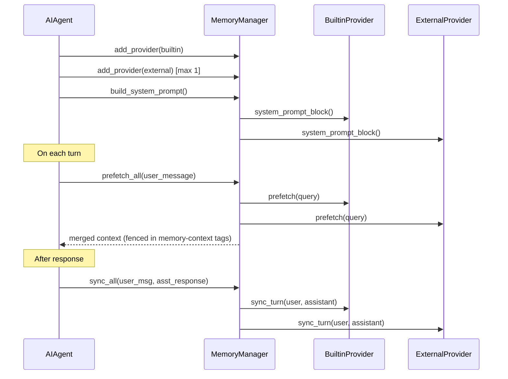
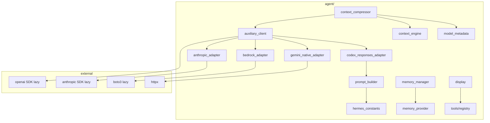

<details>
<summary>Relevant source files</summary>

- [agent/prompt_builder.py](../agent/prompt_builder.py)
- [agent/prompt_caching.py](../agent/prompt_caching.py)
- [agent/context_compressor.py](../agent/context_compressor.py)
- [agent/context_engine.py](../agent/context_engine.py)
- [agent/memory_manager.py](../agent/memory_manager.py)
- [agent/memory_provider.py](../agent/memory_provider.py)
- [agent/anthropic_adapter.py](../agent/anthropic_adapter.py)
- [agent/gemini_native_adapter.py](../agent/gemini_native_adapter.py)
- [agent/bedrock_adapter.py](../agent/bedrock_adapter.py)
- [agent/codex_responses_adapter.py](../agent/codex_responses_adapter.py)
- [agent/auxiliary_client.py](../agent/auxiliary_client.py)
- [agent/credential_pool.py](../agent/credential_pool.py)
- [agent/display.py](../agent/display.py)
- [agent/skill_commands.py](../agent/skill_commands.py)
- [agent/curator.py](../agent/curator.py)
- [agent/image_gen_provider.py](../agent/image_gen_provider.py)
- [agent/model_metadata.py](../agent/model_metadata.py)
- [agent/retry_utils.py](../agent/retry_utils.py)

</details>

# AgentInternals

The `agent/` package contains the core subsystems that power the Hermes agent loop. It is deliberately separated from the top-level `run_agent.py` orchestration layer so that individual concerns — prompt assembly, context management, LLM provider translation, memory, display, credentials — can evolve independently and be tested in isolation. Each module is either a set of stateless pure functions or a class with a narrowly scoped responsibility.

This package is not a public API boundary; `run_agent.py` and `cli.py` call into it directly. Extensions are delivered via ABCs (`MemoryProvider`, `ContextEngine`, `ImageGenProvider`) which the plugin system implements and registers.

---

## Architecture Diagram



---

## Key Concepts

- **Stateless helpers**: Most modules in `agent/` expose pure functions, not classes. `prompt_builder`, `prompt_caching`, `codex_responses_adapter`, and `retry_utils` are entirely stateless so they can be imported and called from any context without lifecycle concerns.
- **Provider adapters**: Each LLM backend (Anthropic, Gemini native, AWS Bedrock, OpenAI Codex Responses) has its own adapter module that translates Hermes's internal OpenAI-shaped message format into the backend's native wire format and normalises responses back.
- **ABCs for extensibility**: Memory backends, context engines, and image generation providers all implement abstract base classes. Only one external memory provider and one context engine are active at a time.
- **Lazy imports**: Heavy SDKs (`openai`, `anthropic`, `boto3`, `google.generativeai`) are imported lazily via module-level sentinels or proxy objects to keep cold startup fast (~240 ms saved per unused SDK).
- **Prompt injection defence**: `prompt_builder` scans every context file (AGENTS.md, .cursorrules, .hermes.md) for invisible Unicode characters and ~10 common injection patterns before injecting content into the system prompt.
- **Cache-aware design**: `prompt_caching` implements Anthropic's breakpoint model in two modes so multi-turn conversations pay ~75% less in input tokens without breaking within-session coherence.
- **Jittered retries**: `retry_utils` provides thread-safe decorrelated backoff used by all provider call sites to avoid thundering-herd spikes in concurrent gateway sessions.

---

## Component Structure

| File | Responsibility | Key Symbols |
|---|---|---|
| [agent/prompt_builder.py](../agent/prompt_builder.py) | Stateless system-prompt assembly; injection scanning; skills index; context file loading | `DEFAULT_AGENT_IDENTITY`, `build_skills_system_prompt()`, `build_context_files_prompt()`, `build_environment_hints()`, `_scan_context_content()` |
| [agent/prompt_caching.py](../agent/prompt_caching.py) | Anthropic `cache_control` breakpoints (two strategies) | `apply_anthropic_cache_control()`, `apply_anthropic_cache_control_long_lived()`, `mark_tools_for_long_lived_cache()` |
| [agent/context_compressor.py](../agent/context_compressor.py) | Token-budget summarization of long conversations; tool output pruning | `ContextCompressor`, `SUMMARY_PREFIX`, `_summarize_tool_result()` |
| [agent/context_engine.py](../agent/context_engine.py) | ABC for pluggable context engines | `ContextEngine` |
| [agent/memory_manager.py](../agent/memory_manager.py) | Orchestrates built-in + one external memory provider | `MemoryManager`, `StreamingContextScrubber`, `build_memory_context_block()` |
| [agent/memory_provider.py](../agent/memory_provider.py) | ABC for memory backends | `MemoryProvider` |
| [agent/anthropic_adapter.py](../agent/anthropic_adapter.py) | Anthropic Messages API translation; extended/adaptive thinking | `THINKING_BUDGET`, `ADAPTIVE_EFFORT_MAP`, `_ANTHROPIC_OUTPUT_LIMITS` |
| [agent/gemini_native_adapter.py](../agent/gemini_native_adapter.py) | Native Gemini REST (bypasses OpenAI-compat shim) | `is_native_gemini_base_url()`, `probe_gemini_tier()`, `GeminiNativeAdapter` |
| [agent/bedrock_adapter.py](../agent/bedrock_adapter.py) | AWS Bedrock Converse API; per-region client caching | `_get_bedrock_runtime_client()`, `reset_client_cache()` |
| [agent/codex_responses_adapter.py](../agent/codex_responses_adapter.py) | OpenAI Responses API (Codex, xAI, GitHub Models) format translation | `_chat_content_to_responses_parts()`, `_TOOL_CALL_LEAK_PATTERN` |
| [agent/auxiliary_client.py](../agent/auxiliary_client.py) | Shared auxiliary LLM client; 7-step provider auto-detection | `call_llm()`, `_resolve_auto()`, `_OpenAIProxy` |
| [agent/credential_pool.py](../agent/credential_pool.py) | Multi-credential failover pool; per-provider cooldown tracking | `PooledCredential`, `STRATEGY_*` constants |
| [agent/display.py](../agent/display.py) | CLI spinner, tool previews, inline diff rendering; no AIAgent dependency | `KawaiiSpinner`, `build_tool_preview()`, `render_edit_diff_with_delta()`, `get_tool_emoji()` |
| [agent/skill_commands.py](../agent/skill_commands.py) | Skill slash command helpers shared by CLI and gateway | `_load_skill_payload()`, `get_skill_commands()` |
| [agent/curator.py](../agent/curator.py) | Background skill maintenance; auto-archives stale agent-created skills | `maybe_run_curator()`, `_state_file()` |
| [agent/image_gen_provider.py](../agent/image_gen_provider.py) | ABC for image generation backends | `ImageGenProvider`, `VALID_ASPECT_RATIOS` |
| [agent/model_metadata.py](../agent/model_metadata.py) | Context length lookup; rough token estimation; provider prefix stripping | `get_model_context_length()`, `estimate_messages_tokens_rough()`, `MINIMUM_CONTEXT_LENGTH` |
| [agent/retry_utils.py](../agent/retry_utils.py) | Jittered decorrelated exponential backoff | `jittered_backoff()` |

---

## Core Flows

### System Prompt Assembly

Every conversation turn, `AIAgent._build_system_prompt()` assembles the prompt by calling stateless helpers from `prompt_builder`:



`build_context_files_prompt()` loads `AGENTS.md`, `.cursorrules`, `HERMES.md`, and project-level overrides found by walking up to the git root. Each file is passed through `_scan_context_content()` which checks for ~10 regex patterns (prompt injection, deception, bypass directives) and 10 invisible Unicode characters before allowing the content into the prompt.

Sources: [agent/prompt_builder.py:37-58](../agent/prompt_builder.py#L37-L58), [agent/prompt_builder.py:1417](../agent/prompt_builder.py#L1417)

---

### Context Compression Flow

When token usage exceeds the `threshold_percent` (default 75%) of the model's context window, `ContextCompressor.compress()` runs a multi-pass reduction:



The summary output uses a structured template with `## Resolved Questions`, `## Active Task`, and `## Remaining Work` sections. The `SUMMARY_PREFIX` header (injected before the summary text) tells the model the content is reference-only and should not be re-executed.

Tool output pruning happens before the LLM summarization pass — `_summarize_tool_result()` replaces raw tool outputs with rich one-line descriptions (e.g., `[terminal] ran 'npm test' -> exit 0, 47 lines output`) to reduce token cost of the summarizer input.

Sources: [agent/context_compressor.py:43-60](../agent/context_compressor.py#L43-L60), [agent/context_compressor.py:240-290](../agent/context_compressor.py#L240-L290)

---

### Auxiliary Client Resolution Chain

`call_llm()` in `auxiliary_client.py` is used by the compressor, session search, web extraction, vision analysis, and other side tasks. It resolves which provider to use via an ordered fallback chain:



Payment/credit exhaustion (HTTP 402) triggers automatic retry with the next provider in the chain. This handles the common case where a user depletes their OpenRouter balance mid-session.

Sources: [agent/auxiliary_client.py:2447](../agent/auxiliary_client.py#L2447), [agent/auxiliary_client.py:4067-4130](../agent/auxiliary_client.py#L4067-L4130)

---

### Memory Provider Lifecycle



Prefetched context is wrapped in `<memory-context>` XML tags with a system note. The `StreamingContextScrubber` removes these tags from streamed assistant output to prevent them from appearing in the UI.

Sources: [agent/memory_manager.py:230-280](../agent/memory_manager.py#L230-L280), [agent/memory_manager.py:80-120](../agent/memory_manager.py#L80-L120)

---

## Public API / Key Interfaces

### `prompt_builder` — System Prompt Assembly

```python
# agent/prompt_builder.py:988
def build_skills_system_prompt(
    platform: str | None = None,
    cwd: str | None = None,
    enabled_toolsets: list | None = None,
    disabled_toolsets: list | None = None,
) -> str:
    """Build the skills index section of the system prompt."""

# agent/prompt_builder.py:1417
def build_context_files_prompt(
    cwd: Optional[str] = None,
    skip_soul: bool = False,
) -> str:
    """Load AGENTS.md / .cursorrules / HERMES.md after injection scan."""

# agent/prompt_builder.py:736
def build_environment_hints() -> str:
    """Return OS, shell, WSL, and cwd hints for the system prompt."""
```

The `DEFAULT_AGENT_IDENTITY` string at [agent/prompt_builder.py:136](../agent/prompt_builder.py#L136) is the default identity paragraph injected at the top of every system prompt. It can be overridden by provider config.

---

### `prompt_caching` — Anthropic Cache Markers

```python
# agent/prompt_caching.py:50
def apply_anthropic_cache_control(
    api_messages: List[Dict[str, Any]],
    cache_ttl: str = "5m",          # "5m" or "1h"
    native_anthropic: bool = False,
) -> List[Dict[str, Any]]:
    """system_and_3 strategy: system + last 3 non-system messages."""

# agent/prompt_caching.py (line ~135)
def apply_anthropic_cache_control_long_lived(
    api_messages: List[Dict[str, Any]],
    long_lived_ttl: str = "1h",
    rolling_ttl: str = "5m",
    native_anthropic: bool = False,
) -> List[Dict[str, Any]]:
    """prefix_and_2 strategy: stable prefix (1h) + rolling window (5m)."""

# agent/prompt_caching.py
def mark_tools_for_long_lived_cache(
    tools: Optional[List[Dict[str, Any]]],
    long_lived_ttl: str = "1h",
) -> Optional[List[Dict[str, Any]]]:
    """Mark the last tool definition for the 1h cache tier."""
```

Both functions return **deep copies** — they never mutate the input message list. The `prefix_and_2` strategy requires the caller to have pre-split the system message into ordered content blocks so the stable prefix can be isolated.

Sources: [agent/prompt_caching.py:1-20](../agent/prompt_caching.py#L1-L20)

---

### `ContextEngine` ABC

```python
# agent/context_engine.py:1
class ContextEngine(ABC):
    # Token state — run_agent.py reads these directly
    last_prompt_tokens: int = 0
    last_completion_tokens: int = 0
    threshold_tokens: int = 0
    context_length: int = 0
    compression_count: int = 0

    # Compaction parameters
    threshold_percent: float = 0.75
    protect_first_n: int = 3
    protect_last_n: int = 6

    @abstractmethod
    def update_from_response(self, usage: Dict[str, Any]) -> None: ...

    @abstractmethod
    def should_compress(self, prompt_tokens: int = None) -> bool: ...

    @abstractmethod
    def compress(
        self,
        messages: List[Dict[str, Any]],
        current_tokens: int = None,
    ) -> List[Dict[str, Any]]: ...
```

The built-in implementation is `ContextCompressor` in `context_compressor.py`. Third-party engines are placed in `plugins/context_engine/<name>/` and selected via `context.engine` in `config.yaml`.

Sources: [agent/context_engine.py:1-80](../agent/context_engine.py#L1-L80)

---

### `MemoryProvider` ABC

```python
# agent/memory_provider.py:40
class MemoryProvider(ABC):
    @abstractmethod
    def name(self) -> str: ...               # short id, e.g. "honcho"

    @abstractmethod
    def is_available(self) -> bool: ...      # checks deps + config only

    @abstractmethod
    def initialize(self, session_id: str, **kwargs) -> None: ...

    def system_prompt_block(self) -> str: return ""     # static system prompt text
    def prefetch(self, query: str, *, session_id: str = "") -> str: return ""
    def sync_turn(self, user_msg: str, asst_msg: str) -> None: ...
    def get_tool_schemas(self) -> List[Dict]: return []
    def handle_tool_call(self, name: str, args: dict) -> str: ...

    # Optional hooks
    def on_turn_start(self, turn: int, message: str, **kwargs): ...
    def on_session_end(self, messages: List): ...
    def on_pre_compress(self, messages: List) -> str: ...
    def on_memory_write(self, action, target, content, metadata=None): ...
    def on_delegation(self, task, result, **kwargs): ...
```

Sources: [agent/memory_provider.py:1-100](../agent/memory_provider.py#L1-L100)

---

### `ImageGenProvider` ABC

```python
# agent/image_gen_provider.py:55
class ImageGenProvider(abc.ABC):
    @property
    @abc.abstractmethod
    def name(self) -> str: ...           # e.g. "fal", "openai", "replicate"

    def is_available(self) -> bool: return True
    def list_models(self) -> List[Dict]: return []

    @abc.abstractmethod
    def generate(
        self,
        prompt: str,
        *,
        model: str | None = None,
        aspect_ratio: str = "landscape",
        negative_prompt: str | None = None,
        **kwargs,
    ) -> Dict[str, Any]: ...
```

Providers live in `plugins/image_gen/<name>/` and are selected via `image_gen.provider` in `config.yaml`. The `generate()` return value is produced by the `success_response()` / `error_response()` helpers in the same module.

Sources: [agent/image_gen_provider.py:1-110](../agent/image_gen_provider.py#L1-L110)

---

### `PooledCredential` and `credential_pool`

```python
# agent/credential_pool.py:97
@dataclass
class PooledCredential:
    provider: str
    id: str
    label: str
    auth_type: str       # "oauth" | "api_key"
    priority: int
    source: str          # "manual"
    access_token: str
    refresh_token: Optional[str] = None
    last_status: Optional[str] = None
    last_error_code: Optional[int] = None
    request_count: int = 0
    ...
```

Pool selection strategies: `STRATEGY_FILL_FIRST`, `STRATEGY_ROUND_ROBIN`, `STRATEGY_RANDOM`, `STRATEGY_LEAST_USED`. Error cooldowns:

| Error code | Cooldown |
|---|---|
| 401 (auth failure) | 5 minutes |
| 429 (rate limited) | 1 hour |
| 402 (billing) / other | 1 hour |

Sources: [agent/credential_pool.py:60-95](../agent/credential_pool.py#L60-L95)

---

### `KawaiiSpinner` and display helpers

```python
# agent/display.py:573
class KawaiiSpinner:
    """Animated spinner with kawaii faces for CLI feedback."""

    # Skin-aware face/verb resolution
    @classmethod
    def get_waiting_faces(cls) -> list: ...   # idle wait faces
    @classmethod
    def get_thinking_faces(cls) -> list: ...  # active tool-call faces
    @classmethod
    def get_thinking_verbs(cls) -> list: ...  # action verbs like "pondering"

# agent/display.py:135
def get_tool_emoji(tool_name: str, default: str = "⚡") -> str:
    """Skin override → registry emoji → hardcoded fallback."""

# agent/display.py (line ~170)
def build_tool_preview(tool_name: str, args: dict, max_len: int | None = None) -> str | None:
    """One-line preview of a tool call's primary argument."""
```

The spinner faces and verbs are resolved from the active skin at runtime via `hermes_cli/skin_engine.get_active_skin()`, falling back to hardcoded defaults if no skin is loaded.

Sources: [agent/display.py:1-10](../agent/display.py#L1-L10), [agent/display.py:573](../agent/display.py#L573)

---

### `jittered_backoff`

```python
# agent/retry_utils.py:25
def jittered_backoff(
    attempt: int,
    *,
    base_delay: float = 5.0,
    max_delay: float = 120.0,
    jitter_ratio: float = 0.5,
) -> float:
    """Decorrelated jittered exponential backoff.

    Returns min(base * 2^(attempt-1), max_delay) + uniform_jitter.
    Thread-safe via _jitter_lock.
    """
```

Sources: [agent/retry_utils.py:25-60](../agent/retry_utils.py#L25-L60)

---

## LLM Provider Adapters

Each adapter translates Hermes's internal OpenAI-format messages into the backend's native API and normalises responses back. All adapters use lazy SDK imports.

### Anthropic (`anthropic_adapter.py`)

| Feature | Detail |
|---|---|
| Auth | API key (`sk-ant-api*`), OAuth setup-token (`sk-ant-oat*`), Claude Code credentials (`~/.claude.json`) |
| Thinking modes | Extended thinking (manual budget via `THINKING_BUDGET`) or adaptive thinking (`ADAPTIVE_EFFORT_MAP`) |
| Models with adaptive-only | Substrings `4-6`, `4.6`, `4-7`, `4.7` — extended thinking removed |
| Models without sampling params | Substrings `4-7`, `4.7` — `temperature`/`top_p`/`top_k` raise 400 |
| Output token limits | Per-model in `_ANTHROPIC_OUTPUT_LIMITS` (e.g. `claude-opus-4-7`: 128 000) |

Sources: [agent/anthropic_adapter.py:47-95](../agent/anthropic_adapter.py#L47-L95)

### Gemini Native (`gemini_native_adapter.py`)

Uses direct `httpx` calls to `generativelanguage.googleapis.com/v1beta` rather than the OpenAI-compatible endpoint. `is_native_gemini_base_url()` detects whether a configured `base_url` is the native path (must contain `generativelanguage.googleapis.com` and NOT end in `/openai`).

`probe_gemini_tier()` inspects the `x-ratelimit-limit-requests-per-day` response header — keys with ≤ 1 000 RPD are classified as free-tier and rejected during setup.

Sources: [agent/gemini_native_adapter.py:1-100](../agent/gemini_native_adapter.py#L1-L100)

### AWS Bedrock (`bedrock_adapter.py`)

`boto3` is imported lazily on first use via `_require_boto3()`. Clients are cached per-region in module-level dicts (`_bedrock_runtime_client_cache`, `_bedrock_control_client_cache`). `invalidate_runtime_client(region)` evicts a stale connection-pool entry without clearing all regions.

The Converse API provides a single interface across Claude, Nova, Llama, Mistral, and other Bedrock-hosted models with streaming support.

Sources: [agent/bedrock_adapter.py:1-90](../agent/bedrock_adapter.py#L1-L90)

### OpenAI Responses API (`codex_responses_adapter.py`)

Used by OpenAI Codex, xAI (Grok), and GitHub Models. The Responses API has a different content-part type system than Chat Completions:

| Chat type | Responses type (user) | Responses type (assistant) |
|---|---|---|
| `text` | `input_text` | `output_text` |
| `image_url` | `input_image` | — |

`_TOOL_CALL_LEAK_PATTERN` detects when the model serialises a tool call into assistant-message content instead of a structured `function_call` item, which can happen with Codex/Harmony backends.

Sources: [agent/codex_responses_adapter.py:1-100](../agent/codex_responses_adapter.py#L1-L100)

---

## Configuration

| Config key | Default | Module | Purpose |
|---|---|---|---|
| `context.engine` | `"compressor"` | `context_engine.py` | Which context engine to use |
| `context.threshold_percent` | `0.75` | `context_engine.py` | Compression trigger threshold |
| `memory.provider` | `"builtin"` | `memory_provider.py` | Which memory backend to activate |
| `image_gen.provider` | — | `image_gen_provider.py` | Which image generation backend |
| `auxiliary.compression.provider` | `"auto"` | `auxiliary_client.py` | LLM provider for summarization |
| `auxiliary.compression.model` | — | `auxiliary_client.py` | Model override for summarization |
| `auxiliary.vision.provider` | `"auto"` | `auxiliary_client.py` | Vision task provider |
| `curator.enabled` | `true` | `curator.py` | Enable background skill maintenance |
| `curator.interval_hours` | `168` (7 days) | `curator.py` | How often curator runs |
| `curator.min_idle_hours` | `2` | `curator.py` | Required idle time before trigger |
| `curator.stale_after_days` | `30` | `curator.py` | Days until skill is stale |
| `curator.archive_after_days` | `90` | `curator.py` | Days until stale skill is archived |
| `display.tool_preview_length` | `0` (unlimited) | `display.py` | Max chars in tool call previews |

Environment variables relevant to this layer:

| Variable | Used by | Purpose |
|---|---|---|
| `OPENROUTER_API_KEY` | `auxiliary_client.py` | OpenRouter fallback in auto-detection |
| `ANTHROPIC_API_KEY` | `anthropic_adapter.py` | Direct Anthropic auth |
| `GOOGLE_API_KEY` | `gemini_native_adapter.py` | Gemini API key |
| `AWS_*` / `AWS_PROFILE` | `bedrock_adapter.py` | AWS credential chain |
| `HERMES_PLATFORM` | `skill_commands.py` | Active platform for skill filtering |

---

## Dependencies

This package has **no circular imports within `agent/`** — modules only import upward from utilities or outward to the tools registry and hermes_cli.



Key external dependencies:

| Dependency | Import style | Required for |
|---|---|---|
| `openai` | Lazy via `_OpenAIProxy` | `auxiliary_client.py` OpenAI-compat calls |
| `anthropic` | Lazy via `_get_anthropic_sdk()` | `anthropic_adapter.py` native calls |
| `boto3` | Lazy via `_require_boto3()` | `bedrock_adapter.py` |
| `httpx` | Direct import | `gemini_native_adapter.py` |
| `hermes_constants` | Direct | `get_hermes_home()`, `get_skills_dir()` |
| `tools/registry` | Direct | `display.py` emoji lookup |
| `hermes_cli/config` | Direct | `credential_pool.py` config loading |

---

## Extension Points

### Adding a Memory Provider Plugin

Implement `MemoryProvider` ABC from [agent/memory_provider.py](../agent/memory_provider.py) and ship it as a plugin in `plugins/memory/<name>/`. The plugin's `register(ctx)` function calls `ctx.register_memory_provider(YourProvider())`. Configure it with `memory.provider: <name>` in `config.yaml`.

Minimum implementation: `name`, `is_available()`, `initialize()`. All other methods have no-op defaults.

### Adding a Context Engine Plugin

Implement `ContextEngine` ABC from [agent/context_engine.py](../agent/context_engine.py) and ship it in `plugins/context_engine/<name>/`. Activate with `context.engine: <name>` in `config.yaml`.

### Adding an Image Generation Provider

Implement `ImageGenProvider` ABC from [agent/image_gen_provider.py](../agent/image_gen_provider.py) and ship it in `plugins/image_gen/<name>/` with `kind: backend` in `plugin.yaml`. Activate with `image_gen.provider: <name>`.

### Adding a LLM Provider Adapter

1. Create a new module `agent/<provider>_adapter.py` following the pattern of `anthropic_adapter.py` — translate OpenAI-format `messages`/`tools` into the backend's format, translate responses back.
2. Register the provider profile in `plugins/model-providers/<name>/__init__.py` via `providers.register_provider(ProviderProfile(...))`.
3. In `auxiliary_client.py`, add the provider to the `_resolve_auto()` fallback chain if it should be an auxiliary fallback.

### Customising Display / Spinner

Spinner faces, verbs, wings, and tool emoji overrides are all configurable via the skin engine (`hermes_cli/skin_engine.py`) — no code changes needed. Create `~/.hermes/skins/<name>.yaml` and activate with `display.skin: <name>` or `/skin <name>` at runtime. See [AGENTS.md](../AGENTS.md) for the full skin key reference.

### Tuning Prompt Caching

Two caching layouts are provided in [agent/prompt_caching.py](../agent/prompt_caching.py):

- `system_and_3` (default): 4 breakpoints at uniform TTL — works everywhere Anthropic cache control is supported.
- `prefix_and_2` (long-lived path): stable system prefix at 1 h + rolling 2-message tail at 5 min — requires the caller to split the system message into ordered content blocks so the stable prefix byte-sequence doesn't change between sessions.

To add a new caching layout, add a pure function following the same pattern (deep copy, apply markers, return) and call it from the relevant `run_agent.py` branch.
