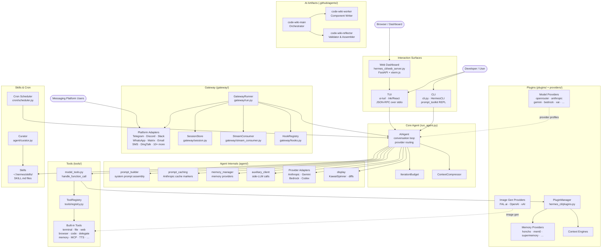
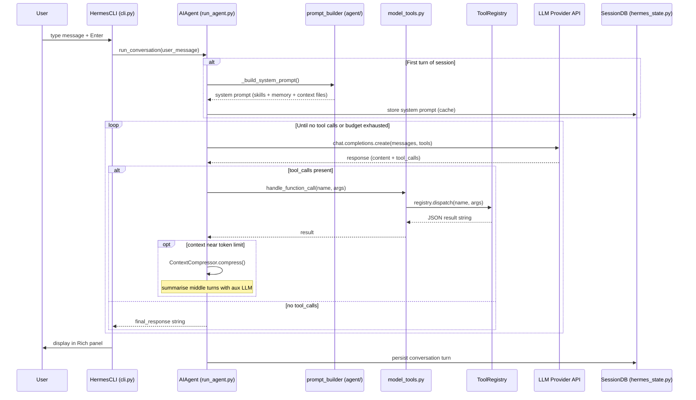
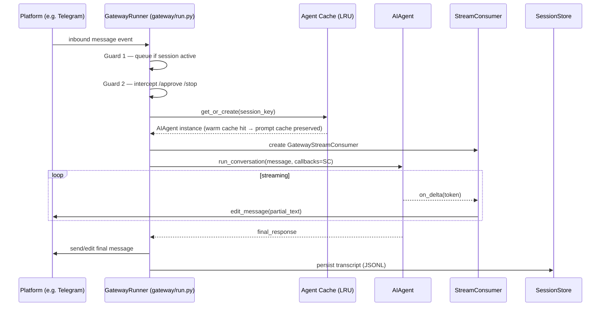

# hermes-agent — Architecture Overview

> **Generated:** 2026-05-12 | **Repository:** `hermes-agent`

---

## Table of Contents

1. [Executive Summary](#executive-summary)
2. [System Overview](#system-overview)
3. [High-Level Architecture Diagram](#high-level-architecture-diagram)
4. [Component Index](#component-index)
5. [Key Architectural Patterns](#key-architectural-patterns)
6. [Data Flow Overview](#data-flow-overview)
7. [Development Guide Quick Reference](#development-guide-quick-reference)
8. [Cross-Cutting Concerns](#cross-cutting-concerns)
9. [Appendices](#appendices)

---

## Executive Summary

**hermes-agent** is a production-grade, self-hostable AI agent framework written in Python. It delivers a conversational agent that can execute code, manipulate files, browse the web, delegate to subagents, schedule recurring jobs, and communicate across more than 15 messaging platforms — all from a single unified runtime. The framework is designed to be run locally by developers, deployed as a long-lived gateway daemon on a server, or embedded in automated CI/CD pipelines via its batch runner.

Architecturally, hermes-agent is organized around a central `AIAgent` runtime loop (the [CoreAgent](CoreAgent.md)) that is provider-agnostic: it can target OpenAI-compatible APIs, the native Anthropic Messages API, Google Gemini, AWS Bedrock, or any custom endpoint with a single configuration change. Above the core sit two primary interaction surfaces — a rich interactive CLI built with `prompt_toolkit` and Rich (the [CLI](CLI.md)), and a React/Ink terminal UI served over stdio JSON-RPC (the [TUI](TUI.md)). Below the core, a modular [Tools](Tools.md) registry provides self-registering, availability-gated capabilities, and a layered [Plugins](Plugins.md) system allows third-party extension without touching framework internals. An async [Gateway](Gateway.md) daemon bridges the agent to external messaging platforms, while [Skills](SkillsAndCron.md) encode procedural AI knowledge and [Cron](SkillsAndCron.md) provides autonomous scheduled execution.

The repository also includes AI-native tooling artifacts: three VS Code agent definition files (`.agent.md`) that implement a fully automated multi-agent workflow for generating this very documentation. Details are covered in the [AIArtifacts](AIArtifacts.md) component doc.

---

## System Overview

### Purpose

hermes-agent is a multi-modal, multi-platform AI agent runtime. Its key value propositions are:

- **Provider flexibility** — works with any OpenAI-compatible endpoint, Anthropic, Gemini, Bedrock, or custom LLMs without code changes.
- **Rich tooling** — 40+ built-in tools covering file I/O, terminal, web, browser automation, code execution, memory, delegation, image generation, TTS, and more.
- **Multi-surface delivery** — same agent brain accessible from an interactive CLI, terminal UI, Telegram, Discord, Slack, WhatsApp, Matrix, Email, SMS, and 10+ more platforms simultaneously.
- **Extensible plugin system** — memory backends, model providers, context engines, image generators, and gateway platforms are all hot-pluggable without modifying core files.
- **Autonomous operation** — skills provide reusable procedural knowledge; cron schedules repeating agent runs; the curator self-maintains the skill library.

### Major Subsystems

| Subsystem | Entry Point | Role |
|---|---|---|
| Core Agent | `run_agent.py` → `AIAgent` | Conversation loop, tool dispatch, provider routing |
| Agent Internals | `agent/` package | Prompt assembly, caching, memory, compression, display |
| CLI | `cli.py` → `HermesCLI` | Interactive REPL, slash commands, skin engine |
| Gateway | `gateway/run.py` → `GatewayRunner` | Async multi-platform messaging daemon |
| Tools | `tools/` package | Self-registering capability library |
| Plugins | `hermes_cli/plugins.py` + `plugins/` | General, memory, model-provider, platform extensions |
| TUI | `ui-tui/` + `tui_gateway/` | Ink/React terminal UI with JSON-RPC backend |
| Skills & Cron | `skills/`, `cron/` | AI knowledge library + scheduled execution |
| AI Artifacts | `.github/agents/` | Multi-agent wiki-generation workflow |

### Process Entry Points

| Command | What it does |
|---|---|
| `hermes` | Interactive CLI (prompt_toolkit REPL) |
| `hermes --tui` | React/Ink terminal UI |
| `hermes gateway` | Start the messaging gateway daemon |
| `hermes --gateway` | Inline gateway mode |
| `hermes web` | Launch the FastAPI web dashboard |
| `hermes cron` | Manage scheduled jobs |
| `hermes kanban` | Manage kanban board |
| `hermes setup` | Interactive configuration wizard |
| `python batch_runner.py` | Parallel batch processing of a JSONL prompt dataset |

### Deployment Contexts

- **Local developer machine** — `hermes` or `hermes --tui` for interactive use.
- **Always-on server** — `hermes gateway` running as a systemd service; the gateway manages reconnects and platform lifecycles indefinitely.
- **Dashboard** — `hermes web` serves a FastAPI app; `/chat` embeds `hermes --tui` via a POSIX PTY over WebSocket.
- **CI / evaluation** — `batch_runner.py` processes a JSONL dataset in parallel with checkpointing and trajectory export.

---

## High-Level Architecture Diagram



---

## Component Index

| Component | Wiki Doc | One-Line Summary |
|---|---|---|
| **CoreAgent** | [CoreAgent.md](CoreAgent.md) | `AIAgent` class — the central conversation loop, provider router, and tool-dispatch orchestrator (~12k LOC) |
| **AgentInternals** | [AgentInternals.md](AgentInternals.md) | `agent/` package — prompt assembly, caching, compression, memory, provider adapters, display, and auxiliary LLM client |
| **CLI** | [CLI.md](CLI.md) | `HermesCLI` REPL and `hermes` entry-point — slash commands, skin engine, plugin loader, web dashboard, profile management |
| **Gateway** | [Gateway.md](Gateway.md) | Async messaging daemon bridging `AIAgent` to 15+ platforms (Telegram, Discord, Slack, …) with approval flows and streaming |
| **Tools** | [Tools.md](Tools.md) | Self-registering built-in tool library — 40+ tools from file I/O and terminal to browser, delegation, and MCP |
| **Plugins** | [Plugins.md](Plugins.md) | Multi-surface plugin ecosystem for memory backends, model providers, image gen, context engines, and gateway platforms |
| **TUI** | [TUI.md](TUI.md) | React/Ink terminal UI with JSON-RPC Python backend — full replacement for the classic CLI, also embedded in the web dashboard |
| **SkillsAndCron** | [SkillsAndCron.md](SkillsAndCron.md) | Markdown-defined AI skill library and durable cron scheduler for autonomous recurring agent runs |
| **AIArtifacts** | [AIArtifacts.md](AIArtifacts.md) | Three VS Code `.agent.md` files implementing a multi-agent workflow that generates this wiki |

---

## Key Architectural Patterns

### 1. Provider-Agnostic API Routing

`AIAgent` auto-detects the correct API mode from the configured endpoint and model name, routing to one of four adapters:

| Mode | Adapter | Covers |
|---|---|---|
| `chat_completions` | Standard OpenAI client | OpenAI, OpenRouter, Azure, GMI, most providers |
| `anthropic_messages` | `agent/anthropic_adapter.py` | Anthropic direct API with extended thinking |
| `codex_responses` | `agent/codex_responses_adapter.py` | OpenAI Responses API, xAI, GitHub Models |
| `bedrock_converse` | `agent/bedrock_adapter.py` | AWS Bedrock regional endpoints |
| Native Gemini | `agent/gemini_native_adapter.py` | Google Gemini bypassing OpenAI-compat shim |

### 2. Prompt Caching (Anthropic)

`agent/prompt_caching.py` places `cache_control` breakpoints on the system prompt and tool list so multi-turn conversations pay ~75% less in input tokens. **The system prompt is built once per session and never rebuilt mid-conversation** — rebuilding invalidates cache entries and drives up cost. This is a hard invariant enforced throughout the codebase.

```
System prompt (built once, cache breakpoint A)
  └─ Tool schemas (built once, cache breakpoint B)
       └─ Turn 1: user + assistant + tool results
       └─ Turn 2: user + assistant (only Turn 2 tokens billed)
```

### 3. Tool Registry — Zero Circular Imports

`tools/registry.py` has **no external dependencies** and sits at the root of the import chain. All tool files call `registry.register(...)` at module level. `discover_builtin_tools()` uses Python's `ast` module to scan `tools/*.py` and only imports files that actually contain a `registry.register(...)` call, preventing false positives.

```
tools/registry.py  (no deps)
       ↑
tools/*.py  (each registers at import time)
       ↑
model_tools.py  (triggers discovery, provides get_tool_definitions / handle_function_call)
       ↑
run_agent.py, cli.py, batch_runner.py, tui_gateway/server.py
```

### 4. Plugin System — Five Surfaces, Three Discovery Paths

Plugins extend Hermes through three independent discovery systems that run in parallel:

| Discovery System | File | Plugin Kinds |
|---|---|---|
| `PluginManager` | `hermes_cli/plugins.py` | `standalone`, `backend`, `platform` |
| Memory discovery | `plugins/memory/__init__.py` | `exclusive` memory backends |
| Provider discovery | `providers/__init__.py` | `model-provider` inference profiles |

Plugins receive a `PluginContext` façade with five registration methods: `register_tool`, `register_hook`, `register_cli_command`, `register_platform`, and `register_context_engine`. Hook failures are isolated per-callback so a broken plugin cannot crash the agent loop.

### 5. Multi-Guard Message Pipeline (Gateway)

Every inbound gateway message passes through two sequential guards:

1. **Adapter-level guard** (`BasePlatformAdapter`) — queues messages in `_pending_messages` when a session is already active.
2. **Runner-level guard** (`GatewayRunner`) — intercepts control commands (`/stop`, `/approve`, `/deny`, `/new`) before they reach the pending queue.

Control commands that must reach the runner while an agent is blocked (e.g. approval responses) **bypass both guards** and are dispatched inline.

### 6. Iteration Budget and Subagent Isolation

Each `AIAgent` instance carries an `IterationBudget` (default 90 tool-calling iterations). When `delegate_task` spawns a child agent, the child receives its own independent budget. A process-global `_last_resolved_tool_names` in `model_tools.py` is saved and restored around each child execution so concurrent delegations cannot clobber each other's state.

### 7. TUI — TypeScript Owns Screen, Python Owns State

The TUI maintains a strict separation of concerns over stdio JSON-RPC 2.0:

- **Node/Ink** renders the transcript, composer, tool activity, and interactive prompts.
- **Python `tui_gateway`** owns all session state, `AIAgent` instances, tool execution, and slash command dispatch.
- Communication is newline-delimited JSON with a `contextvars.ContextVar` per worker thread so concurrent requests route to the correct transport peer.

### 8. Profile-Aware Paths

All persistent state is rooted at `HERMES_HOME` (resolved via `get_hermes_home()` from `hermes_constants.py`), **not** the literal `~/.hermes`. The `hermes -p <name>` flag sets `HERMES_HOME` before any module imports via `_apply_profile_override()`. This gives each profile a fully isolated config, session store, API keys, skills library, and gateway state.

---

## Data Flow Overview

### Message Flow: CLI → Agent → Tools → Response



### Message Flow: Gateway Platform → Agent → Platform Reply



---

## Development Guide Quick Reference

### Adding a New Built-in Tool

1. Create `tools/your_tool.py` with a top-level `registry.register(...)` call.
2. Add the tool name to a toolset in `toolsets.py` (`_HERMES_CORE_TOOLS` for all platforms, or a named toolset).
3. Return a JSON string from the handler — no exceptions should propagate.

> For custom or local-only tools, use the **plugin route** (`~/.hermes/plugins/<name>/`) instead of editing core.

See: [Tools.md](Tools.md#component-structure), [AGENTS.md](../AGENTS.md#adding-new-tools)

### Adding a Plugin

Create `~/.hermes/plugins/<name>/plugin.yaml` (with `kind: standalone`) and `__init__.py` with a `register(ctx)` function. Enable in `config.yaml` under `plugins.enabled`.

```python
def register(ctx):
    ctx.register_tool(name="my_tool", schema={...}, handler=my_handler)
    ctx.register_hook("pre_tool_call", my_hook)
```

See: [Plugins.md](Plugins.md#core-flows)

### Adding a Memory Provider Plugin

Create `~/.hermes/plugins/memory/<name>/__init__.py` implementing the `MemoryProvider` ABC. Set `memory.provider: <name>` in `config.yaml`.

See: [Plugins.md](Plugins.md#component-structure), [AgentInternals.md](AgentInternals.md#memory-provider-lifecycle)

### Adding a Model Provider Plugin

Create `plugins/model-providers/<name>/__init__.py` calling `providers.register_provider(ProviderProfile(...))`. User plugins of the same name override bundled ones.

See: [Plugins.md](Plugins.md#component-structure), `website/docs/developer-guide/model-provider-plugin.md`

### Adding a Gateway Platform

Extend `BasePlatformAdapter`, call `registry.register_platform(...)` in `register(ctx)`, and package as a plugin with `kind: platform`. The adapter must implement `connect()`, `disconnect()`, `send_message()`, and `on_message()`.

See: [Gateway.md](Gateway.md), `gateway/platforms/ADDING_A_PLATFORM.md`

### Adding a Slash Command

1. Add a `CommandDef` entry to `COMMAND_REGISTRY` in `hermes_cli/commands.py`.
2. Add handler in `HermesCLI.process_command()` in `cli.py`.
3. (Optional) Add gateway handler in `gateway/run.py`.

All consumers (help text, autocomplete, Telegram menu, Slack subcommand map) update automatically.

See: [CLI.md](CLI.md#adding-a-slash-command)

### Adding a Configuration Key

1. Add to `DEFAULT_CONFIG` in `hermes_cli/config.py`.
2. Bump `_config_version` only if migrating existing values (adding a new key does not require a bump).

See: [CLI.md](CLI.md), [AGENTS.md](../AGENTS.md#adding-configuration)

### Creating a Skill

Write a `SKILL.md` with YAML frontmatter (`name`, `description`, `version`) and Markdown instructions in `~/.hermes/skills/<skill-name>/`. The agent can invoke it as a slash command (`/<skill-name>`) or via `skill_view`.

See: [SkillsAndCron.md](SkillsAndCron.md#skillmd-format)

### Running Tests

Always use the wrapper script — do not call `pytest` directly:

```bash
scripts/run_tests.sh                                    # full suite (CI-parity)
scripts/run_tests.sh tests/gateway/                     # one directory
scripts/run_tests.sh tests/agent/test_foo.py::test_x    # one test
scripts/run_tests.sh -v --tb=long                       # pass-through flags
```

The wrapper enforces: unset API keys, `TZ=UTC`, `LANG=C.UTF-8`, `-n 4` xdist workers.

See: [AGENTS.md](../AGENTS.md#testing)

### Key Source Files

| Entry Point | Location | Purpose |
|---|---|---|
| `AIAgent.__init__` | [run_agent.py:986](../run_agent.py#L986) | Core agent constructor |
| `AIAgent.run_conversation` | [run_agent.py:11592](../run_agent.py#L11592) | Main conversation loop |
| `handle_function_call` | [model_tools.py:697](../model_tools.py#L697) | Tool dispatch entry point |
| `discover_builtin_tools` | [tools/registry.py:56](../tools/registry.py#L56) | Auto-discovery of all tools |
| `HermesCLI.__init__` | [cli.py:2278](../cli.py#L2278) | CLI REPL constructor |
| `GatewayRunner.__init__` | [gateway/run.py:1163](../gateway/run.py#L1163) | Gateway controller constructor |
| `DEFAULT_CONFIG` | [hermes_cli/config.py](../hermes_cli/config.py) | All configuration defaults |
| `COMMAND_REGISTRY` | [hermes_cli/commands.py:64](../hermes_cli/commands.py#L64) | All slash commands |
| `get_hermes_home` | [hermes_constants.py:14](../hermes_constants.py#L14) | Profile-aware HERMES_HOME |

---

## Cross-Cutting Concerns

### Profiles (Multi-Instance Isolation)

Each profile gets a fully isolated `HERMES_HOME` directory. Activate with `hermes -p <name>`. All code **must** use `get_hermes_home()` from `hermes_constants` — never hardcode `~/.hermes`. Display-facing messages use `display_hermes_home()`. Profile operations (`create`/`clone`/`delete`) are HOME-anchored via `Path.home() / ".hermes" / "profiles"` (not relative to the active profile).

See: [AGENTS.md](../AGENTS.md#profiles-multi-instance-support)

### Security

| Concern | Mechanism |
|---|---|
| Path traversal | `tools/path_security.py` — `validate_within_dir()` resolves symlinks before `relative_to()` |
| Prompt injection | `agent/prompt_builder.py` — `_scan_context_content()` checks 10 regex patterns + 10 invisible Unicode chars in every context file |
| Dangerous command approval | `tools/approval.py` — per-session `threading.Event`; smart detection via auxiliary LLM; plugin hooks |
| Credential security | `hermes_logging.py` — `RedactingFormatter` strips secrets from logs; `~/.hermes/.env` for API keys only |
| Tool shadow protection | `tools/registry.py` — `register()` rejects cross-toolset overwrites (except MCP refresh) |
| MCP credential leaks | `tools/mcp_tool.py` — credential strings stripped from error messages before returning to the model |
| URL safety | `tools/url_safety.py`, `tools/website_policy.py` — allowlist/blocklist for web requests |

### Performance

| Optimization | Location |
|---|---|
| Prompt cache breakpoints | `agent/prompt_caching.py` — saves ~75% on Anthropic input tokens in multi-turn sessions |
| Tool `check_fn` TTL cache | `tools/registry.py` — 30-second window prevents repeated expensive availability probes |
| Lazy SDK imports | `agent/` adapters — `openai`, `anthropic`, `boto3`, `google.generativeai` imported lazily (~240ms cold-start saving per unused SDK) |
| Parallel tool execution | `run_agent.py::_should_parallelize_tool_batch()` — up to 8 workers for safe batch calls |
| Agent LRU cache (gateway) | `gateway/run.py` — max 128 agents, 1h idle TTL; preserves system prompt state across turns |
| Context compression | `agent/context_compressor.py` — tool output pruning + LLM summarization when tokens > 75% |

### Observability

| Log | Path | Content |
|---|---|---|
| `agent.log` | `~/.hermes/logs/agent.log` | INFO+ from all agent activity |
| `errors.log` | `~/.hermes/logs/errors.log` | WARNING+ errors and exceptions |
| `gateway.log` | `~/.hermes/logs/gateway.log` | Gateway-specific events (when running gateway) |
| Langfuse plugin | `plugins/observability/langfuse/` | Opt-in LLM call traces and metrics |

Browse logs with `hermes logs [--follow] [--level ...] [--session ...]`.

### Known Pitfalls

| Pitfall | Safeguard |
|---|---|
| Hardcoded `~/.hermes` paths | Use `get_hermes_home()` — breaks profiles if bypassed |
| `simple_term_menu` usage | New interactive menus must use `hermes_cli/curses_ui.py` (ghost-duplication bug in tmux/iTerm2) |
| `\033[K` in spinner code | Use space-padding (`f"\r{line}{' ' * pad}"`) — leaks as `?[K` under `prompt_toolkit` |
| Cache-breaking mid-session | Never rebuild system prompt, change toolsets, or reload memories during a conversation |
| `_last_resolved_tool_names` global | Saved/restored around subagent runs in `delegate_tool.py` |
| Cross-tool schema references | Add cross-references dynamically in `get_tool_definitions()`, not in static schema text |
| Test isolation | Tests must not write to `~/.hermes/` — `tests/conftest.py` autouse fixture redirects `HERMES_HOME` |

---

## Appendices

### A. Technology Stack

| Layer | Technology |
|---|---|
| Core language | Python 3.10+ |
| Interactive CLI | `prompt_toolkit`, `rich` |
| Terminal UI | TypeScript, React, [Ink](https://github.com/vadimdemedes/ink), Node.js |
| TUI ↔ Python transport | Newline-delimited JSON-RPC 2.0 over stdio |
| Web dashboard | FastAPI, xterm.js, WebSocket |
| LLM APIs | OpenAI SDK (default), native Anthropic SDK, Boto3 (Bedrock), Google Generative AI SDK |
| Session store | SQLite (WAL mode, FTS5 full-text search) |
| Config | YAML (`~/.hermes/config.yaml`) + `.env` for secrets |
| Scheduling | `croniter`, custom tick loop |
| Plugin discovery | `importlib`, pip `entry_points` |

### B. File Structure (Top-Level)

```
hermes-agent/
├── run_agent.py          # AIAgent class — core conversation loop
├── model_tools.py        # Tool orchestration, discovery, dispatch
├── toolsets.py           # Toolset definitions and _HERMES_CORE_TOOLS
├── cli.py                # HermesCLI class — interactive CLI
├── hermes_state.py       # SessionDB — SQLite session store
├── hermes_constants.py   # get_hermes_home(), display_hermes_home()
├── hermes_logging.py     # setup_logging(), RedactingFormatter
├── batch_runner.py       # Parallel batch processing
├── agent/                # Agent internals (adapters, memory, caching, …)
├── hermes_cli/           # CLI subcommands, config, plugins, skin engine
├── tools/                # Tool implementations and registry
├── gateway/              # Messaging gateway daemon
├── plugins/              # Built-in and user plugins
├── providers/            # Model-provider profiles
├── skills/               # Built-in bundled skills
├── optional-skills/      # Optional niche skills (not active by default)
├── cron/                 # Scheduler — jobs.py + scheduler.py
├── tui_gateway/          # Python JSON-RPC backend for the TUI
├── ui-tui/               # Ink/React TUI frontend
├── web/                  # Web dashboard frontend assets
├── acp_adapter/          # ACP server (VS Code / Zed / JetBrains)
├── environments/         # RL training environments (Atropos)
├── scripts/              # run_tests.sh, release.py
├── tests/                # Pytest suite (~17k tests, ~900 files)
├── website/              # Docusaurus documentation site
└── wiki/                 # Generated architecture documentation
```

### C. Glossary

| Term | Definition |
|---|---|
| `AIAgent` | The central Python class in `run_agent.py` that manages one conversation session |
| `IterationBudget` | Thread-safe counter capping the number of API calls per conversation |
| `HERMES_HOME` | Root directory for all user-specific state; defaults to `~/.hermes`; profile-aware |
| `_HERMES_CORE_TOOLS` | The canonical list of tools included in every default platform toolset |
| `SessionDB` | SQLite-backed session persistence with FTS5 full-text search |
| `BasePlatformAdapter` | Abstract base class all gateway platform adapters must extend |
| `MessageEvent` | Normalized inbound message from any platform, carrying `.text`, `.source`, `.media_urls` |
| `ToolRegistry` | Singleton in `tools/registry.py` holding all registered tool metadata |
| `ToolEntry` | `__slots__` dataclass holding a single tool's name, schema, handler, and check function |
| `check_fn` | Zero-arg callable on a `ToolEntry` that returns `True` when the tool is available |
| `SessionSource` | Normalized origin descriptor for a gateway message (platform + chat_id + user_id) |
| `GatewayStreamConsumer` | Bridges agent token callbacks to async progressive platform message edits |
| `SKILL.md` | Markdown file with YAML frontmatter defining an AI skill's name, description, and instructions |
| `curator` | Background system that auto-archives stale agent-created skills |
| Profile | Isolated `HERMES_HOME` directory for running multiple independent Hermes instances |
| `PluginContext` | Façade passed to `register(ctx)` giving plugins access to registration methods only |
| `ProviderProfile` | Dataclass describing an LLM provider's endpoint, model list, and capabilities |
| Prompt caching | Anthropic feature that reuses a prefix of the input tokens across turns; Hermes preserves the system prompt to keep cache valid |
| `delegate_task` | Built-in tool that spawns an isolated child `AIAgent` with its own budget and context |
| `no_agent` cron mode | A cron job that runs a shell script and delivers output directly, with no LLM invocation |

### D. Component Dependency Map

```
AIArtifacts (.github/agents/)
  └── (generates) → all wiki/ docs

CLI (cli.py + hermes_cli/)
  └── CoreAgent (run_agent.py)
       ├── AgentInternals (agent/)
       │    ├── Plugins (for memory + image gen)
       │    └── (provider adapters)
       ├── Tools (tools/)
       │    └── Plugins (for tool hooks)
       └── SkillsAndCron (skills/ + cron/)

Gateway (gateway/)
  ├── CoreAgent
  ├── Tools
  └── Plugins (for platform adapters)

TUI (ui-tui/ + tui_gateway/)
  └── CoreAgent (via tui_gateway JSON-RPC)
       └── CLI (HermesCLI via _SlashWorker)
```
