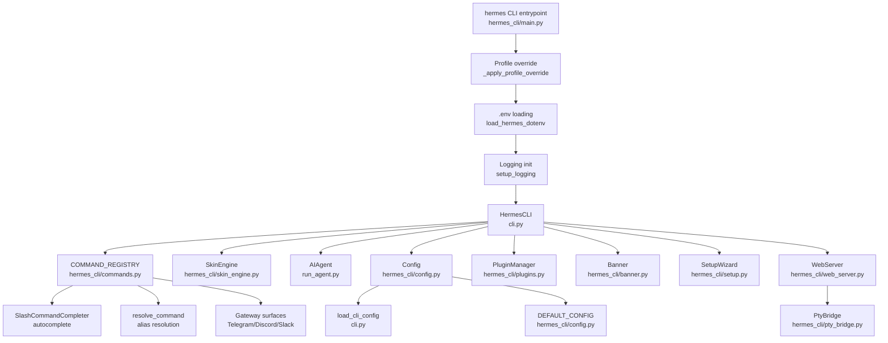
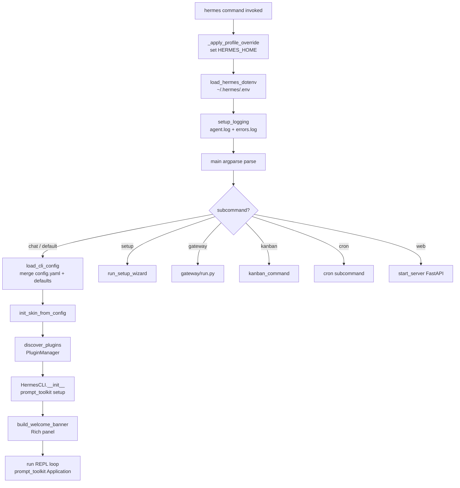
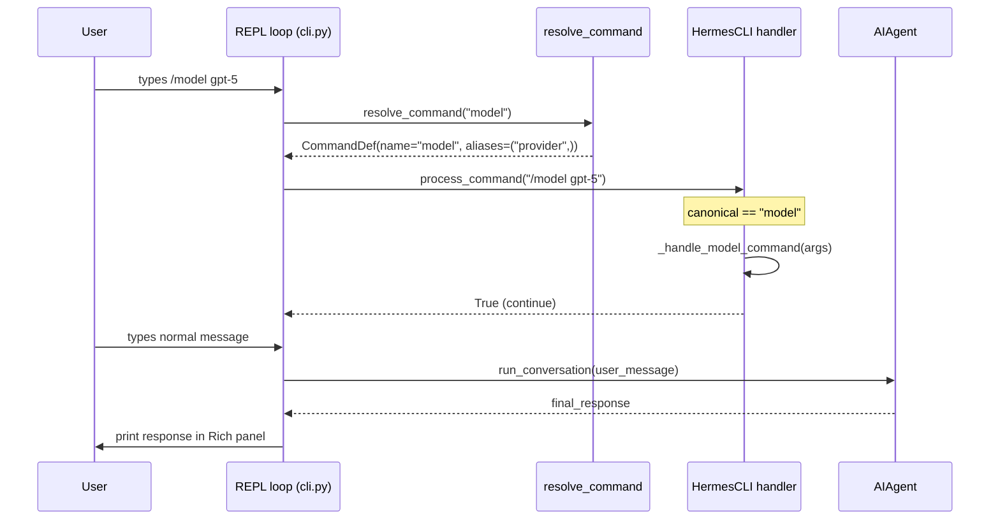

<details>
<summary>Relevant source files</summary>

- [cli.py](../cli.py)
- [hermes_cli/main.py](../hermes_cli/main.py)
- [hermes_cli/commands.py](../hermes_cli/commands.py)
- [hermes_cli/skin_engine.py](../hermes_cli/skin_engine.py)
- [hermes_cli/config.py](../hermes_cli/config.py)
- [hermes_cli/setup.py](../hermes_cli/setup.py)
- [hermes_cli/plugins.py](../hermes_cli/plugins.py)
- [hermes_cli/kanban.py](../hermes_cli/kanban.py)
- [hermes_cli/cron.py](../hermes_cli/cron.py)
- [hermes_cli/profiles.py](../hermes_cli/profiles.py)
- [hermes_cli/web_server.py](../hermes_cli/web_server.py)
- [hermes_cli/pty_bridge.py](../hermes_cli/pty_bridge.py)
- [hermes_cli/model_catalog.py](../hermes_cli/model_catalog.py)
- [hermes_cli/skills_hub.py](../hermes_cli/skills_hub.py)
- [hermes_cli/banner.py](../hermes_cli/banner.py)
</details>

# CLI

The CLI component is the primary interactive surface of Hermes Agent. It delivers a full REPL experience via the `HermesCLI` class (in [cli.py](../cli.py)), an argparse-based `hermes` entry-point (in [hermes_cli/main.py](../hermes_cli/main.py)), and a rich ecosystem of supporting modules: a central slash-command registry, a data-driven skin/theme engine, a plugin system, and CLI sub-surfaces for kanban boards, cron scheduling, profile management, skills discovery, and a web dashboard server.

The component bridges user intent—typed messages, slash commands, flags—to the `AIAgent` core loop and to tool infrastructure. All visible CLI features (help text, Telegram BotCommand menus, Slack subcommand maps, autocomplete, gateway dispatch) are derived from the single `COMMAND_REGISTRY` list in [hermes_cli/commands.py](../hermes_cli/commands.py), so new commands need only one file change.

---

## Architecture Diagram



---

## Key Concepts

- **`COMMAND_REGISTRY`** — The single source of truth for all slash commands. Every consumer (CLI help, gateway dispatch, Telegram menus, Slack subcommand maps, autocomplete) derives from this list. Adding a command means adding one `CommandDef` entry; adding an alias means adding a tuple value. Sources: [hermes_cli/commands.py:64](../hermes_cli/commands.py#L64)

- **`HermesCLI`** — The main REPL class built on `prompt_toolkit`. Manages the session lifecycle, display pipeline, slash command dispatch, streaming output, status bar, and interaction callbacks. Sources: [cli.py:2278](../cli.py#L2278)

- **Profile Override** — `_apply_profile_override()` in [hermes_cli/main.py](../hermes_cli/main.py) intercepts `--profile`/`-p` from `sys.argv` *before* any module imports, sets `HERMES_HOME`, and strips the flag. This ensures all module-level constants resolve to the correct profile path. Sources: [hermes_cli/main.py:121](../hermes_cli/main.py#L121)

- **Skin Engine** — Data-driven visual customization via YAML. `SkinConfig` encapsulates colors, spinner faces/verbs, branding strings, tool emoji overrides, and ASCII art. No code changes are required to add a new skin. Sources: [hermes_cli/skin_engine.py:130](../hermes_cli/skin_engine.py#L130)

- **Plugin System** — `PluginManager` discovers plugins from four sources (bundled, user, project, pip entry points) and allows plugins to register tools, lifecycle hooks, and CLI sub-commands via a `PluginContext`. Sources: [hermes_cli/plugins.py:1](../hermes_cli/plugins.py#L1)

- **`load_cli_config()`** — The CLI-specific config loader in [cli.py](../cli.py). Deep-merges hardcoded defaults with `~/.hermes/config.yaml`, bridges terminal/auxiliary settings to env vars, and initializes the skin engine. Distinct from `load_config()` in `hermes_cli/config.py`. Sources: [cli.py:266](../cli.py#L266)

- **PTY Bridge** — POSIX-only module wrapping `ptyprocess` to stream `hermes --tui` through a browser terminal emulator (xterm.js) in the web dashboard. Sources: [hermes_cli/pty_bridge.py:1](../hermes_cli/pty_bridge.py#L1)

---

## Component Structure

| File | Purpose | Key Symbols |
|---|---|---|
| [cli.py](../cli.py) | `HermesCLI` REPL class (~12k LOC). Main chat loop, slash-command dispatch, streaming display, status bar, session management. | `HermesCLI`, `load_cli_config()`, `process_command()`, `chat()` |
| [hermes_cli/main.py](../hermes_cli/main.py) | `hermes` argparse entry-point. Profile override, `.env` loading, logging init, argparse subcommand wiring. | `_apply_profile_override()`, `main()` |
| [hermes_cli/commands.py](../hermes_cli/commands.py) | Slash command registry. Single source of truth for all CLI and gateway commands. | `CommandDef`, `COMMAND_REGISTRY`, `resolve_command()`, `SlashCommandCompleter` |
| [hermes_cli/skin_engine.py](../hermes_cli/skin_engine.py) | Data-driven visual theme engine. Built-in skins + user YAML skins. | `SkinConfig`, `get_active_skin()`, `set_active_skin()`, `init_skin_from_config()` |
| [hermes_cli/config.py](../hermes_cli/config.py) | Config loading, saving, migration. Thread-safe with RLock; file-level cache. | `load_config()`, `save_config()`, `DEFAULT_CONFIG`, `OPTIONAL_ENV_VARS` |
| [hermes_cli/setup.py](../hermes_cli/setup.py) | Interactive multi-section setup wizard. | `run_setup_wizard()` |
| [hermes_cli/plugins.py](../hermes_cli/plugins.py) | Plugin discovery, loading, and lifecycle hook invocation. | `PluginManager`, `PluginContext`, `discover_plugins()`, `invoke_hook()` |
| [hermes_cli/kanban.py](../hermes_cli/kanban.py) | `hermes kanban` CLI subcommand — 15-verb board interface. | `kanban_command()`, `build_parser()` |
| [hermes_cli/cron.py](../hermes_cli/cron.py) | `hermes cron` CLI subcommand — list/create/edit/pause/run/remove jobs. | `cron_list()`, `cron_create()` |
| [hermes_cli/profiles.py](../hermes_cli/profiles.py) | Profile management — create/clone/delete isolated HERMES_HOME directories. | `_PROFILE_ID_RE`, `resolve_profile_env()`, `seed_profile_skills()` |
| [hermes_cli/web_server.py](../hermes_cli/web_server.py) | FastAPI web dashboard server. REST API for config/sessions, WebSocket PTY. | `app`, `start_server()`, `/api/pty` WebSocket |
| [hermes_cli/pty_bridge.py](../hermes_cli/pty_bridge.py) | POSIX PTY wrapper for browser-embedded `hermes --tui`. | `PtyBridge`, `PtyBridge.spawn()`, `PtyUnavailableError` |
| [hermes_cli/model_catalog.py](../hermes_cli/model_catalog.py) | Remote model catalog fetcher with disk cache and TTL. | `get_catalog()`, `get_curated_openrouter_models()` |
| [hermes_cli/skills_hub.py](../hermes_cli/skills_hub.py) | `hermes skills` and `/skills` command handler — search, browse, install. | `do_search()`, `do_install()`, `_resolve_short_name()` |
| [hermes_cli/banner.py](../hermes_cli/banner.py) | ASCII art logo, caduceus art, welcome banner builder. Skin-aware. | `build_welcome_banner()`, `HERMES_AGENT_LOGO`, `HERMES_CADUCEUS` |

---

## Core Flows

### CLI Startup



Sources: [hermes_cli/main.py:121](../hermes_cli/main.py#L121), [cli.py:600](../cli.py#L600)

### Slash Command Dispatch



Sources: [cli.py:7236](../cli.py#L7236), [hermes_cli/commands.py:240](../hermes_cli/commands.py#L240)

---

## Public API / Key Interfaces

### `HermesCLI` class — [cli.py:2278](../cli.py#L2278)

```python
class HermesCLI:
    def __init__(
        self,
        model: str = None,
        toolsets: List[str] = None,
        provider: str = None,
        api_key: str = None,
        base_url: str = None,
        max_turns: int = None,
        verbose: bool = False,
        compact: bool = False,
        resume: str = None,
        checkpoints: bool = False,
        pass_session_id: bool = False,
        ignore_rules: bool = False,
    ): ...

    def process_command(self, command: str) -> bool:
        """Dispatch a slash command. Returns False to exit."""

    def chat(self, message, images: list = None) -> Optional[str]:
        """Send a message to the agent and stream/display response."""
```

Sources: [cli.py:2278](../cli.py#L2278), [cli.py:7236](../cli.py#L7236), [cli.py:10176](../cli.py#L10176)

### `CommandDef` and `COMMAND_REGISTRY` — [hermes_cli/commands.py:43](../hermes_cli/commands.py#L43)

```python
@dataclass(frozen=True)
class CommandDef:
    name: str               # canonical name without slash
    description: str
    category: str           # "Session", "Configuration", "Tools & Skills", "Info", "Exit"
    aliases: tuple[str, ...] = ()
    args_hint: str = ""     # "<prompt>" = required, "[name]" = optional
    subcommands: tuple[str, ...] = ()  # for tab-complete
    cli_only: bool = False
    gateway_only: bool = False
    gateway_config_gate: str | None = None  # config dotpath that enables in gateway

COMMAND_REGISTRY: list[CommandDef] = [...]  # ~70 commands

def resolve_command(name: str) -> CommandDef | None:
    """Resolve a command name or alias (with or without leading /) to its CommandDef."""
```

Sources: [hermes_cli/commands.py:43](../hermes_cli/commands.py#L43), [hermes_cli/commands.py:238](../hermes_cli/commands.py#L238)

### `SkinConfig` and skin engine — [hermes_cli/skin_engine.py:130](../hermes_cli/skin_engine.py#L130)

```python
@dataclass
class SkinConfig:
    name: str
    description: str = ""
    colors: Dict[str, str] = field(default_factory=dict)
    spinner: Dict[str, Any] = field(default_factory=dict)
    branding: Dict[str, str] = field(default_factory=dict)
    tool_prefix: str = "┊"
    tool_emojis: Dict[str, str] = field(default_factory=dict)
    banner_logo: str = ""
    banner_hero: str = ""

    def get_color(self, key: str, fallback: str = "") -> str: ...
    def get_branding(self, key: str, fallback: str = "") -> str: ...
    def get_spinner_wings(self) -> List[Tuple[str, str]]: ...

# Module-level API
def get_active_skin() -> SkinConfig: ...
def set_active_skin(name: str) -> None: ...
def init_skin_from_config(config: dict) -> None: ...
def list_skins() -> list[str]: ...
```

Sources: [hermes_cli/skin_engine.py:130](../hermes_cli/skin_engine.py#L130)

### `PluginContext` — [hermes_cli/plugins.py](../hermes_cli/plugins.py)

```python
class PluginContext:
    def register_hook(self, hook_name: str, callback: Callable) -> None:
        """Register a lifecycle hook: pre_tool_call, post_tool_call,
           pre_llm_call, post_llm_call, on_session_start, on_session_end"""

    def register_tool(self, name: str, schema: dict, handler: Callable,
                      toolset: str = "plugin", ...) -> None:
        """Register a new tool (delegates to tools.registry)."""

    def register_cli_command(self, name: str, description: str,
                              handler: Callable, args_hint: str = "") -> None:
        """Register a plugin slash command visible in CLI and gateway surfaces."""
```

Sources: [hermes_cli/plugins.py:120](../hermes_cli/plugins.py#L120)

### `PtyBridge` — [hermes_cli/pty_bridge.py:70](../hermes_cli/pty_bridge.py#L70)

```python
class PtyBridge:
    @classmethod
    def is_available(cls) -> bool: ...

    @classmethod
    def spawn(cls, argv: Sequence[str], *, cwd=None, env=None,
              cols=80, rows=24) -> "PtyBridge": ...

    def read(self, timeout: float = 0.2) -> Optional[bytes]: ...
    def write(self, data: bytes) -> None: ...
    def resize(self, cols: int, rows: int) -> None: ...
    def terminate(self) -> None: ...
```

Sources: [hermes_cli/pty_bridge.py:70](../hermes_cli/pty_bridge.py#L70)

### `load_cli_config()` — [cli.py:266](../cli.py#L266)

Merges hardcoded defaults with `~/.hermes/config.yaml` and bridges terminal/auxiliary/security settings to env vars so downstream tool code can read them without knowing about `config.yaml`. Returns the merged `dict`.

Sources: [cli.py:266](../cli.py#L266)

---

## Configuration

### Config file locations

| File | Purpose |
|---|---|
| `~/.hermes/config.yaml` | Primary user config — model, toolsets, display, terminal, delegation, etc. |
| `~/.hermes/.env` | Secrets only (API keys, tokens) |
| `~/.hermes/skins/<name>.yaml` | User-installed custom skins |
| `~/.hermes/active_profile` | Sticky default profile name |

### Selected `config.yaml` keys relevant to CLI

| Key | Default | Effect |
|---|---|---|
| `display.skin` | `"default"` | Active skin name. Changed at runtime via `/skin`. |
| `display.streaming` | `false` | Stream tokens to the terminal as they arrive. |
| `display.tool_progress` | `"all"` | Tool output verbosity: `off` / `new` / `all` / `verbose`. |
| `display.compact` | `false` | Compact display mode (shorter banner). |
| `display.busy_input_mode` | `"interrupt"` | What Enter does while agent is running: `interrupt` / `queue` / `steer`. |
| `display.show_reasoning` | `false` | Display model thinking/reasoning before the response. |
| `display.persistent_output` | `true` | Keep a scrollback buffer of terminal output. |
| `display.inline_diffs` | `true` | Show inline diff previews for file-write tools. |
| `agent.max_turns` | `90` | Maximum tool-calling iterations. |
| `agent.reasoning_effort` | `""` | Reasoning effort level sent to the provider. |
| `agent.system_prompt` | `""` | Additional system prompt injected into every session. |
| `terminal.backend` | `"local"` | Terminal backend: `local`, `docker`, `ssh`, `modal`, etc. |
| `model_catalog.enabled` | `true` | Whether to fetch the remote model catalog. |
| `model_catalog.ttl_hours` | `24` | Cache TTL for the remote catalog. |
| `model_catalog.url` | catalog endpoint | Override the catalog URL. |

Sources: [cli.py:356](../cli.py#L356), [hermes_cli/model_catalog.py:95](../hermes_cli/model_catalog.py#L95)

### Key environment variables

| Variable | Effect |
|---|---|
| `HERMES_HOME` | Override the profile home directory (set automatically by `_apply_profile_override`). |
| `HERMES_IGNORE_USER_CONFIG` | Skip `~/.hermes/config.yaml` (use built-in defaults only). |
| `HERMES_QUIET` | Suppress startup messages. |
| `HERMES_PLUGINS_DEBUG` | Verbose plugin discovery logging to stderr. |
| `HERMES_BUNDLED_PLUGINS` | Override bundled plugins directory (Nix/packaged installs). |
| `HERMES_WEB_DIST` | Override web UI static files directory. |
| `HERMES_DASHBOARD_TUI` / `HERMES_DASHBOARD_CHAT_ENABLED` | Enable embedded `hermes --tui` in the dashboard. |
| `TERMINAL_ENV` | Terminal backend type (bridged from `terminal.backend`). |
| `TERMINAL_CWD` | Terminal working directory. For CLI, always `os.getcwd()`. |

Sources: [cli.py:520](../cli.py#L520), [hermes_cli/main.py:1](../hermes_cli/main.py#L1)

---

## Dependencies

| Dependency | Why |
|---|---|
| **CoreAgent** (`run_agent.py`) | `HermesCLI` instantiates `AIAgent` and calls `run_conversation()` for every user message. |
| **AgentInternals** (`agent/`) | Display utilities (`agent/display.py`), usage pricing, markdown table rendering, skill commands, context compressor. |
| **Tools** (`tools/`, `toolsets.py`) | `get_tool_definitions()`, `get_toolset_for_tool()`, terminal cleanup, browser cleanup on exit, skills tool. |
| **Gateway** (`gateway/`) | `get_running_pid()`, `read_runtime_status()` for dashboard status; `gateway/status.py` for scoped locks. |
| **`prompt_toolkit`** | Fixed input area TUI, autocomplete, history, key bindings, `patch_stdout`. |
| **Rich** | Banner panels, response box, tables, console output. |
| **FastAPI + uvicorn** | Web dashboard server (optional, only for `hermes web`). |
| **`ptyprocess`** | PTY spawning for dashboard chat tab (POSIX-only, optional). |
| **`yaml`** | Config file parsing. |

---

## Extension Points

### Adding a Slash Command

1. Add a `CommandDef` entry to `COMMAND_REGISTRY` in [hermes_cli/commands.py:64](../hermes_cli/commands.py#L64):

```python
CommandDef(
    "mycommand",
    "Short description of what it does",
    "Session",               # category
    aliases=("mc",),
    args_hint="[arg]",
    cli_only=True,           # omit to expose in gateway too
),
```

2. Add a handler in `HermesCLI.process_command()` in [cli.py:7236](../cli.py#L7236):

```python
elif canonical == "mycommand":
    self._handle_mycommand(cmd_original)
```

3. If gateway-available, add a handler in `gateway/run.py`.

All downstream consumers (autocomplete, help text, Telegram menu, Slack mapping, gateway bypass set) update automatically from the registry — no other changes needed.

Sources: [hermes_cli/commands.py:64](../hermes_cli/commands.py#L64), [cli.py:7236](../cli.py#L7236)

### Adding an Alias

Add the alias to the `aliases` tuple of the existing `CommandDef`. One line change; everything else updates automatically.

### Adding a Built-in Skin

Add an entry to `_BUILTIN_SKINS` in [hermes_cli/skin_engine.py](../hermes_cli/skin_engine.py). All keys are optional; missing values inherit from the `"default"` skin. Built-in skins: `default`, `ares`, `mono`, `slate`, `daylight`, `warm-lightmode`.

```python
"mytheme": {
    "name": "mytheme",
    "description": "My custom theme",
    "colors": { "banner_border": "#FF00FF", ... },
    "spinner": { "thinking_verbs": ["hacking", "computing"] },
    "branding": { "agent_name": "My Agent", "prompt_symbol": ">" },
    "tool_prefix": "▏",
},
```

Sources: [hermes_cli/skin_engine.py:165](../hermes_cli/skin_engine.py#L165)

### Adding a User Skin (YAML)

Drop a file at `~/.hermes/skins/<name>.yaml` following the schema documented at the top of [hermes_cli/skin_engine.py](../hermes_cli/skin_engine.py#L1). Activate with `/skin <name>` or `display.skin: <name>` in `config.yaml`.

### Adding a Plugin with a CLI Command

Create `~/.hermes/plugins/<name>/plugin.yaml` and `__init__.py`:

```python
def register(ctx):
    ctx.register_cli_command(
        name="myplugin",
        description="Does something useful",
        handler=my_handler,
        args_hint="[subcommand]",
    )
```

Plugin commands appear in the Telegram BotCommand menu, Slack subcommand mapping, Discord native slash commands, and autocomplete without any core file changes.

Sources: [hermes_cli/plugins.py:1](../hermes_cli/plugins.py#L1), [hermes_cli/commands.py:470](../hermes_cli/commands.py#L470)

### Adding a Profile

```bash
hermes profile create myprofile          # fresh isolated HERMES_HOME
hermes profile create myprofile --clone  # copy config + .env + SOUL.md + memories
hermes -p myprofile chat                 # use the profile
hermes profile use myprofile             # set as sticky default
```

Profiles live under `~/.hermes/profiles/<name>/` and are discovered by `hermes_cli/profiles.py`. The profile name must match `[a-z0-9][a-z0-9_-]{0,63}`. Sources: [hermes_cli/profiles.py:1](../hermes_cli/profiles.py#L1)

---

## Summary

The CLI component acts as the orchestration layer between user input and the agent engine. Its design keeps visual themes, command definitions, and plugin commands as pure data, making customization straightforward without modifying core logic. The `COMMAND_REGISTRY` pattern ensures consistency across every consumer (CLI, gateway, Telegram, Slack, Discord, autocomplete) from a single source of truth. The PTY bridge and web server extend the same `hermes --tui` experience into a browser, meaning all new Ink-side features appear in the dashboard automatically.
