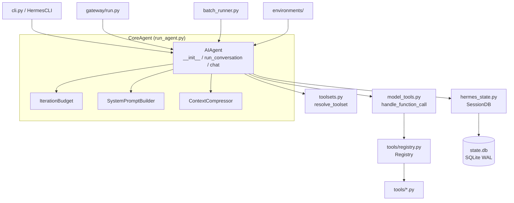
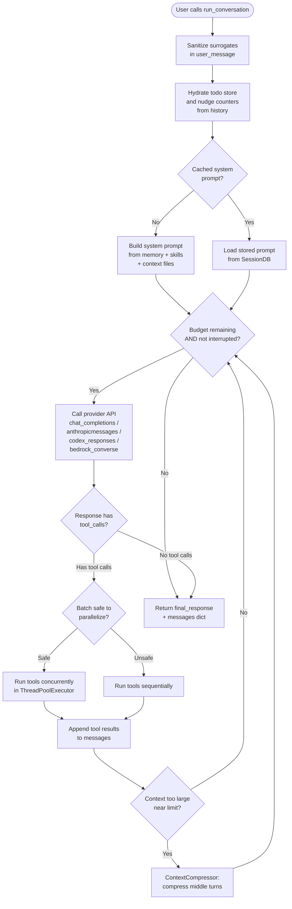
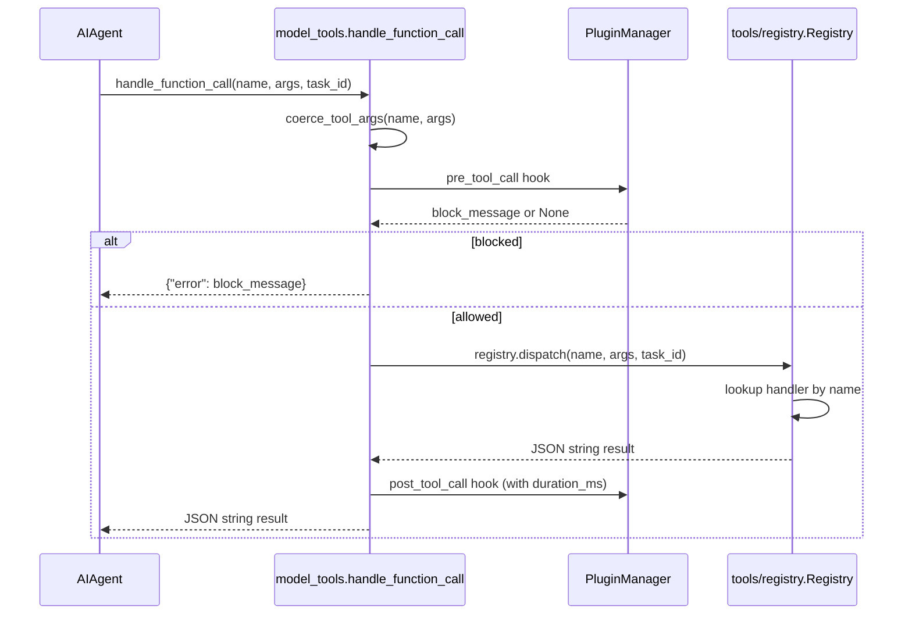
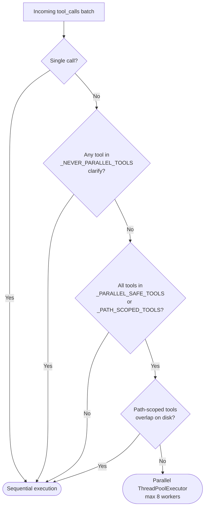

<details>
<summary>Relevant source files</summary>

- [run_agent.py](../run_agent.py)
- [model_tools.py](../model_tools.py)
- [toolsets.py](../toolsets.py)
- [batch_runner.py](../batch_runner.py)
- [utils.py](../utils.py)
- [hermes_state.py](../hermes_state.py)
- [hermes_constants.py](../hermes_constants.py)
- [hermes_logging.py](../hermes_logging.py)
- [hermes_time.py](../hermes_time.py)
- [toolset_distributions.py](../toolset_distributions.py)
- [trajectory_compressor.py](../trajectory_compressor.py)
</details>

# CoreAgent

The CoreAgent is the load-bearing runtime of hermes-agent. It contains the `AIAgent` class that drives every agent interaction — managing the conversation loop, dispatching tool calls, enforcing iteration budgets, persisting sessions, and routing to the correct provider API. Every other subsystem (CLI, gateway, batch runner, RL environments) creates an `AIAgent` instance and delegates all model interaction to it.

The component spans ~12,000 lines in `run_agent.py` alone and integrates with the tool registry (`model_tools.py`), the toolset definition layer (`toolsets.py`), the SQLite session store (`hermes_state.py`), and a suite of thin utility modules (`hermes_constants.py`, `hermes_logging.py`, `hermes_time.py`). The batch runner (`batch_runner.py`) and trajectory compressor (`trajectory_compressor.py`) sit alongside as first-class consumers of this runtime.

---

## Architecture Diagram

The diagram below shows how the main modules relate at a process level.



Sources: [run_agent.py:1](../run_agent.py#L1), [model_tools.py:1](../model_tools.py#L1), [hermes_state.py:1](../hermes_state.py#L1)

---

## Key Concepts

- **`AIAgent`** — the central class. One instance per conversation turn (gateway) or one long-lived instance (CLI). Owns the conversation loop, provider selection, fallback logic, and tool dispatch.
- **`IterationBudget`** — thread-safe counter that caps the number of model API calls (`max_iterations`, default 90). Each subagent spawned by `delegate_task` receives its own independent budget.
- **`run_conversation()`** — the main entry point for a single user turn. Returns `{"final_response": str, "messages": list}`.
- **`chat()`** — thin wrapper over `run_conversation()` for callers that only want the response string.
- **`get_tool_definitions()`** — memoized function in `model_tools.py` that resolves the enabled/disabled toolset filter to a list of OpenAI-format tool schemas for the API call.
- **`handle_function_call()`** — single dispatch point in `model_tools.py` for all tool invocations; fires pre/post plugin hooks, measures latency, and delegates to `registry.dispatch()`.
- **`_HERMES_CORE_TOOLS`** — the canonical list in `toolsets.py` of tools bundled into every default platform toolset.
- **`SessionDB`** — SQLite-backed session store in `hermes_state.py`; uses WAL mode for concurrent access with automatic fallback to `DELETE` mode on NFS/SMB.
- **API modes** — the agent auto-detects and routes to one of: `chat_completions`, `codex_responses`, `anthropic_messages`, or `bedrock_converse`.
- **Prompt caching** — system prompt is built once per session and reused across turns; rebuilding invalidates Anthropic prefix caching and drives up costs.

---

## Component Structure

| File | Role | Key Symbols |
|---|---|---|
| [run_agent.py](../run_agent.py) | `AIAgent` class — conversation loop, provider routing, tool dispatch orchestration, ~12 k LOC | `AIAgent`, `IterationBudget`, `_should_parallelize_tool_batch`, `_repair_tool_call_arguments` |
| [model_tools.py](../model_tools.py) | Thin orchestration over the tool registry; tool schema resolution and function call dispatch | `get_tool_definitions`, `handle_function_call`, `TOOL_TO_TOOLSET_MAP`, `_run_async` |
| [toolsets.py](../toolsets.py) | Toolset definitions, `_HERMES_CORE_TOOLS` list, `TOOLSETS` dict | `_HERMES_CORE_TOOLS`, `TOOLSETS`, `resolve_toolset`, `validate_toolset` |
| [batch_runner.py](../batch_runner.py) | Parallel batch processing of prompts from a JSONL dataset; checkpointing; trajectory export | `BatchRunner`, `_extract_tool_stats`, `_normalize_tool_stats` |
| [hermes_state.py](../hermes_state.py) | SQLite session store with FTS5 full-text search; WAL mode with NFS fallback | `SessionDB`, `apply_wal_with_fallback`, `DEFAULT_DB_PATH`, `SCHEMA_VERSION` |
| [hermes_constants.py](../hermes_constants.py) | Profile-aware path helpers; single source of truth for `HERMES_HOME` | `get_hermes_home`, `display_hermes_home`, `get_hermes_dir` |
| [hermes_logging.py](../hermes_logging.py) | Centralized `setup_logging()`; per-session log tagging; `RedactingFormatter` | `setup_logging`, `set_session_context`, `clear_session_context`, `COMPONENT_PREFIXES` |
| [hermes_time.py](../hermes_time.py) | Timezone-aware `now()` helper; reads `HERMES_TIMEZONE` env or `timezone` config key | `now`, `get_timezone`, `reset_cache` |
| [toolset_distributions.py](../toolset_distributions.py) | Named toolset probability distributions for batch data generation runs | `DISTRIBUTIONS`, `sample_toolsets_from_distribution`, `list_distributions` |
| [trajectory_compressor.py](../trajectory_compressor.py) | Post-processes saved trajectories to compress them under a token budget | `TrajectoryCompressor`, `CompressionConfig` |
| [utils.py](../utils.py) | Shared utilities: atomic file writes, env-var parsing, URL helpers | `atomic_json_write`, `env_var_enabled`, `atomic_replace` |

### Notable line-level anchors

| Symbol | Location |
|---|---|
| `AIAgent.__init__` | [run_agent.py:986](../run_agent.py#L986) |
| `AIAgent.run_conversation` | [run_agent.py:11592](../run_agent.py#L11592) |
| `AIAgent.chat` | [run_agent.py:15448](../run_agent.py#L15448) |
| `IterationBudget` | [run_agent.py:292](../run_agent.py#L292) |
| `_HERMES_CORE_TOOLS` | [toolsets.py:30](../toolsets.py#L30) |
| `TOOLSETS` | [toolsets.py:75](../toolsets.py#L75) |
| `get_tool_definitions` | [model_tools.py:265](../model_tools.py#L265) |
| `handle_function_call` | [model_tools.py:697](../model_tools.py#L697) |
| `SessionDB` schema | [hermes_state.py:200](../hermes_state.py#L200) |
| `get_hermes_home` | [hermes_constants.py:14](../hermes_constants.py#L14) |

---

## Core Flows

### Conversation Loop

The diagram below traces one user turn from `run_conversation()` to final response.



Sources: [run_agent.py:11592](../run_agent.py#L11592), [run_agent.py:360](../run_agent.py#L360)

### Tool Call Dispatch



Sources: [model_tools.py:697](../model_tools.py#L697), [model_tools.py:730](../model_tools.py#L730)

### Parallel vs Sequential Tool Execution

When the model returns multiple tool calls in a single response, `_should_parallelize_tool_batch()` decides whether to run them concurrently:



Sources: [run_agent.py:350](../run_agent.py#L350), [run_agent.py:410](../run_agent.py#L410)

---

## Public API / Key Interfaces

### `AIAgent.__init__`

[run_agent.py:986](../run_agent.py#L986)

```python
class AIAgent:
    def __init__(
        self,
        base_url: str = None,
        api_key: str = None,
        provider: str = None,
        api_mode: str = None,           # "chat_completions" | "codex_responses" | "anthropic_messages" | "bedrock_converse"
        model: str = "",
        max_iterations: int = 90,
        tool_delay: float = 1.0,
        enabled_toolsets: List[str] = None,
        disabled_toolsets: List[str] = None,
        save_trajectories: bool = False,
        quiet_mode: bool = False,
        ephemeral_system_prompt: str = None,
        platform: str = None,           # "cli" | "telegram" | "discord" | ...
        session_id: str = None,
        skip_context_files: bool = False,
        skip_memory: bool = False,
        session_db=None,
        iteration_budget: IterationBudget = None,
        fallback_model: Dict[str, Any] = None,
        credential_pool=None,
        # ... callbacks, IDs, checkpoints config, ...
    )
```

The constructor auto-detects `api_mode` from `provider` name and `base_url` pattern. The `enabled_toolsets` / `disabled_toolsets` parameters filter which tools are exposed to the model (tool schemas are computed once and cached).

### `AIAgent.run_conversation`

[run_agent.py:11592](../run_agent.py#L11592)

```python
def run_conversation(
    self,
    user_message: str,
    system_message: str = None,
    conversation_history: List[Dict[str, Any]] = None,
    task_id: str = None,
    stream_callback: Optional[callable] = None,
    persist_user_message: Optional[str] = None,
) -> Dict[str, Any]:
    # Returns {"final_response": str, "messages": list, ...}
```

The full interface for a single turn. Pass `conversation_history` to continue an existing session. `task_id` scopes terminal/browser environments; auto-generated when absent.

### `AIAgent.chat`

[run_agent.py:15448](../run_agent.py#L15448)

```python
def chat(self, message: str, stream_callback: Optional[callable] = None) -> str:
    """Simple interface — returns final response string."""
```

Convenience wrapper for callers (tests, scripts) that don't need the full message history.

### `IterationBudget`

[run_agent.py:292](../run_agent.py#L292)

```python
class IterationBudget:
    def __init__(self, max_total: int): ...
    def consume(self) -> bool: ...   # Returns False when budget exhausted
    def refund(self) -> None: ...    # execute_code turns refund one iteration
    @property
    def remaining(self) -> int: ...
```

Thread-safe counter. Parent agents pass their budget to subagents via `iteration_budget=` so total cross-agent API calls are bounded.

### `get_tool_definitions` — model_tools.py

[model_tools.py:265](../model_tools.py#L265)

```python
def get_tool_definitions(
    enabled_toolsets: List[str] = None,
    disabled_toolsets: List[str] = None,
    quiet_mode: bool = False,
) -> List[Dict[str, Any]]:
```

Returns OpenAI-format tool schemas filtered by the toolset config. Memoized: cache key is `(frozenset(enabled), frozenset(disabled), registry._generation, config_mtime)`. Dynamic schemas (Discord intents, `execute_code` sandbox tools) are rebuilt on every cache miss.

### `handle_function_call` — model_tools.py

[model_tools.py:697](../model_tools.py#L697)

```python
def handle_function_call(
    function_name: str,
    function_args: Dict[str, Any],
    task_id: Optional[str] = None,
    tool_call_id: Optional[str] = None,
    session_id: Optional[str] = None,
    user_task: Optional[str] = None,
    enabled_tools: Optional[List[str]] = None,
    skip_pre_tool_call_hook: bool = False,
) -> str:   # always returns a JSON string
```

### `SessionDB` — hermes_state.py

[hermes_state.py:14](../hermes_state.py#L14)

The SQLite database at `~/.hermes/state.db` (schema version 11). Key tables:

| Table | Purpose |
|---|---|
| `sessions` | One row per agent session; metadata + token/cost accounting |
| `messages` | One row per message; full content + tool call/result linkage |
| `messages_fts` | FTS5 virtual table for fast full-text search across all messages |
| `messages_fts_trigram` | FTS5 trigram table for CJK and substring search |
| `state_meta` | Key-value store for process-wide state |

---

## Configuration

### config.yaml keys (relevant to CoreAgent)

| Key | Default | Purpose |
|---|---|---|
| `model.name` | `""` | Active model; resolved by provider plugins |
| `agent.max_iterations` | `90` | Maximum tool-calling iterations per turn |
| `delegation.max_iterations` | `50` | Per-subagent iteration cap |
| `delegation.max_concurrent_children` | `3` | Parallel subagent concurrency cap |
| `delegation.child_timeout_seconds` | — | Timeout for a child `delegate_task` |
| `memory.provider` | `""` | Active memory backend plugin |
| `memory.nudge_interval` | — | How many turns before an automatic memory review |
| `checkpoints.enabled` | `false` | Enable mid-turn conversation snapshots |
| `checkpoints.max_snapshots` | `20` | Per-session snapshot retention limit |
| `timezone` | `""` | IANA timezone name for `hermes_time.now()` |
| `tools.<platform>.enabled` | `[]` | Toolsets enabled for a platform |
| `tools.<platform>.disabled` | `[]` | Toolsets disabled for a platform |

### Environment variables

| Variable | Purpose |
|---|---|
| `HERMES_HOME` | Override `~/.hermes` home directory (profile support) |
| `HERMES_TIMEZONE` | Override timezone used by `hermes_time.now()` |
| `HERMES_OPTIONAL_SKILLS` | Override path to optional-skills directory |
| `HTTPS_PROXY` / `HTTP_PROXY` / `ALL_PROXY` | Proxy for outbound API requests |
| `NO_PROXY` | Hosts to bypass proxy |
| `HERMES_BACKGROUND_NOTIFICATIONS` | `all` / `result` / `error` / `off` — background process verbosity |
| `HERMES_KANBAN_TASK` | Presence gates kanban worker tools in the schema |
| `HERMES_KANBAN_BOARD` | Scopes a worker to a specific kanban board |

Sources: [hermes_constants.py:14](../hermes_constants.py#L14), [hermes_time.py:1](../hermes_time.py#L1), [run_agent.py:262](../run_agent.py#L262)

---

## Dependencies

| Dependency | Why |
|---|---|
| **AgentInternals** (`agent/` package) | Prompt building, context compression, memory management, provider adapters, display utilities, tool guardrails |
| **Tools** (`tools/` package) | All executable tool handlers; auto-discovered via `tools/registry.py` |
| **Plugins** (`hermes_cli/plugins.py`) | Pre/post tool call hooks, lifecycle hooks (`on_session_start`), additional registered tools |
| `openai` SDK | Chat completions and Responses API transport |
| `anthropic` SDK | Native Anthropic Messages API transport (via `agent/anthropic_adapter.py`) |
| `rich` | Progress rendering in batch runner |
| `sqlite3` (stdlib) | Session persistence in `hermes_state.py` |
| `threading` (stdlib) | Parallel tool execution, async bridging event loops |

The dependency chain is strictly ordered:

```
tools/registry.py  →  tools/*.py  →  model_tools.py  →  run_agent.py
```

`model_tools.py` triggers `discover_builtin_tools()` (and `discover_plugins()`) as a module-level side effect on import. Any file importing `model_tools` — directly or transitively — causes full tool discovery.

Sources: [model_tools.py:175](../model_tools.py#L175), [run_agent.py:120](../run_agent.py#L120)

---

## Extension Points

### Adding or replacing tools

Tools auto-register via `tools/registry.py`. To add a **core** tool:
1. Create `tools/your_tool.py` with a `registry.register(...)` call at module top level.
2. Add the tool name to `_HERMES_CORE_TOOLS` in [toolsets.py:30](../toolsets.py#L30) (or a named toolset in `TOOLSETS`).

For **custom / user tools** without modifying the repo, create a plugin under `~/.hermes/plugins/<name>/` with `plugin.yaml` + `__init__.py` calling `ctx.register_tool(...)`.

### Adding toolset distributions (batch runs)

Extend the `DISTRIBUTIONS` dict in [toolset_distributions.py:27](../toolset_distributions.py#L27) with a new entry mapping toolset names to selection probabilities. Used by `batch_runner.py --distribution=<name>`.

### Provider-specific API mode

`AIAgent.__init__` auto-detects `api_mode` from `provider` string and `base_url`. To add a new provider, register a `ProviderProfile` in `plugins/model-providers/<name>/__init__.py`; the auto-detection heuristics in `run_agent.py` cover well-known hostnames and provider identifiers.

### Plugin lifecycle hooks

Register hooks via `ctx.register_hook("pre_tool_call", fn)` or `ctx.register_hook("on_session_start", fn)` in a plugin's `register(ctx)` function. Available hooks:

| Hook | Fires |
|---|---|
| `pre_tool_call` | Before every tool invocation; can return a block directive |
| `post_tool_call` | After every tool invocation; receives result + `duration_ms` |
| `pre_llm_call` | Before every model API call |
| `post_llm_call` | After every model API call |
| `on_session_start` | Once, when a new session is created |
| `on_session_end` | Once, when a session ends |

Sources: [model_tools.py:697](../model_tools.py#L697), [hermes_state.py:1](../hermes_state.py#L1), [toolsets.py:30](../toolsets.py#L30)

### Prompt caching safety rule

**Do not invalidate the system prompt mid-conversation.** `_cached_system_prompt` is set once on the first `run_conversation` call and reused for every subsequent turn. Rebuilding it breaks Anthropic prefix caching and dramatically increases cost. The only sanctioned rebuild path is after context compression.

Sources: [run_agent.py:11830](../run_agent.py#L11830)
