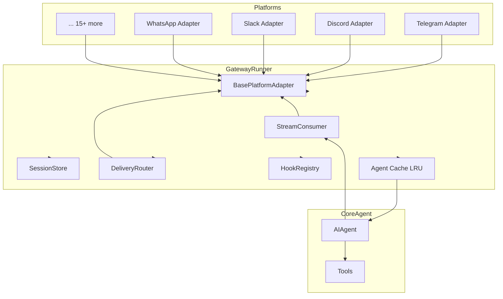
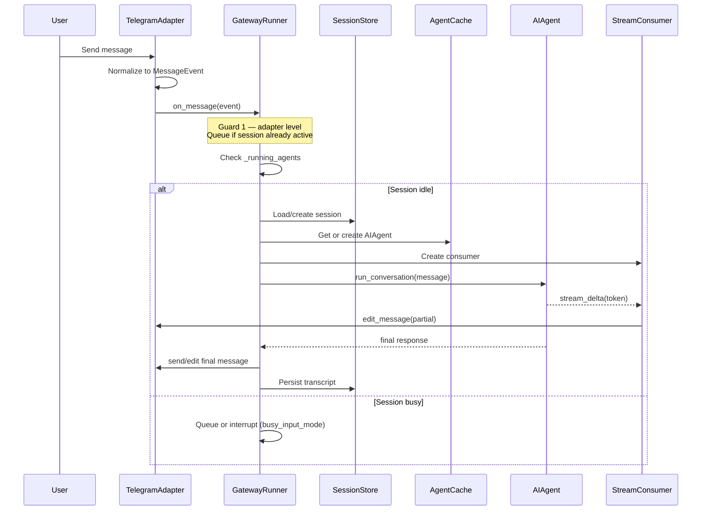
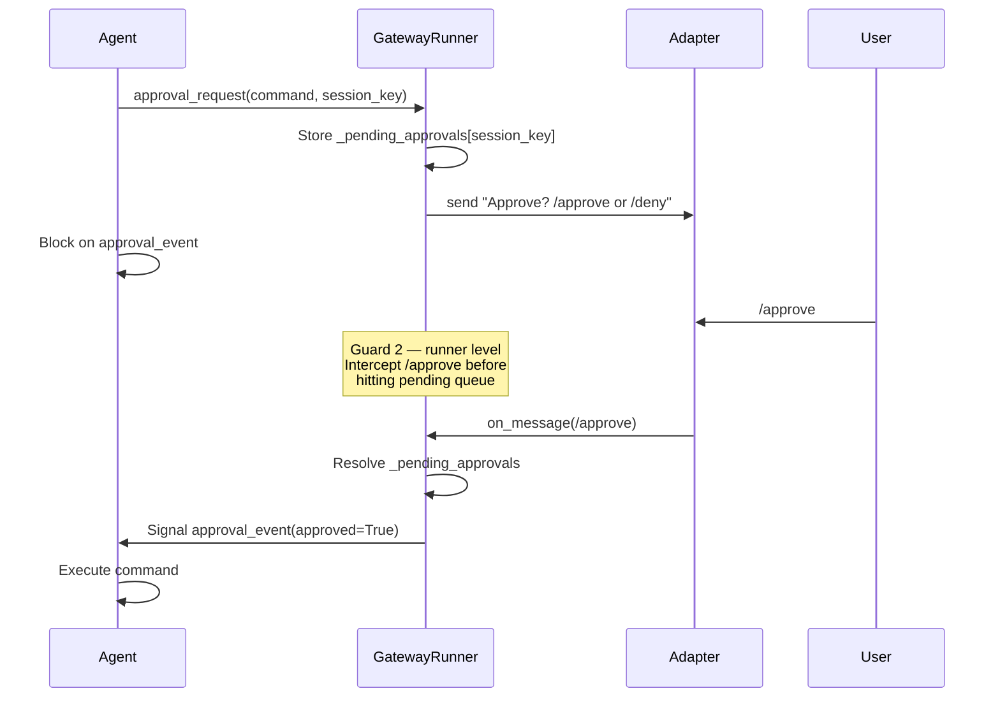
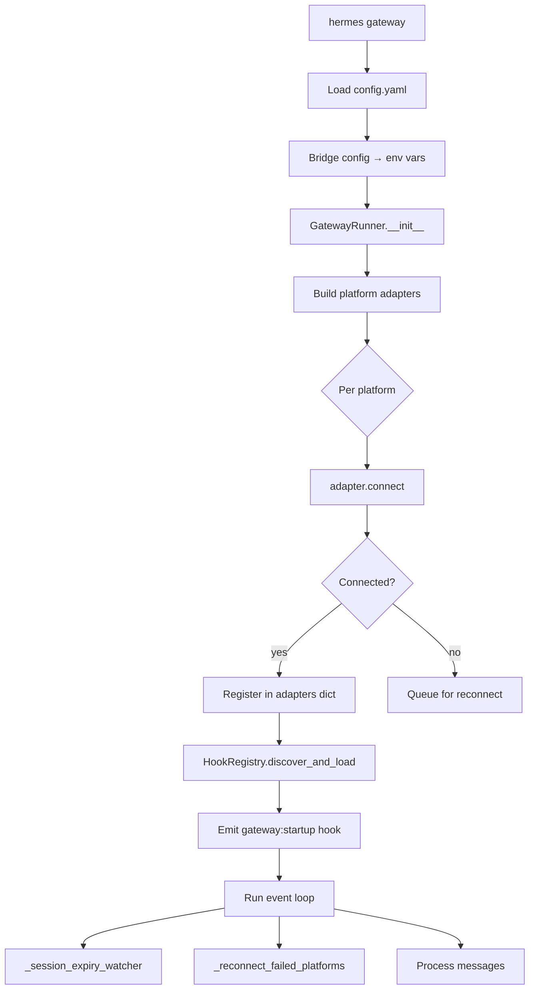

<details>
<summary>Relevant source files</summary>

- [gateway/run.py](../gateway/run.py)
- [gateway/session.py](../gateway/session.py)
- [gateway/session_context.py](../gateway/session_context.py)
- [gateway/config.py](../gateway/config.py)
- [gateway/hooks.py](../gateway/hooks.py)
- [gateway/delivery.py](../gateway/delivery.py)
- [gateway/status.py](../gateway/status.py)
- [gateway/stream_consumer.py](../gateway/stream_consumer.py)
- [gateway/mirror.py](../gateway/mirror.py)
- [gateway/platform_registry.py](../gateway/platform_registry.py)
- [gateway/platforms/base.py](../gateway/platforms/base.py)
- [gateway/platforms/telegram.py](../gateway/platforms/telegram.py)
- [gateway/platforms/discord.py](../gateway/platforms/discord.py)
- [gateway/platforms/slack.py](../gateway/platforms/slack.py)
- [gateway/platforms/ADDING_A_PLATFORM.md](../gateway/platforms/ADDING_A_PLATFORM.md)
</details>

# Gateway

The Gateway is Hermes's messaging bridge — a long-lived asyncio daemon that connects the `AIAgent` core to external platforms (Telegram, Discord, Slack, WhatsApp, Matrix, Email, SMS, DingTalk, WeCom, and more). Each inbound message is normalized into a `MessageEvent`, routed through the session lifecycle, dispatched to the agent, and the reply is delivered back to the originating platform. The gateway also manages approval flows, streaming output, slash commands, event hooks, cron delivery, and platform reconnection.

The Gateway is activated by `hermes gateway` or `hermes --gateway`. It runs until SIGTERM, a `/restart` command, or all platforms disconnect.

---

## Architecture Diagram



Sources: [gateway/run.py:1148](../gateway/run.py#L1148), [gateway/platforms/base.py:540](../gateway/platforms/base.py#L540)

---

## Key Concepts

- **`GatewayRunner`** — Central asyncio controller. Owns the platform adapter map, session store, agent cache, delivery router, and hook registry. One instance per process.
- **`SessionSource`** — Normalized origin descriptor for every inbound message: platform, chat_id, chat_type, user_id, thread_id, guild_id. Used to derive the session key and route replies.
- **Session key** — Deterministic string `agent:main:{platform}:{chat_type}:{chat_id}[:{thread_id}]`. Uniquely identifies a conversation channel within a session store.
- **`BasePlatformAdapter`** — Abstract base class all platform adapters extend. Defines `connect()`, `disconnect()`, `send_message()`, `edit_message()`, `delete_message()`, and `send_audio()`.
- **`MessageEvent`** — Normalized incoming message. Every adapter converts its native update into a `MessageEvent` with `.text`, `.source`, `.media_urls`, `.message_type`, `.message_id`.
- **Agent cache** — LRU OrderedDict (max 128, idle TTL 1h) of live `AIAgent` instances keyed by session key. Preserves the system prompt and LLM provider state so prompt-cache hits survive across turns.
- **`GatewayStreamConsumer`** — Bridges synchronous agent token callbacks to async progressive platform edits. The agent fires `on_delta(text)` from a worker thread; the consumer buffers and rate-limits edits to the platform.
- **`HookRegistry`** — Drop-in event system. Hooks in `~/.hermes/hooks/<name>/` fire at `gateway:startup`, `agent:start`, `agent:end`, `session:start`, `session:end`, `command:*`, etc.
- **Two message guards** — Every inbound message passes through (1) the adapter-level pending queue (buffers while a session is active) and then (2) the runner-level guard that intercepts control commands (`/stop`, `/approve`, `/deny`, `/new`).
- **`DeliveryRouter`** — Routes cron/background outputs to the right destination: `origin`, `local`, `telegram`, `telegram:chat_id`, etc.
- **`ContextVar`-based session context** — `gateway/session_context.py` stores per-task session variables so concurrent asyncio tasks cannot clobber each other's routing state.

---

## Component Structure

| File | Description |
|------|-------------|
| [gateway/run.py](../gateway/run.py) | `GatewayRunner` class — full gateway lifecycle, command dispatch, approval flows, agent creation |
| [gateway/session.py](../gateway/session.py) | `SessionSource`, `SessionContext`, `SessionStore` — session identity and JSONL persistence |
| [gateway/session_context.py](../gateway/session_context.py) | `ContextVar`-based per-task session variables replacing `os.environ` |
| [gateway/config.py](../gateway/config.py) | `Platform` enum, `GatewayConfig`, `HomeChannel`, `SessionResetPolicy`, config loading |
| [gateway/hooks.py](../gateway/hooks.py) | `HookRegistry` — discovers `~/.hermes/hooks/` and emits lifecycle events |
| [gateway/delivery.py](../gateway/delivery.py) | `DeliveryTarget`, `DeliveryRouter` — parses and routes cron/background delivery targets |
| [gateway/status.py](../gateway/status.py) | PID-file gateway liveness, `acquire_scoped_lock` / `release_scoped_lock` for token-scoped multi-profile locks |
| [gateway/stream_consumer.py](../gateway/stream_consumer.py) | `GatewayStreamConsumer` — progressive platform message editing from agent token stream |
| [gateway/mirror.py](../gateway/mirror.py) | Cross-platform session mirroring: appends delivery records to target-platform transcripts |
| [gateway/platform_registry.py](../gateway/platform_registry.py) | `PlatformRegistry` + `PlatformEntry` — self-registration API for plugin platform adapters |
| [gateway/platforms/base.py](../gateway/platforms/base.py) | `BasePlatformAdapter` ABC, `MessageEvent`, `MessageType`, `SendResult`, `EphemeralReply`, media caching |
| [gateway/platforms/](../gateway/platforms/) | Adapter per platform: `telegram.py`, `discord.py`, `slack.py`, `whatsapp.py`, `matrix.py`, `email.py`, `sms.py`, `dingtalk.py`, `wecom.py`, `feishu.py`, `qqbot.py`, `signal.py`, `mattermost.py`, `bluebubbles.py`, `yuanbao.py`, `api_server.py`, `webhook.py`, `homeassistant.py` |
| [gateway/pairing.py](../gateway/pairing.py) | Code-based user authorization / DM pairing store |
| [gateway/restart.py](../gateway/restart.py) | Graceful restart / drain constants and helpers |

Key symbols and locations:

| Symbol | File | Line |
|--------|------|------|
| `GatewayRunner` | [gateway/run.py:1145](../gateway/run.py#L1145) | Main controller class |
| `GatewayRunner.__init__` | [gateway/run.py:1163](../gateway/run.py#L1163) | Wires all subsystems |
| `SessionSource` | [gateway/session.py:51](../gateway/session.py#L51) | Origin descriptor dataclass |
| `BasePlatformAdapter` | [gateway/platforms/base.py:548](../gateway/platforms/base.py#L548) | Abstract adapter base class |
| `MessageEvent` | [gateway/platforms/base.py:870](../gateway/platforms/base.py#L870) | Normalized inbound message |
| `GatewayStreamConsumer` | [gateway/stream_consumer.py:72](../gateway/stream_consumer.py#L72) | Token streaming bridge |
| `HookRegistry` | [gateway/hooks.py:33](../gateway/hooks.py#L33) | Lifecycle hook registry |
| `DeliveryRouter` | [gateway/delivery.py:1](../gateway/delivery.py#L1) | Cron/background delivery routing |
| `PlatformRegistry` | [gateway/platform_registry.py:120](../gateway/platform_registry.py#L120) | Plugin adapter registry |
| `Platform` (enum) | [gateway/config.py:88](../gateway/config.py#L88) | All supported platform identifiers |

---

## Core Flows

### Inbound Message Flow

The sequence from a user sending a message on Telegram to receiving a reply:



Sources: [gateway/run.py:750](../gateway/run.py#L750), [gateway/stream_consumer.py:72](../gateway/stream_consumer.py#L72)

---

### Approval Flow

When the agent requests an exec approval (`HERMES_EXEC_ASK=1`), the gateway pauses and waits for the user to `/approve` or `/deny`:



Sources: [gateway/run.py:785](../gateway/run.py#L785), [AGENTS.md](../AGENTS.md)

---

### Gateway Startup Sequence



Sources: [gateway/run.py:300](../gateway/run.py#L300), [gateway/hooks.py:56](../gateway/hooks.py#L56)

---

## Public API / Key Interfaces

### `GatewayRunner`

[gateway/run.py:1145](../gateway/run.py#L1145)

```python
class GatewayRunner:
    def __init__(self, config: Optional[GatewayConfig] = None)
    async def start(self) -> None          # Connect all adapters, start event loop
    async def stop(self) -> None           # Drain active agents, disconnect adapters
    async def _process_message_background(
        self, event: MessageEvent, adapter: BasePlatformAdapter
    ) -> None                             # Main per-message entry point (asyncio task)
```

The `GatewayRunner.__init__` wires together:
- `SessionStore` (JSONL + SQLite transcript persistence)
- `DeliveryRouter` (routes cron/background delivery)
- `HookRegistry` (event hooks)
- `PairingStore` (user authorization codes)
- An `OrderedDict` LRU agent cache (max 128, idle TTL 1h)

Sources: [gateway/run.py:1145](../gateway/run.py#L1145), [gateway/run.py:1163](../gateway/run.py#L1163)

---

### `BasePlatformAdapter`

[gateway/platforms/base.py:548](../gateway/platforms/base.py#L548)

Every platform adapter must implement this abstract interface:

```python
class BasePlatformAdapter(ABC):
    platform: Platform

    @abstractmethod
    async def connect(self) -> bool: ...

    @abstractmethod
    async def disconnect(self) -> None: ...

    @abstractmethod
    async def send_message(
        self, chat_id: str, message: str,
        metadata: Optional[dict] = None,
        attachments: Optional[list] = None,
    ) -> SendResult: ...

    async def edit_message(
        self, chat_id: str, message_id: str, new_text: str,
        metadata: Optional[dict] = None,
    ) -> SendResult: ...

    async def delete_message(
        self, chat_id: str, message_id: str
    ) -> bool: ...

    async def send_audio(
        self, chat_id: str, audio_path: str,
        caption: Optional[str] = None, metadata: Optional[dict] = None,
    ) -> SendResult: ...
```

Adapters also maintain `_pending_messages: Dict[str, MessageEvent]` — a single-slot pending queue for follow-up messages arriving while a session is active.

Sources: [gateway/platforms/base.py:548](../gateway/platforms/base.py#L548)

---

### `SessionSource`

[gateway/session.py:51](../gateway/session.py#L51)

```python
@dataclass
class SessionSource:
    platform: Platform
    chat_id: str
    chat_name: Optional[str] = None
    chat_type: str = "dm"          # "dm", "group", "channel", "thread"
    user_id: Optional[str] = None
    user_name: Optional[str] = None
    thread_id: Optional[str] = None
    guild_id: Optional[str] = None
    parent_chat_id: Optional[str] = None
    message_id: Optional[str] = None
```

All routing logic — session key generation, reply targeting, system prompt injection — derives from this dataclass.

Sources: [gateway/session.py:51](../gateway/session.py#L51)

---

### `GatewayStreamConsumer`

[gateway/stream_consumer.py:72](../gateway/stream_consumer.py#L72)

```python
class GatewayStreamConsumer:
    def on_delta(self, text: str) -> None   # Thread-safe, called by agent worker
    def finish(self) -> None                # Signal stream complete
    async def run(self) -> None             # Asyncio task — buffers and edits
    def new_segment(self) -> None           # Tool boundary — start fresh message
```

The consumer uses a `queue.Queue` to bridge the synchronous agent thread to the asyncio event loop. It rate-limits edits (default: every 1.2s or 50 chars buffered) to avoid platform flood control.

Sources: [gateway/stream_consumer.py:1](../gateway/stream_consumer.py#L1), [gateway/stream_consumer.py:72](../gateway/stream_consumer.py#L72)

---

### `HookRegistry`

[gateway/hooks.py:33](../gateway/hooks.py#L33)

```python
class HookRegistry:
    def discover_and_load(self) -> None
    async def emit(self, event_type: str, context: dict = None) -> None
    async def emit_collect(self, event_type: str, context: dict = None) -> List[Any]
```

Available event types:

| Event | When |
|-------|------|
| `gateway:startup` | Gateway process starts |
| `session:start` | First message of a new session |
| `session:end` | `/new` or `/reset` |
| `agent:start` | Agent begins processing |
| `agent:step` | Each tool-calling iteration |
| `agent:end` | Agent finishes |
| `command:*` | Any slash command executed (wildcard) |

Sources: [gateway/hooks.py:1](../gateway/hooks.py#L1), [gateway/hooks.py:160](../gateway/hooks.py#L160)

---

### `DeliveryTarget` / `DeliveryRouter`

[gateway/delivery.py:1](../gateway/delivery.py#L1)

```python
@dataclass
class DeliveryTarget:
    platform: Platform
    chat_id: Optional[str] = None   # None = use home channel
    thread_id: Optional[str] = None
    is_origin: bool = False

    @classmethod
    def parse(cls, target: str, origin: Optional[SessionSource] = None) -> "DeliveryTarget":
        # Formats: "origin", "local", "telegram", "telegram:123456", "telegram:123456:thread_id"
```

Sources: [gateway/delivery.py:30](../gateway/delivery.py#L30)

---

### `Platform` enum

[gateway/config.py:88](../gateway/config.py#L88)

Built-in members: `LOCAL`, `TELEGRAM`, `DISCORD`, `WHATSAPP`, `SLACK`, `SIGNAL`, `MATTERMOST`, `MATRIX`, `HOMEASSISTANT`, `EMAIL`, `SMS`, `DINGTALK`, `API_SERVER`, `WEBHOOK`, `FEISHU`, `WECOM`, `WEIXIN`, `BLUEBUBBLES`, `QQBOT`, `YUANBAO`.

The `_missing_` classmethod dynamically creates pseudo-members for plugin platforms (e.g. `Platform("irc")`), scanning `plugins/platforms/` and the `PlatformRegistry`. Dynamic members are cached in `_value2member_map_` so `Platform("irc") is Platform("irc")` holds True.

Sources: [gateway/config.py:88](../gateway/config.py#L88), [gateway/config.py:118](../gateway/config.py#L118)

---

## Configuration

All gateway settings live under `gateway:` in `~/.hermes/config.yaml`. Key knobs:

| Config key | Env var bridge | Default | Description |
|------------|---------------|---------|-------------|
| `agent.max_turns` | `HERMES_MAX_ITERATIONS` | 90 | Max tool-calling iterations per turn |
| `agent.gateway_timeout` | `HERMES_AGENT_TIMEOUT` | 1800s | Per-turn hard timeout |
| `agent.gateway_auto_continue_freshness` | `HERMES_AUTO_CONTINUE_FRESHNESS` | 3600s | Window for resuming interrupted sessions after restart |
| `agent.restart_drain_timeout` | `HERMES_RESTART_DRAIN_TIMEOUT` | 60s | Time to wait for active agents during `/restart` |
| `display.busy_input_mode` | `HERMES_GATEWAY_BUSY_INPUT_MODE` | `"interrupt"` | What to do when a message arrives during active processing: `interrupt`, `queue`, `steer` |
| `display.busy_ack_enabled` | `HERMES_GATEWAY_BUSY_ACK_ENABLED` | `true` | Send "busy" acknowledgment messages |
| `terminal.cwd` | `TERMINAL_CWD` | `~` | Working directory for terminal tools in gateway context |
| `terminal.backend` | `TERMINAL_ENV` | `"local"` | Terminal backend: `local`, `docker`, `ssh`, `modal`, `daytona` |
| `gateway.group_sessions_per_user` | — | `true` | Separate session per user in group chats |

Platform-specific credentials (bot tokens, API keys) are set in `~/.hermes/.env`:

| Env var | Platform |
|---------|----------|
| `TELEGRAM_BOT_TOKEN` | Telegram |
| `DISCORD_BOT_TOKEN` | Discord |
| `SLACK_BOT_TOKEN` + `SLACK_APP_TOKEN` | Slack |
| `WHATSAPP_PHONE_NUMBER_ID` + `WHATSAPP_ACCESS_TOKEN` | WhatsApp Cloud |
| `MATRIX_HOMESERVER` + `MATRIX_ACCESS_TOKEN` | Matrix |
| `EMAIL_HOST` + `EMAIL_USER` + `EMAIL_PASSWORD` | Email |
| `SIGNAL_PHONE_NUMBER` | Signal (via signal-cli) |

Sources: [gateway/run.py:450](../gateway/run.py#L450), [gateway/config.py:1](../gateway/config.py#L1)

---

## Dependencies

| Dependency | Why |
|-----------|-----|
| **`CoreAgent` (`run_agent.py`)** | `AIAgent` processes each message turn; gateway creates/caches instances per session |
| **`AgentInternals` (`agent/`)** | Prompt caching, streaming callbacks, auxiliary client, credential pool |
| **`Tools` (`tools/`)** | Tool handlers are invoked inside the agent loop; gateway sets `HERMES_EXEC_ASK=1` to enable approval flows |
| **`hermes_state.SessionDB`** | SQLite session store for FTS search, `/resume`, `/history`, Telegram topic bindings |
| **`hermes_cli.config`** | `load_config`, `get_hermes_home` — gateway respects profile-scoped homes |
| **`cron/scheduler`** | Cron jobs call `DeliveryRouter` to send outputs back to home channels |
| **`gateway/status.py`** | PID file + lock management for multi-profile isolation |

The agent cache (`_agent_cache`) is critical: without it each message would reconstruct the `AIAgent` with a fresh system prompt, destroying LLM provider prefix-cache hits and costing ~10x more on Anthropic.

Sources: [gateway/run.py:1195](../gateway/run.py#L1195), [gateway/run.py:1225](../gateway/run.py#L1225)

---

## Extension Points

### Adding a New Platform Adapter

Full instructions are in [gateway/platforms/ADDING_A_PLATFORM.md](../gateway/platforms/ADDING_A_PLATFORM.md).

Quick summary:

1. Create `gateway/platforms/myplatform.py` extending `BasePlatformAdapter`:
```python
from gateway.platforms.base import BasePlatformAdapter, MessageEvent, MessageType, SendResult

class MyPlatformAdapter(BasePlatformAdapter):
    platform = Platform("myplatform")

    async def connect(self) -> bool: ...
    async def disconnect(self) -> None: ...
    async def send_message(self, chat_id, message, metadata=None, attachments=None) -> SendResult: ...
```

2. For **plugin platforms** (recommended), register via `PlatformRegistry`:
```python
from gateway.platform_registry import platform_registry, PlatformEntry

platform_registry.register(PlatformEntry(
    name="myplatform",
    label="My Platform",
    adapter_factory=lambda cfg: MyPlatformAdapter(cfg),
    check_fn=lambda: bool(os.getenv("MYPLATFORM_TOKEN")),
    required_env=["MYPLATFORM_TOKEN"],
    emoji="🔌",
))
```

3. For **built-in platforms**, add a case in `GatewayRunner._create_adapter()` in `gateway/run.py` and add the `Platform` member to `gateway/config.py`.

Sources: [gateway/platform_registry.py:1](../gateway/platform_registry.py#L1), [gateway/config.py:88](../gateway/config.py#L88)

---

### Adding Gateway Event Hooks

Drop a directory into `~/.hermes/hooks/<hook-name>/` with two files:

**`HOOK.yaml`**:
```yaml
name: my-hook
description: Log each agent turn
events:
  - agent:start
  - agent:end
  - command:*
```

**`handler.py`**:
```python
async def handle(event_type: str, context: dict) -> None:
    print(f"[my-hook] {event_type}: platform={context.get('platform')}")
```

The `HookRegistry` discovers and loads hooks at startup. Errors in hooks are caught and logged but never block the main pipeline.

Sources: [gateway/hooks.py:56](../gateway/hooks.py#L56), [gateway/hooks.py:160](../gateway/hooks.py#L160)

---

### Adding Gateway Slash Commands

Follow the pattern described in `AGENTS.md`:

1. Add a `CommandDef` to `COMMAND_REGISTRY` in `hermes_cli/commands.py`
2. Add the handler in `GatewayRunner._process_message_background` in `gateway/run.py`, dispatching on `canonical` command name
3. Ensure the command bypasses both message guards if it must respond while an agent is active (see the `/approve`/`/deny` pattern)

The two-guard rule is critical: control commands that must work during active processing (e.g. `/stop`, `/approve`) must bypass the adapter-level `_pending_messages` slot AND be intercepted at the runner level before they reach the normal `_process_message_background` flow.

Sources: [gateway/run.py:785](../gateway/run.py#L785), [AGENTS.md](../AGENTS.md)

---

### Profile Isolation

The gateway respects `HERMES_HOME` via `get_hermes_home()` from `hermes_constants`. Each profile gets its own:
- `gateway.pid` / `gateway.lock` / `gateway_state.json`
- Session store (`~/.hermes/sessions/`)
- Hook directory (`~/.hermes/hooks/`)
- `.env` credentials

Platform adapters that use unique credentials (bot tokens) should call `acquire_scoped_lock(scope, identity)` in `connect()` and `release_scoped_lock()` in `disconnect()` to prevent two profiles from using the same bot token simultaneously.

Sources: [gateway/status.py:1](../gateway/status.py#L1), [gateway/status.py:75](../gateway/status.py#L75)
