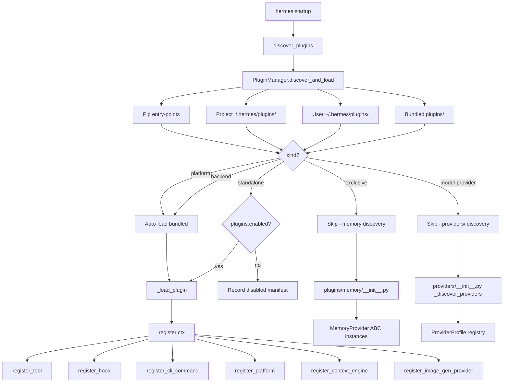
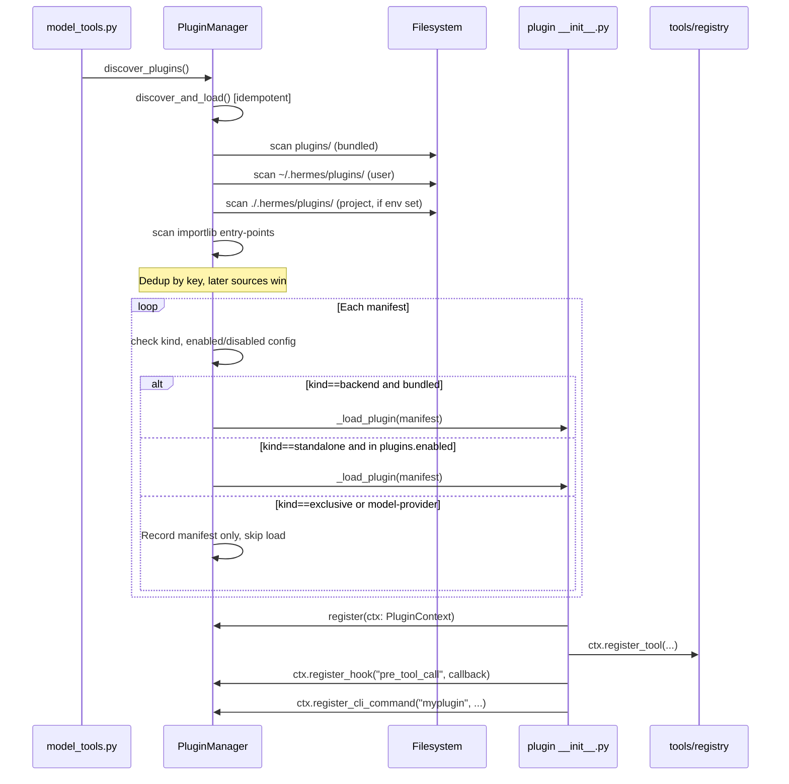
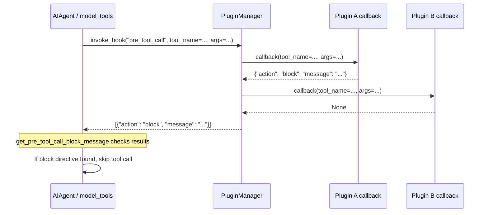
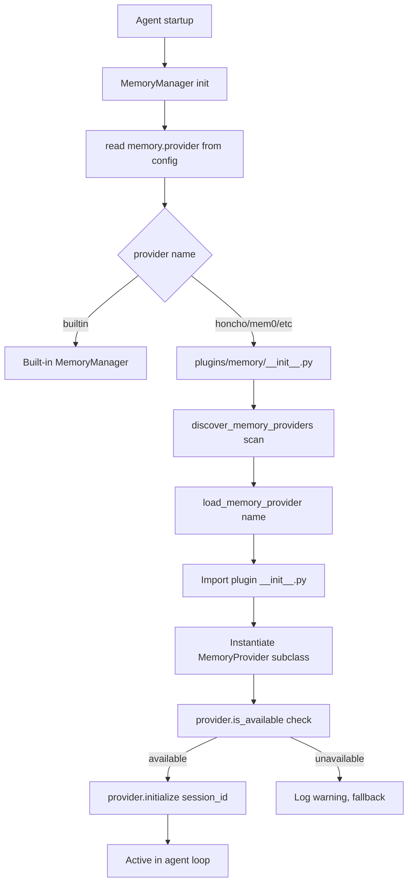

<details>
<summary>Relevant source files</summary>

- [hermes_cli/plugins.py](../hermes_cli/plugins.py)
- [agent/memory_provider.py](../agent/memory_provider.py)
- [agent/memory_manager.py](../agent/memory_manager.py)
- [agent/image_gen_provider.py](../agent/image_gen_provider.py)
- [agent/image_gen_registry.py](../agent/image_gen_registry.py)
- [agent/context_engine.py](../agent/context_engine.py)
- [agent/plugin_llm.py](../agent/plugin_llm.py)
- [providers/__init__.py](../providers/__init__.py)
- [providers/base.py](../providers/base.py)
- [plugins/__init__.py](../plugins/__init__.py)
- [plugins/memory/__init__.py](../plugins/memory/__init__.py)
- [plugins/memory/honcho/__init__.py](../plugins/memory/honcho/__init__.py)
- [plugins/memory/honcho/plugin.yaml](../plugins/memory/honcho/plugin.yaml)
- [plugins/memory/mem0/__init__.py](../plugins/memory/mem0/__init__.py)
- [plugins/model-providers/openrouter/__init__.py](../plugins/model-providers/openrouter/__init__.py)
- [plugins/model-providers/openrouter/plugin.yaml](../plugins/model-providers/openrouter/plugin.yaml)
- [plugins/image_gen/openai/__init__.py](../plugins/image_gen/openai/__init__.py)
- [plugins/context_engine/__init__.py](../plugins/context_engine/__init__.py)
- [plugins/observability/langfuse/__init__.py](../plugins/observability/langfuse/__init__.py)
- [plugins/observability/langfuse/plugin.yaml](../plugins/observability/langfuse/plugin.yaml)
- [gateway/platform_registry.py](../gateway/platform_registry.py)
- [tools/registry.py](../tools/registry.py)

</details>

# Plugins

Hermes provides a multi-surface plugin ecosystem that allows developers to extend the agent with custom tools, lifecycle hooks, CLI commands, memory backends, inference provider profiles, context compression engines, image generation backends, and gateway platform adapters. Three distinct discovery and activation systems operate in parallel — general plugins (managed by `PluginManager`), memory-provider plugins (managed by `plugins/memory/__init__.py`), and model-provider plugins (managed by `providers/__init__.py`) — each with its own opt-in semantics and override rules.

Together these surfaces let third parties ship capabilities as self-contained directories or pip packages without touching Hermes core code. The system enforces isolation: only explicitly enabled plugins are imported, each plugin runs in its own namespace, hook failures are caught per-callback so a broken plugin cannot bring down the agent loop, and no plugin kind can register against a surface it does not own.

## Architecture Diagram



Sources: [hermes_cli/plugins.py:700-870](../hermes_cli/plugins.py#L700-L870), [providers/__init__.py:130-175](../providers/__init__.py#L130-L175), [plugins/memory/__init__.py:1-60](../plugins/memory/__init__.py#L1-L60)

## Key Concepts

- **Plugin kind** — Every manifest declares one of five kinds: `standalone` (opt-in general plugin), `backend` (pluggable tool backend, auto-loads when bundled), `exclusive` (one-active memory/context provider), `platform` (gateway messaging adapter), or `model-provider` (inference backend profile).
- **Opt-in activation** — Standalone and user-installed plugins are only loaded when their name appears in `plugins.enabled` in `config.yaml`. Bundled `backend` and `platform` plugins auto-load.
- **Last-writer-wins override** — Later plugin sources override earlier ones on name collision. User plugins beat bundled; project plugins beat user; pip plugins are appended after user.
- **PluginContext facade** — Each plugin's `register(ctx)` receives a `PluginContext` instance that exposes registration methods without granting access to framework internals.
- **Hook isolation** — Each callback in `invoke_hook()` is wrapped in its own `try/except`; a failing plugin hook cannot break the agent loop.
- **Separate discovery paths** — Memory providers and model-provider profiles each have their own lazy discovery system invoked on first use, independent of `PluginManager`.
- **Prompt cache safety** — Hook context injection always targets the user message, never the system prompt, to preserve token caching.
- **`HERMES_PLUGINS_DEBUG=1`** — Enables verbose stderr debug logging for plugin authors during development.

## Component Structure

### Plugin Directory Layout

| Directory | Kind | Description |
|---|---|---|
| `plugins/disk-cleanup/` | standalone | Disk usage / cache cleanup tool |
| `plugins/google_meet/` | standalone | Google Meet integration |
| `plugins/hermes-achievements/` | standalone | Gamified achievement tracking |
| `plugins/spotify/` | standalone | Spotify playback controls |
| `plugins/teams_pipeline/` | standalone | Microsoft Teams pipeline |
| `plugins/image_gen/openai/` | backend | OpenAI gpt-image-2 image generation |
| `plugins/image_gen/openai-codex/` | backend | OpenAI Codex image generation |
| `plugins/image_gen/xai/` | backend | xAI Grok image generation |
| `plugins/platforms/` | platform | Bundled gateway platform adapters |
| `plugins/memory/honcho/` | exclusive | Honcho cross-session user modeling |
| `plugins/memory/mem0/` | exclusive | Mem0 semantic memory |
| `plugins/memory/supermemory/` | exclusive | Supermemory backend |
| `plugins/memory/hindsight/` | exclusive | Hindsight memory backend |
| `plugins/memory/holographic/` | exclusive | Holographic memory |
| `plugins/memory/byterover/` | exclusive | Byterover memory |
| `plugins/memory/openviking/` | exclusive | OpenViking memory |
| `plugins/memory/retaindb/` | exclusive | RetainDB memory |
| `plugins/model-providers/openrouter/` | model-provider | OpenRouter aggregator |
| `plugins/model-providers/anthropic/` | model-provider | Anthropic direct API |
| `plugins/model-providers/gemini/` | model-provider | Google Gemini |
| `plugins/model-providers/gmi/` | model-provider | GMI Cloud |
| `plugins/model-providers/deepseek/` | model-provider | DeepSeek |
| `plugins/model-providers/nvidia/` | model-provider | NVIDIA NIM |
| `plugins/model-providers/ollama-cloud/` | model-provider | Ollama |
| `plugins/model-providers/xai/` | model-provider | xAI Grok |
| `plugins/model-providers/bedrock/` | model-provider | AWS Bedrock |
| `plugins/model-providers/azure-foundry/` | model-provider | Azure AI Foundry |
| `plugins/context_engine/` | exclusive | Context engine plugins |
| `plugins/observability/langfuse/` | standalone | Langfuse tracing observability |
| `plugins/kanban/` | N/A | Kanban board dashboard + systemd service |

Sources: [hermes_cli/plugins.py:263-280](../hermes_cli/plugins.py#L263-L280), [plugins/observability/langfuse/plugin.yaml:1-15](../plugins/observability/langfuse/plugin.yaml#L1-L15)

### Core Files

| File | Purpose |
|---|---|
| [hermes_cli/plugins.py](../hermes_cli/plugins.py) | `PluginManager`, `PluginContext`, `PluginManifest`, `LoadedPlugin`, hook invocation |
| [agent/memory_provider.py](../agent/memory_provider.py) | `MemoryProvider` abstract base class |
| [agent/memory_manager.py](../agent/memory_manager.py) | Orchestrates the active memory provider |
| [providers/base.py](../providers/base.py) | `ProviderProfile` dataclass (model provider base) |
| [providers/__init__.py](../providers/__init__.py) | Model provider lazy discovery and registry |
| [plugins/memory/__init__.py](../plugins/memory/__init__.py) | Memory provider discovery |
| [plugins/context_engine/__init__.py](../plugins/context_engine/__init__.py) | Context engine discovery |
| [agent/image_gen_provider.py](../agent/image_gen_provider.py) | `ImageGenProvider` ABC |
| [agent/image_gen_registry.py](../agent/image_gen_registry.py) | Image gen provider registry |
| [agent/plugin_llm.py](../agent/plugin_llm.py) | `PluginLlm` — host-owned LLM facade for plugins |
| [gateway/platform_registry.py](../gateway/platform_registry.py) | Gateway platform registry |

## Core Flows

### General Plugin Discovery and Loading



Sources: [hermes_cli/plugins.py:695-870](../hermes_cli/plugins.py#L695-L870), [hermes_cli/plugins.py:1065-1120](../hermes_cli/plugins.py#L1065-L1120)

### Hook Invocation Flow



Sources: [hermes_cli/plugins.py:1215-1265](../hermes_cli/plugins.py#L1215-L1265), [hermes_cli/plugins.py:1315-1360](../hermes_cli/plugins.py#L1315-L1360)

### Memory Provider Activation



Sources: [plugins/memory/__init__.py:1-90](../plugins/memory/__init__.py#L1-L90), [agent/memory_provider.py:1-90](../agent/memory_provider.py#L1-L90)

## Public API / Key Interfaces

### `PluginManager`

Central singleton that owns discovery, loading, and hook dispatch.

```python
# hermes_cli/plugins.py:668+
class PluginManager:
    def discover_and_load(self, force: bool = False) -> None: ...
    def invoke_hook(self, hook_name: str, **kwargs) -> List[Any]: ...
    def list_plugins(self) -> List[Dict[str, Any]]: ...
    def find_plugin_skill(self, qualified_name: str) -> Optional[Path]: ...
```

Access via the module-level singleton:

```python
from hermes_cli.plugins import get_plugin_manager, discover_plugins, invoke_hook

discover_plugins()          # idempotent, call from model_tools.py import side-effect
invoke_hook("pre_llm_call", messages=messages, model=model)
```

Sources: [hermes_cli/plugins.py:668-700](../hermes_cli/plugins.py#L668-L700), [hermes_cli/plugins.py:1285-1310](../hermes_cli/plugins.py#L1285-L1310)

### `PluginContext`

Facade handed to each plugin's `register(ctx)` function. Exposes all registration surfaces without exposing framework internals.

| Method | Purpose |
|---|---|
| `ctx.register_tool(name, toolset, schema, handler, ...)` | Add a tool to the global registry |
| `ctx.register_hook(hook_name, callback)` | Subscribe to a lifecycle hook |
| `ctx.register_cli_command(name, help, setup_fn, ...)` | Add a `hermes <name>` subcommand |
| `ctx.register_command(name, handler, ...)` | Add a `/slash` command |
| `ctx.register_platform(name, label, adapter_factory, ...)` | Register a gateway platform |
| `ctx.register_context_engine(engine)` | Replace the built-in context compressor |
| `ctx.register_image_gen_provider(provider)` | Add an image generation backend |
| `ctx.register_skill(name, path, ...)` | Expose a plugin-owned skill |
| `ctx.inject_message(content, role)` | Push a message into the active conversation |
| `ctx.dispatch_tool(tool_name, args, ...)` | Call a registered tool from a plugin |
| `ctx.llm` | `PluginLlm` — host-owned LLM facade (gated by `plugins.entries.<id>.llm.*`) |

Sources: [hermes_cli/plugins.py:290-670](../hermes_cli/plugins.py#L290-L670)

### Valid Lifecycle Hooks

```python
VALID_HOOKS = {
    "pre_tool_call",         # before tool dispatch; return {"action":"block","message":"..."} to veto
    "post_tool_call",        # after tool dispatch
    "transform_terminal_output",
    "transform_tool_result",
    "transform_llm_output",  # first non-None return replaces response text
    "pre_llm_call",          # return {"context":"..."} to inject ephemeral user-message context
    "post_llm_call",
    "pre_api_request",       # raw HTTP request (observability)
    "post_api_request",
    "on_session_start",
    "on_session_end",
    "on_session_finalize",
    "on_session_reset",
    "subagent_stop",
    "pre_gateway_dispatch",  # return {"action":"skip"/"rewrite"/"allow"} to control routing
    "pre_approval_request",  # observers only; return value ignored
    "post_approval_response",
}
```

Sources: [hermes_cli/plugins.py:128-175](../hermes_cli/plugins.py#L128-L175)

### `MemoryProvider` ABC

All memory backends implement this interface, located in [agent/memory_provider.py](../agent/memory_provider.py).

```python
class MemoryProvider(ABC):
    @property
    @abstractmethod
    def name(self) -> str: ...

    @abstractmethod
    def is_available(self) -> bool: ...

    @abstractmethod
    def initialize(self, session_id: str, **kwargs) -> None: ...

    def system_prompt_block(self) -> str: ...        # static prompt text
    def prefetch(self, query: str, *, session_id: str = "") -> str: ...   # recall before turn
    def queue_prefetch(self, query: str, *, session_id: str = "") -> None: ...
    def sync_turn(self, user_content: str, assistant_content: str, *, session_id: str = "") -> None: ...

    @abstractmethod
    def get_tool_schemas(self) -> List[Dict[str, Any]]: ...

    def handle_tool_call(self, tool_name: str, args: Dict, **kwargs) -> str: ...
    def shutdown(self) -> None: ...

    # Optional hooks
    def on_turn_start(self, turn_number: int, message: str, **kwargs) -> None: ...
    def on_session_end(self, messages: List[Dict]) -> None: ...
    def on_session_switch(self, new_session_id: str, *, parent_session_id: str = "", reset: bool = False, **kwargs) -> None: ...
    def on_pre_compress(self, messages) -> str: ...
    def on_memory_write(self, action, target, content, metadata=None) -> None: ...
    def on_delegation(self, task, result, **kwargs) -> None: ...
```

Sources: [agent/memory_provider.py:42-200](../agent/memory_provider.py#L42-L200)

### `ProviderProfile`

Base dataclass for model provider plugins, located in [providers/base.py](../providers/base.py).

```python
@dataclass
class ProviderProfile:
    name: str
    api_mode: str = "chat_completions"
    aliases: tuple = ()
    display_name: str = ""
    description: str = ""
    signup_url: str = ""
    env_vars: tuple = ()
    base_url: str = ""
    models_url: str = ""
    auth_type: str = "api_key"      # api_key|oauth_device_code|oauth_external|copilot|aws_sdk
    fallback_models: tuple = ()
    # ... plus ~30 more behavioral flags for streaming, temperature, tool call format, etc.
```

Providers self-register at import time:

```python
from providers import register_provider
from providers.base import ProviderProfile

register_provider(ProviderProfile(
    name="myprovider",
    base_url="https://api.example.com/v1",
    env_vars=("EXAMPLE_API_KEY",),
    fallback_models=("example-model-7b",),
))
```

Sources: [providers/base.py:28-90](../providers/base.py#L28-L90), [providers/__init__.py:55-75](../providers/__init__.py#L55-L75)

### `PluginManifest`

Parsed from `plugin.yaml`. Key fields:

| Field | Type | Description |
|---|---|---|
| `name` | str | Plugin identifier (falls back to directory name) |
| `version` | str | Semver string |
| `description` | str | Human-readable description |
| `kind` | str | `standalone`, `backend`, `exclusive`, `platform`, or `model-provider` |
| `key` | str | Path-derived registry key (e.g. `image_gen/openai`) |
| `source` | str | `bundled`, `user`, `project`, or `entrypoint` |
| `requires_env` | list | Environment variables required for this plugin |
| `provides_tools` | list | Tool names this plugin registers |
| `provides_hooks` | list | Hook names this plugin subscribes to |

Sources: [hermes_cli/plugins.py:218-280](../hermes_cli/plugins.py#L218-L280)

## Configuration

### `config.yaml` Keys

| Key | Type | Description |
|---|---|---|
| `plugins.enabled` | `list[str]` | Allow-list of plugin keys to activate (e.g. `["observability/langfuse", "disk-cleanup"]`) |
| `plugins.disabled` | `list[str]` | Deny-list; wins over `plugins.enabled` |
| `plugins.entries.<id>.llm.*` | dict | Per-plugin LLM override (model, auth profile, agent id) |
| `memory.provider` | str | Name of the active memory provider (e.g. `honcho`, `mem0`) |
| `context.engine` | str | Name of the active context engine (default: `compressor`) |
| `image_gen.provider` | str | Name of the active image generation backend |
| `image_gen.model` | str | Model ID within the chosen image gen backend |

### Environment Variables

| Variable | Description |
|---|---|
| `HERMES_PLUGINS_DEBUG` | Set to `1` to enable verbose plugin discovery logging to stderr |
| `HERMES_ENABLE_PROJECT_PLUGINS` | Set to `1` to scan `./.hermes/plugins/` in the working directory |
| `HERMES_BUNDLED_PLUGINS` | Override path to the bundled `plugins/` directory (Nix / packaged installs) |
| `HERMES_LANGFUSE_PUBLIC_KEY` | Langfuse public key (required for observability plugin) |
| `HERMES_LANGFUSE_SECRET_KEY` | Langfuse secret key |
| `HERMES_LANGFUSE_BASE_URL` | Langfuse server URL (default: `https://cloud.langfuse.com`) |
| `MEM0_API_KEY` | Mem0 Platform API key (required for mem0 memory plugin) |
| `MEM0_USER_ID` | User identifier for Mem0 (default: `hermes-user`) |

Sources: [hermes_cli/plugins.py:74-100](../hermes_cli/plugins.py#L74-L100), [plugins/observability/langfuse/plugin.yaml:1-15](../plugins/observability/langfuse/plugin.yaml#L1-L15), [plugins/memory/mem0/__init__.py:30-55](../plugins/memory/mem0/__init__.py#L30-L55)

## Dependencies

| Dependency | Why |
|---|---|
| [CoreAgent](CoreAgent.md) | `run_agent.py` wires memory provider lifecycle (`initialize`, `sync_turn`, `shutdown`) into the agent loop |
| [AgentInternals](AgentInternals.md) | `model_tools.py` is the canonical import side-effect that triggers `discover_plugins()`; also owns `handle_function_call` which plugin tools flow through |
| `tools/registry.py` | `PluginContext.register_tool()` delegates directly to `registry.register()`; all plugin tools appear alongside built-in tools |
| `gateway/platform_registry.py` | `PluginContext.register_platform()` writes into the gateway platform registry |
| `agent/image_gen_registry.py` | `PluginContext.register_image_gen_provider()` calls `register_provider()` here |
| `agent/context_engine.py` | Context engine plugins must subclass `ContextEngine` ABC |
| `hermes_cli/commands.py` | `register_command()` checks against built-in slash commands before allowing registration |
| `hermes_constants.get_hermes_home()` | Used throughout for profile-aware paths to user plugin dirs and config files |

## Extension Points

### Authoring a General Plugin

A general plugin lives at `~/.hermes/plugins/<name>/` and requires two files:

**`plugin.yaml`**:
```yaml
name: my-plugin
version: 1.0.0
description: "What this plugin does"
kind: standalone       # standalone | backend | platform
requires_env:
  - MY_API_KEY
provides_tools:
  - my_tool
provides_hooks:
  - pre_tool_call
```

**`__init__.py`**:
```python
from hermes_cli.plugins import PluginContext

def register(ctx: PluginContext) -> None:
    # Register a tool
    ctx.register_tool(
        name="my_tool",
        toolset="my_toolset",
        schema={
            "name": "my_tool",
            "description": "Does something useful",
            "parameters": {
                "type": "object",
                "properties": {"query": {"type": "string"}},
                "required": ["query"],
            },
        },
        handler=lambda args, **kw: my_tool_impl(args["query"]),
    )

    # Register a lifecycle hook
    ctx.register_hook("pre_tool_call", on_pre_tool_call)

    # Register a CLI subcommand (hermes myplugin ...)
    ctx.register_cli_command(
        name="myplugin",
        help="My plugin subcommand",
        setup_fn=setup_args,
        handler_fn=handle_command,
    )

def on_pre_tool_call(tool_name, args, **kwargs):
    # Return {"action": "block", "message": "..."} to veto
    # Return None or nothing to allow
    pass
```

Activate with:
```bash
hermes plugins enable my-plugin
```

Sources: [hermes_cli/plugins.py:290-440](../hermes_cli/plugins.py#L290-L440)

### Authoring a Memory-Provider Plugin

Memory provider plugins live at `~/.hermes/plugins/<name>/` and must subclass `MemoryProvider`.

```python
# __init__.py
from agent.memory_provider import MemoryProvider
from typing import Any, Dict, List

class MyMemoryProvider(MemoryProvider):
    @property
    def name(self) -> str:
        return "mymemory"

    def is_available(self) -> bool:
        import os
        return bool(os.getenv("MY_MEMORY_API_KEY"))

    def initialize(self, session_id: str, **kwargs) -> None:
        hermes_home = kwargs.get("hermes_home", "")
        # connect, create resources, warm up
        self._session_id = session_id

    def prefetch(self, query: str, *, session_id: str = "") -> str:
        # Return formatted recall context or empty string
        return ""

    def sync_turn(self, user_content: str, assistant_content: str, *, session_id: str = "") -> None:
        # Persist the completed turn
        pass

    def get_tool_schemas(self) -> List[Dict[str, Any]]:
        return []   # or return tool schemas if the provider exposes tools

    def shutdown(self) -> None:
        pass


# Module-level registration — discovered by heuristic scan
def register_memory_provider():
    return MyMemoryProvider()
```

Activate by setting in `config.yaml`:
```yaml
memory:
  provider: mymemory
```

Sources: [agent/memory_provider.py:42-200](../agent/memory_provider.py#L42-L200), [plugins/memory/honcho/__init__.py:1-50](../plugins/memory/honcho/__init__.py#L1-L50)

### Authoring a Model-Provider Plugin

Model provider plugins live at `~/.hermes/plugins/model-providers/<name>/` and self-register via `register_provider()`.

```python
# __init__.py
from providers import register_provider
from providers.base import ProviderProfile

class MyProviderProfile(ProviderProfile):
    """Custom provider with special request building."""

    def build_extra_body(self, *, session_id=None, **context):
        return {"my_custom_param": True}

register_provider(MyProviderProfile(
    name="myprovider",
    display_name="My Provider",
    description="My custom inference backend",
    signup_url="https://myprovider.example.com",
    env_vars=("MY_PROVIDER_API_KEY",),
    base_url="https://api.myprovider.example.com/v1",
    fallback_models=("my-model-v1",),
    aliases=("myprov",),
))
```

**`plugin.yaml`**:
```yaml
name: myprovider
kind: model-provider
version: 1.0.0
description: My custom inference backend
```

Discovery is lazy — triggered on the first call to `get_provider_profile()` or `list_providers()`. User plugins override bundled plugins on name collision (last-writer-wins).

Sources: [providers/__init__.py:55-175](../providers/__init__.py#L55-L175), [providers/base.py:28-90](../providers/base.py#L28-L90), [plugins/model-providers/openrouter/__init__.py:1-30](../plugins/model-providers/openrouter/__init__.py#L1-L30)

### Authoring a Context Engine Plugin

Context engine plugins live at `plugins/context_engine/<name>/` (bundled) and must implement the `ContextEngine` ABC from `agent/context_engine.py`. Only one can be active at a time, selected via `context.engine` in `config.yaml`.

```python
# plugin __init__.py
from agent.context_engine import ContextEngine

class MyContextEngine(ContextEngine):
    @property
    def name(self) -> str:
        return "myengine"

    def is_available(self) -> bool:
        return True

    def compress(self, messages, *, budget_tokens=None, **kwargs):
        # Return compressed messages list
        return messages
```

Sources: [plugins/context_engine/__init__.py:1-80](../plugins/context_engine/__init__.py#L1-L80)

### Authoring an Image Generation Plugin

Image generation backend plugins live at `plugins/image_gen/<name>/` and register via `PluginContext.register_image_gen_provider()`. The backend must subclass `agent.image_gen_provider.ImageGenProvider`.

```python
from agent.image_gen_provider import ImageGenProvider

class MyImageGenProvider(ImageGenProvider):
    @property
    def name(self) -> str:
        return "myimagegen"

    def generate(self, prompt: str, **kwargs) -> dict:
        # Return success_response(...) or error_response(...)
        pass

def register(ctx):
    ctx.register_image_gen_provider(MyImageGenProvider())
```

Select the provider with `image_gen.provider: myimagegen` in `config.yaml`.

Sources: [plugins/image_gen/openai/__init__.py:1-60](../plugins/image_gen/openai/__init__.py#L1-L60), [agent/image_gen_provider.py](../agent/image_gen_provider.py)

### Plugin Management CLI

```bash
hermes plugins list                    # show all discovered plugins and status
hermes plugins enable my-plugin        # add to plugins.enabled
hermes plugins disable my-plugin       # add to plugins.disabled
```

Or via the curses UI:

```bash
hermes tools                           # navigate to plugin section
```

Sources: [hermes_cli/plugins.py:1260-1300](../hermes_cli/plugins.py#L1260-L1300)

## Summary

The plugin ecosystem is organized into three parallel surfaces: the general `PluginManager` handles standalone tools, hooks, CLI commands, gateway adapters, and image-gen backends via an opt-in `plugins.enabled` config list; the memory provider system (`plugins/memory/__init__.py`) activates a single `MemoryProvider` ABC implementation selected by `memory.provider`; and the model provider system (`providers/__init__.py`) lazily imports all `ProviderProfile` subclasses from `plugins/model-providers/` so the agent can route requests to any supported inference backend. All three systems share the same override semantics (user plugins win over bundled), the same profile-aware path helper (`get_hermes_home()`), and the same isolation rule that plugins must not modify core files.
