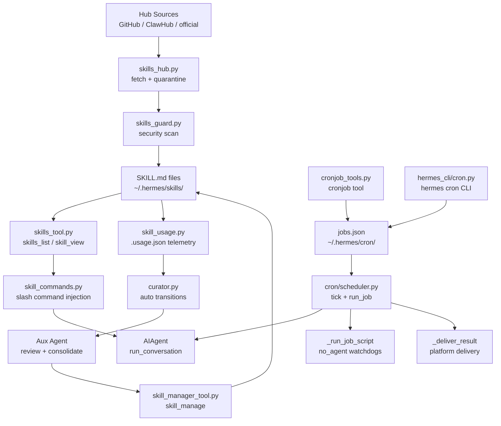
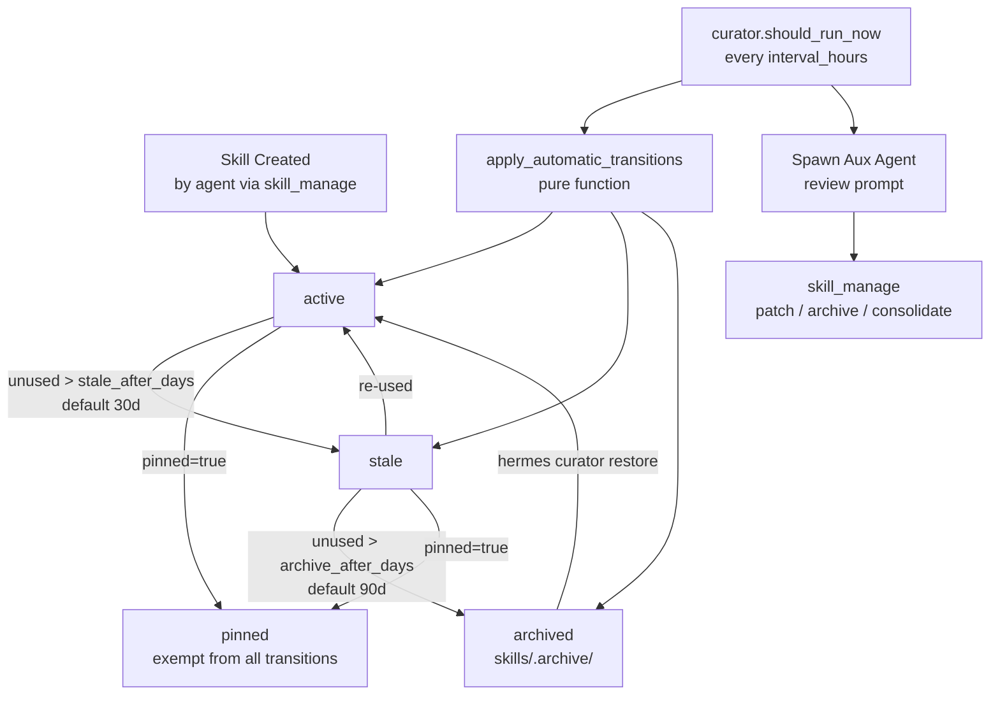
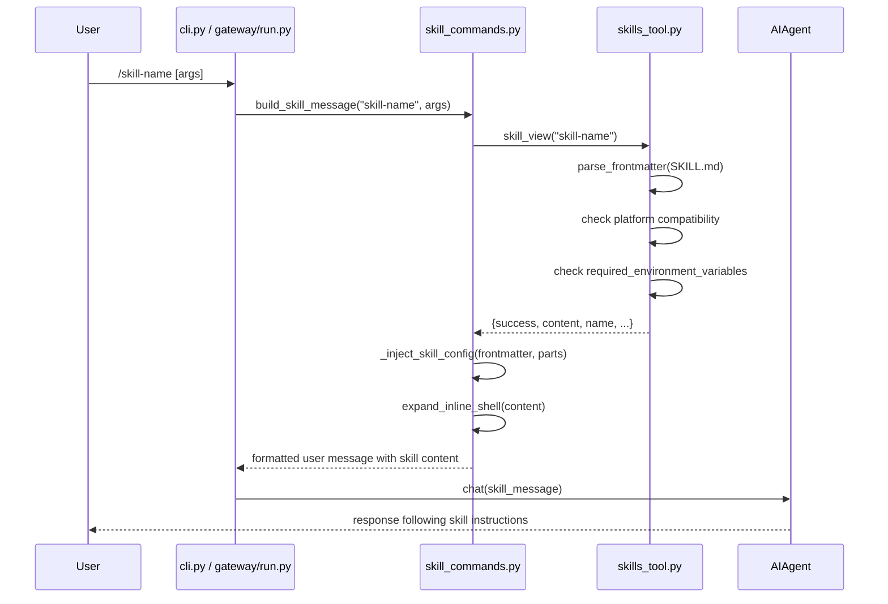
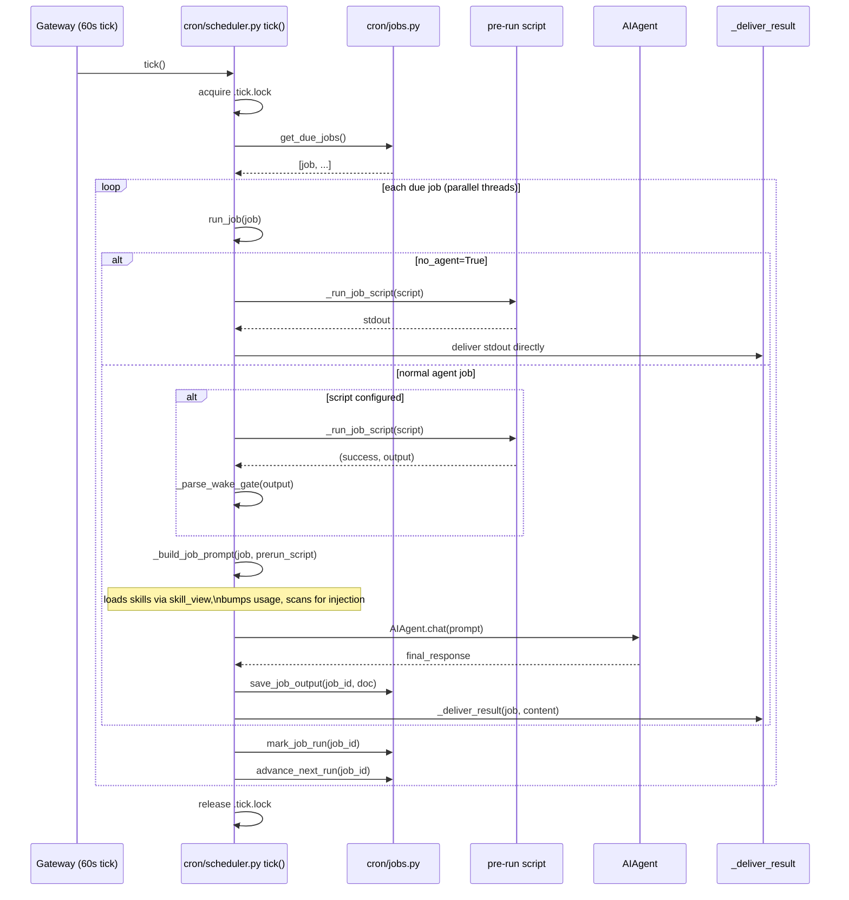

<details>
<summary>Relevant source files</summary>

- [tools/skills_tool.py](../tools/skills_tool.py)
- [tools/skill_manager_tool.py](../tools/skill_manager_tool.py)
- [tools/skills_hub.py](../tools/skills_hub.py)
- [tools/skill_usage.py](../tools/skill_usage.py)
- [agent/curator.py](../agent/curator.py)
- [agent/skill_commands.py](../agent/skill_commands.py)
- [cron/jobs.py](../cron/jobs.py)
- [cron/scheduler.py](../cron/scheduler.py)
- [hermes_cli/cron.py](../hermes_cli/cron.py)
- [hermes_cli/skills_hub.py](../hermes_cli/skills_hub.py)
- [skills/](../skills/)
- [optional-skills/](../optional-skills/)
- [hermes_cli/config.py](../hermes_cli/config.py)

</details>

# SkillsAndCron

Skills and Cron are two complementary extensibility layers in Hermes Agent. **Skills** are Markdown-defined AI capabilities that encode procedural knowledge — a developer or the agent itself writes a `SKILL.md` file, and Hermes loads it into the model's context at invocation time. **Cron** provides durable scheduled-job execution: jobs are stored in a flat JSON database, evaluated by a tick loop (every 60 s when the gateway is running), and can trigger full agent runs, data-collection scripts, or script-only watchdogs on any schedule.

Together they allow Hermes to accumulate long-lived domain knowledge (skills) and autonomously act on that knowledge on a repeating basis (cron), closing the loop between human-authored instructions and automated execution.

---

## Architecture Overview



---

## Key Concepts

- **SKILL.md** — A Markdown file with YAML frontmatter (`name`, `description`, `version`, `platforms`, `required_environment_variables`, etc.) followed by free-form instructions. The agent loads the file verbatim into the prompt when a skill is invoked. Sources: [tools/skills_tool.py:13-58](../tools/skills_tool.py#L13-L58)
- **Skill provenance** — Three origins: `bundled` (shipped in `skills/`), `hub-installed` (downloaded via `hermes skills install`), and `agent-created` (written by the agent via `skill_manage`). The curator only touches `agent-created` skills. Sources: [tools/skill_usage.py:1-30](../tools/skill_usage.py#L1-L30)
- **Progressive disclosure** — Skills expose metadata (name, description ≤1024 chars) for listing (`skills_list`), then full content on demand (`skill_view`). Token cost is deferred until the skill is actually needed. Sources: [tools/skills_tool.py:52-58](../tools/skills_tool.py#L52-L58)
- **Skill lifecycle (curator)** — Agent-created skills move through `active → stale → archived` based on inactivity thresholds; pinned skills are exempt. Archived skills go to `~/.hermes/skills/.archive/` (recoverable). Sources: [tools/skill_usage.py:17-27](../tools/skill_usage.py#L17-L27), [agent/curator.py:253-288](../agent/curator.py#L253-L288)
- **Hub quarantine** — External skills pass through a quarantine directory and security scan before installation. Trust levels: `builtin`, `trusted`, `community`. Sources: [tools/skills_hub.py:45-56](../tools/skills_hub.py#L45-L56)
- **Cron job kinds** — Three schedule kinds: `once` (one-shot ISO timestamp or duration), `interval` (recurring every N minutes), `cron` (5-field cron expression via `croniter`). Sources: [cron/jobs.py:183-254](../cron/jobs.py#L183-L254)
- **no_agent mode** — A cron job whose script output is delivered verbatim, with no LLM invocation. Ideal for classic watchdogs that only need bash/Python logic. Sources: [cron/scheduler.py:1011-1080](../cron/scheduler.py#L1011-L1080)
- **context_from chaining** — A job can read the latest output of a prior job and inject it as context, enabling pipeline-style cron chains. Sources: [cron/scheduler.py:860-900](../cron/scheduler.py#L860-L900)
- **Injection scanning** — Assembled cron prompts (including skill content loaded at runtime) are scanned for injection patterns before the agent runs. Sources: [cron/scheduler.py:992-1010](../cron/scheduler.py#L992-L1010)

---

## Component Structure

| File | Purpose |
|---|---|
| [tools/skills_tool.py](../tools/skills_tool.py) | `skills_list` and `skill_view` agent tools; SKILL.md parser; frontmatter normalizer; platform-compatibility gating; secret-capture integration |
| [tools/skill_manager_tool.py](../tools/skill_manager_tool.py) | `skill_manage` agent tool — `create`, `edit`, `patch`, `delete`, `write_file`, `remove_file` on agent-created skills; optional security scan gate |
| [tools/skills_hub.py](../tools/skills_hub.py) | `SkillSource` ABC; `OptionalSkillSource` (repo-bundled optional skills); `GitHubSource`; `HubLockFile` provenance tracker; quarantine + audit log management |
| [tools/skill_usage.py](../tools/skill_usage.py) | Sidecar `.usage.json` telemetry — `bump_use`, `bump_view`, `bump_patch`; `set_state`; `archive_skill`; `agent_created_report` |
| [agent/curator.py](../agent/curator.py) | Inactivity-triggered background skill maintainer — `should_run_now`, `apply_automatic_transitions`, `maybe_run_curator`; review prompt construction |
| [agent/skill_commands.py](../agent/skill_commands.py) | Slash-command injection bridge (`/skill-name`); loads skill payload and injects as user message; resolves `skills.config` template vars |
| [cron/jobs.py](../cron/jobs.py) | Job store (`jobs.json` CRUD); schedule parsing (`parse_schedule`, `compute_next_run`); `create_job`, `list_jobs`, `get_due_jobs`, `mark_job_run` |
| [cron/scheduler.py](../cron/scheduler.py) | Tick loop (`tick`); `run_job`; skill loading for cron prompts; script execution (`_run_job_script`); delivery routing (`_deliver_result`); injection scanner |
| [hermes_cli/cron.py](../hermes_cli/cron.py) | `hermes cron` subcommand — `cron_list`, `cron_create`, `cron_edit`, `cron_pause`, `cron_resume`, `cron_run`, `cron_remove` |
| [hermes_cli/skills_hub.py](../hermes_cli/skills_hub.py) | `hermes skills` subcommand and `/skills` slash handler — search, inspect, install, update, remove; interactive name resolution; `do_install`, `do_search` |

---

## SKILL.md Format

A valid `SKILL.md` has an optional YAML frontmatter block followed by Markdown instructions:

```yaml
---
name: my-skill                  # Required, max 64 chars
description: Brief description  # Required, max 1024 chars
version: 1.0.0                  # Optional
license: MIT                    # Optional
platforms: [linux, macos]       # Optional — omit to load on all platforms
required_environment_variables:
  - name: MY_API_KEY
    prompt: "Enter your API key"
    help: "https://example.com/api-keys"
  - name: OPTIONAL_VAR
    optional: true
prerequisites:                  # Legacy — normalized into required_environment_variables
  env_vars: [OLD_API_KEY]
  commands: [curl]
metadata:
  hermes:
    tags: [example, demo]
    related_skills: [other-skill]
    config:
      some_setting: default_value
---

# My Skill

Full instructions the agent should follow when this skill is invoked...
```

Valid `platforms` values: `macos`, `linux`, `windows`. A skill with `platforms: [macos]` is hidden from `skills_list` on Linux/Windows and silently skipped if loaded. Sources: [tools/skills_tool.py:91-113](../tools/skills_tool.py#L91-L113)

### Skill Directory Layout

```
~/.hermes/skills/
├── my-skill/
│   ├── SKILL.md                # Main instructions (required)
│   ├── references/             # Supporting docs loaded on demand
│   │   └── api.md
│   ├── templates/              # Starter files
│   │   └── config.yaml.template
│   └── scripts/                # Re-runnable scripts
│       └── verify.sh
├── category/
│   └── nested-skill/
│       └── SKILL.md
├── .hub/                       # Hub provenance (lock.json, audit.log, taps.json)
├── .archive/                   # Archived skills (recoverable)
└── .usage.json                 # Curator telemetry sidecar
```

Sources: [tools/skill_manager_tool.py:29-40](../tools/skill_manager_tool.py#L29-L40), [tools/skills_tool.py:22-44](../tools/skills_tool.py#L22-L44)

---

## Skill Lifecycle (Curator)

The curator is an inactivity-triggered background process that maintains agent-created skills. It never touches bundled or hub-installed skills.



### Curator Triggers

`maybe_run_curator()` (in [agent/curator.py](../agent/curator.py)) is called from the agent session start. It fires when:

1. `curator.enabled` is `true` (default)
2. `is_paused()` returns `false`
3. At least `min_idle_hours` have passed since last agent activity
4. At least `interval_hours` have passed since the last curator run

The first call after installation seeds `last_run_at` and defers the first real pass by one full interval, preventing an eager review of an empty collection. Sources: [agent/curator.py:218-246](../agent/curator.py#L218-L246)

---

## Skills Hub

The hub provides four external skill sources accessible via `hermes skills search/install`:

| Source | Trust Level | Description |
|---|---|---|
| `official` | `builtin` | Repo-bundled optional skills in `optional-skills/` directory |
| `github` | `trusted` or `community` | Any GitHub repo via Contents API |
| `clawhub` | `community` | ClawHub registry (community skills) |
| `claude-marketplace` | `community` | Anthropic skills marketplace |

Install flow: `fetch` → quarantine → `scan_skill` (security scan) → `should_allow_install` verdict → copy to `~/.hermes/skills/` → record in `lock.json`. Sources: [tools/skills_hub.py:60-105](../tools/skills_hub.py#L60-L105)

The `HubLockFile` at `~/.hermes/skills/.hub/lock.json` tracks installed-from-hub skills with fields: `name`, `identifier`, `source`, `trust_level`, `installed_at`, `content_hash`, `skill_dir`.

---

## Core Flows

### Skill Loading via Slash Command



Sources: [agent/skill_commands.py:53-100](../agent/skill_commands.py#L53-L100), [tools/skills_tool.py:350-420](../tools/skills_tool.py#L350-L420)

### Cron Job Execution Flow



Sources: [cron/scheduler.py:950-1100](../cron/scheduler.py#L950-L1100), [cron/jobs.py:400-500](../cron/jobs.py#L400-L500)

---

## Public API / Key Interfaces

### `skills_tool.py`

```python
# tools/skills_tool.py

def skills_list(
    category: str = None,
    task_id: str = None,
) -> str:
    """List skills with metadata. Returns JSON string.
    Tier 1 of progressive disclosure — names + descriptions only."""

def skill_view(
    skill: str,
    file: str = None,
    task_id: str = None,
    preprocess: bool = True,
) -> str:
    """Load full skill content. Returns JSON string.
    skill: skill name or path relative to SKILLS_DIR
    file: optional sub-file (e.g. 'references/api.md')"""

def check_skills_requirements() -> bool:
    """Always returns True — directory created on first use."""
```

Sources: [tools/skills_tool.py:52-58](../tools/skills_tool.py#L52-L58)

### `skill_manager_tool.py`

```python
# tools/skill_manager_tool.py

def skill_manage(
    action: str,           # create | edit | patch | delete | write_file | remove_file
    name: str,
    content: str = None,   # full SKILL.md text for create/edit
    old_str: str = None,   # for patch: exact text to replace
    new_str: str = None,   # for patch: replacement text
    file: str = None,      # for write_file/remove_file: relative path
    task_id: str = None,
) -> str:
    """Agent-facing skill CRUD. Returns JSON string."""
```

Sources: [tools/skill_manager_tool.py:36-60](../tools/skill_manager_tool.py#L36-L60)

### `skill_usage.py`

```python
# tools/skill_usage.py

def bump_use(name: str) -> None: ...
def bump_view(name: str) -> None: ...
def bump_patch(name: str) -> None: ...
def set_state(name: str, state: str) -> None: ...
    # state: "active" | "stale" | "archived"
def archive_skill(name: str) -> tuple[bool, str]: ...
def agent_created_report() -> list[dict]: ...
    # Each dict: name, state, pinned, use_count, view_count, patch_count,
    #            last_used_at, last_viewed_at, last_patched_at, created_at
def is_agent_created(name: str) -> bool: ...
def mark_as_agent_created(name: str) -> None: ...
```

Sources: [tools/skill_usage.py:95-180](../tools/skill_usage.py#L95-L180)

### `cron/jobs.py`

```python
# cron/jobs.py

def parse_schedule(schedule: str) -> dict:
    """Parse human schedule string into structured dict.
    Returns: {kind: "once"|"interval"|"cron", ...}"""

def create_job(
    prompt: Optional[str],
    schedule: str,
    name: Optional[str] = None,
    repeat: Optional[int] = None,         # None = infinite; 1 = one-shot
    deliver: Optional[str] = None,        # "local"|"origin"|"telegram"|"all"|...
    origin: Optional[dict] = None,
    skill: Optional[str] = None,
    skills: Optional[list[str]] = None,
    model: Optional[str] = None,
    provider: Optional[str] = None,
    script: Optional[str] = None,
    context_from: Optional[Union[str, list[str]]] = None,
    enabled_toolsets: Optional[list[str]] = None,
    workdir: Optional[str] = None,
    no_agent: bool = False,
) -> dict: ...

def get_due_jobs(now: datetime = None) -> list[dict]: ...
def mark_job_run(job_id: str, ...) -> None: ...
def advance_next_run(job_id: str) -> None: ...
def list_jobs(include_disabled: bool = False) -> list[dict]: ...
def save_job_output(job_id: str, content: str, ...) -> Path: ...
```

Sources: [cron/jobs.py:183-510](../cron/jobs.py#L183-L510)

### `cron/scheduler.py`

```python
# cron/scheduler.py

def tick(adapters=None, loop=None) -> None:
    """Check for due jobs and run them. Called every 60 s by the gateway.
    Uses .tick.lock to prevent concurrent runs."""

def run_job(job: dict) -> tuple[bool, str, str, Optional[str]]:
    """Execute one job. Returns (success, full_output_doc, final_response, error)."""
```

Sources: [cron/scheduler.py:7-12](../cron/scheduler.py#L7-L12)

### `agent/curator.py`

```python
# agent/curator.py

def should_run_now(now: datetime = None) -> bool: ...
def apply_automatic_transitions(now: datetime = None) -> dict:
    """Walk agent-created skills; move active/stale/archived by inactivity.
    Returns counts: {marked_stale, archived, reactivated, checked}"""
def maybe_run_curator(session_context: dict = None) -> None:
    """Called at session start. Runs apply_automatic_transitions then
    optionally forks a review aux-agent."""
def is_paused() -> bool: ...
def set_paused(paused: bool) -> None: ...
def load_state() -> dict: ...
```

Sources: [agent/curator.py:130-290](../agent/curator.py#L130-L290)

---

## Schedule Format Reference

| Input | Kind | Result |
|---|---|---|
| `"30m"` | `once` | one-shot 30 minutes from now |
| `"2h"` | `once` | one-shot 2 hours from now |
| `"1d"` | `once` | one-shot 1 day from now |
| `"every 30m"` | `interval` | recurring every 30 minutes |
| `"every 2h"` | `interval` | recurring every 2 hours |
| `"every monday 9am"` | `interval` | recurring weekly (parsed via duration) |
| `"0 9 * * *"` | `cron` | cron expression (requires `croniter`) |
| `"2026-06-01T09:00:00Z"` | `once` | one-shot at exact ISO timestamp |

Sources: [cron/jobs.py:188-254](../cron/jobs.py#L188-L254)

---

## Configuration

### Skills Configuration (`config.yaml` under `skills:`)

| Key | Default | Description |
|---|---|---|
| `skills.creation_nudge_interval` | `15` | Remind agent to create skills every N tool-call iterations; `0` disables |
| `skills.external_dirs` | `[]` | Additional read-only skill directories (e.g. shared team skills) |
| `skills.guard_agent_created` | `false` | Run security scan on agent-created skills (off by default) |

Sources: [hermes_cli/config.py:1160-1172](../hermes_cli/config.py#L1160-L1172)

### Curator Configuration (`config.yaml` under `curator:`)

| Key | Default | Description |
|---|---|---|
| `curator.enabled` | `true` | Enable/disable the curator entirely |
| `curator.interval_hours` | `168` (7 days) | Minimum time between curator passes |
| `curator.min_idle_hours` | `2` | Agent must be idle at least this long before the curator fires |
| `curator.stale_after_days` | `30` | Days without activity before a skill is marked `stale` |
| `curator.archive_after_days` | `90` | Days without activity before a skill is auto-archived |
| `curator.backup.enabled` | `true` | Snapshot skills before each live curator pass |
| `curator.backup.keep` | `5` | Number of snapshots to retain |

Sources: [hermes_cli/config.py:1175-1205](../hermes_cli/config.py#L1175-L1205)

### Cron Configuration (`config.yaml` under `cron:`)

| Key / Env var | Default | Description |
|---|---|---|
| `cron.script_timeout_seconds` | `120` | Max runtime for pre-run scripts |
| `HERMES_CRON_SCRIPT_TIMEOUT` | — | Env var override for script timeout |
| `tools.cron.enabled` / `disabled` | — | Per-platform toolset gate for the `cron` platform |

Sources: [cron/scheduler.py:665-690](../cron/scheduler.py#L665-L690)

### Cron Delivery Targets

`deliver` field format (comma-separated):

| Value | Meaning |
|---|---|
| `local` | Save to `~/.hermes/cron/output/` only |
| `origin` | Return to the chat/channel where the job was created |
| `telegram` | Home Telegram channel (env `TELEGRAM_HOME_CHANNEL`) |
| `discord` | Home Discord channel (env `DISCORD_HOME_CHANNEL`) |
| `slack` | Home Slack channel (env `SLACK_HOME_CHANNEL`) |
| `all` | Deliver to every platform with a configured home channel |
| `telegram:-1001234:17` | Explicit platform:chat_id:thread_id |

Sources: [cron/scheduler.py:90-120](../cron/scheduler.py#L90-L120), [cron/scheduler.py:386-435](../cron/scheduler.py#L386-L435)

---

## Dependencies

| Dependency | Why |
|---|---|
| **CoreAgent** (`AIAgent`) | `run_job` constructs a full `AIAgent` instance to execute the cron prompt; skill injection for cron runs through the same agent machinery |
| **Tools** (registry) | `skills_list`, `skill_view`, `skill_manage` are registered as agent tools and dispatched by `model_tools.handle_function_call` |
| `croniter` | Required for 5-field cron expression parsing; jobs using cron-kind schedules fail gracefully if absent with a clear warning |
| `httpx` / `yaml` | Used by `tools/skills_hub.py` for HTTP fetching of remote skill bundles and YAML parsing of hub index files |
| `rich` | Used by `hermes_cli/skills_hub.py` for formatted console output (`Table`, `Panel`) |
| `agent/auxiliary_client.py` | Curator forks a lightweight aux-model agent for the review pass, avoiding touching the main session |
| `agent/skill_preprocessing.py` | Handles inline shell expansion (`{{shell:cmd}}`) and template variable substitution in skill content |
| `tools/skills_guard.py` | Security scanner for hub and optionally agent-created skills; provides `scan_skill`, `should_allow_install` |

---

## Extension Points

### Creating a New Skill

**Via agent** (`skill_manage` tool):
```
Create a skill for X that...
```
The agent calls `skill_manage(action="create", name="my-skill", content="---\nname: my-skill\n...\n---\n\n# Instructions...")`.

**Manually** — drop a directory into `~/.hermes/skills/`:
```bash
mkdir -p ~/.hermes/skills/my-skill
cat > ~/.hermes/skills/my-skill/SKILL.md << 'EOF'
---
name: my-skill
description: Does X really well
version: 1.0.0
---

# My Skill

Instructions here...
EOF
```

**Via hub**:
```bash
hermes skills install github:owner/repo/path/to/skill
hermes skills install official/mlops/axolotl
```

Sources: [tools/skill_manager_tool.py:1-45](../tools/skill_manager_tool.py#L1-L45), [hermes_cli/skills_hub.py:1-50](../hermes_cli/skills_hub.py#L1-L50)

### Creating a Cron Job

**Via agent** (`cronjob` tool):
```
Schedule a daily digest at 9am
```

**Via CLI**:
```bash
hermes cron create "Run a daily summary" --schedule "0 9 * * *" --deliver telegram
hermes cron create "Watchdog check" --schedule "every 5m" --script watchdog.sh --no-agent
hermes cron list
hermes cron pause <job-id>
hermes cron run <job-id>     # manual trigger
hermes cron remove <job-id>
```

**Via slash command in chat**:
```
/cron list
/cron add "Daily briefing" every 24h
```

Sources: [hermes_cli/cron.py:38-100](../hermes_cli/cron.py#L38-L100)

### Configuring the Curator

```bash
hermes curator status          # show last run summary
hermes curator run             # trigger a live review pass now
hermes curator run --dry-run   # preview what would be done
hermes curator pause           # suspend automatic runs
hermes curator resume
hermes curator pin my-skill    # exempt from all auto-transitions
hermes curator rollback        # restore from last backup snapshot
```

To tune thresholds, edit `~/.hermes/config.yaml`:
```yaml
curator:
  enabled: true
  interval_hours: 168       # once per week
  min_idle_hours: 2
  stale_after_days: 30
  archive_after_days: 90
  backup:
    enabled: true
    keep: 5
```

Sources: [agent/curator.py:50-100](../agent/curator.py#L50-L100), [hermes_cli/config.py:1175-1205](../hermes_cli/config.py#L1175-L1205)

### Adding an Optional Skill (Repo)

Place the skill directory under `optional-skills/<category>/<skill-name>/SKILL.md`. It will appear as `official/<category>/<skill-name>` in `hermes skills search` results via `OptionalSkillSource`. Sources: [tools/skills_hub.py:1-30](../tools/skills_hub.py#L1-L30)

### Registering a New Hub Tap

```bash
hermes skills tap add https://example.com/skills-index.json
hermes skills tap list
hermes skills tap remove <url>
```

Taps are stored in `~/.hermes/skills/.hub/taps.json`. Sources: [tools/skills_hub.py:55-60](../tools/skills_hub.py#L55-L60)

---

## Security Notes

- **Injection scanning** — `_scan_assembled_cron_prompt` checks the fully-assembled cron prompt (including skill content loaded at runtime) for known injection patterns (`ignore previous instructions`, `<system>`, etc.) before any LLM call. This closes the gap where malicious skill content could bypass create-time scanning in the non-interactive cron context. Sources: [cron/scheduler.py:992-1010](../cron/scheduler.py#L992-L1010)
- **Script path traversal guard** — `_run_job_script` resolves script paths against `~/.hermes/scripts/` and uses `path.relative_to(scripts_dir)` to block escapes. Sources: [cron/scheduler.py:740-760](../cron/scheduler.py#L740-L760)
- **Secret redaction** — Script stdout and stderr are passed through `redact_sensitive_text` before any logging or prompt injection. Sources: [cron/scheduler.py:790-800](../cron/scheduler.py#L790-L800)
- **Hub quarantine** — All external skills enter a quarantine directory and are scanned by `skills_guard.scan_skill` before reaching `~/.hermes/skills/`. The user is prompted for `ask`-verdict skills; `block`-verdict installs are rejected outright. Sources: [tools/skills_hub.py:65-80](../tools/skills_hub.py#L65-L80)
- **File locking** — `.tick.lock` prevents concurrent cron ticks across processes. `.usage.json.lock` serializes sidecar updates. Both use `fcntl` (Unix) / `msvcrt` (Windows) file locks with atomic `os.replace` writes. Sources: [cron/scheduler.py:7-10](../cron/scheduler.py#L7-L10), [tools/skill_usage.py:60-90](../tools/skill_usage.py#L60-L90)
