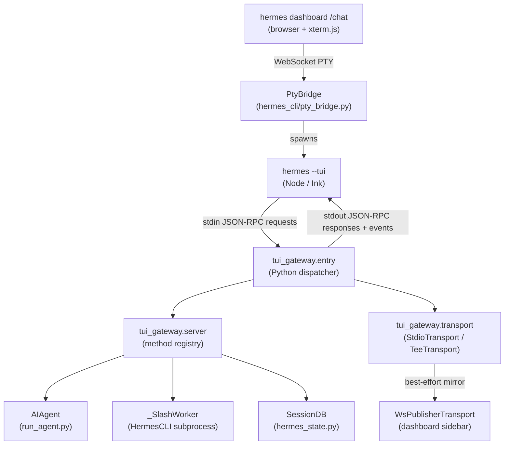
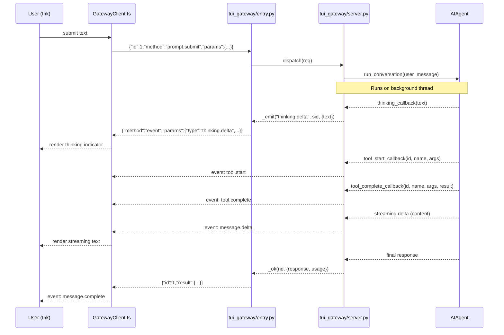
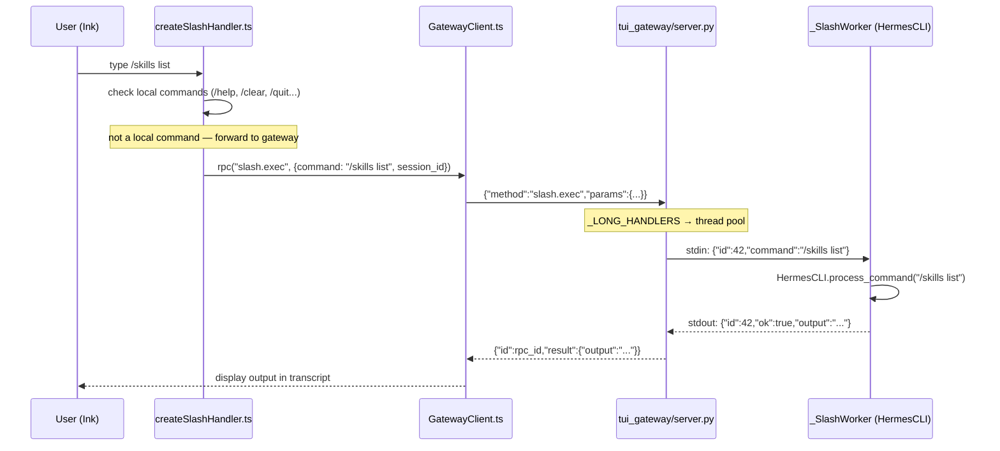

<details>
<summary>Relevant source files</summary>

- [ui-tui/src/app.tsx](../ui-tui/src/app.tsx)
- [ui-tui/src/gatewayClient.ts](../ui-tui/src/gatewayClient.ts)
- [ui-tui/src/gatewayTypes.ts](../ui-tui/src/gatewayTypes.ts)
- [ui-tui/src/app/useMainApp.ts](../ui-tui/src/app/useMainApp.ts)
- [ui-tui/src/app/createGatewayEventHandler.ts](../ui-tui/src/app/createGatewayEventHandler.ts)
- [ui-tui/src/app/createSlashHandler.ts](../ui-tui/src/app/createSlashHandler.ts)
- [ui-tui/src/components/appLayout.tsx](../ui-tui/src/components/appLayout.tsx)
- [ui-tui/src/components/thinking.tsx](../ui-tui/src/components/thinking.tsx)
- [ui-tui/src/components/prompts.tsx](../ui-tui/src/components/prompts.tsx)
- [ui-tui/src/components/sessionPicker.tsx](../ui-tui/src/components/sessionPicker.tsx)
- [tui_gateway/server.py](../tui_gateway/server.py)
- [tui_gateway/transport.py](../tui_gateway/transport.py)
- [tui_gateway/entry.py](../tui_gateway/entry.py)
- [tui_gateway/slash_worker.py](../tui_gateway/slash_worker.py)
- [hermes_cli/pty_bridge.py](../hermes_cli/pty_bridge.py)
- [hermes_cli/web_server.py](../hermes_cli/web_server.py)

</details>

# TUI

The TUI is the full terminal user interface for Hermes Agent, built with [Ink](https://github.com/vadimdemedes/ink) (React/TypeScript running on Node.js). It replaces the classic `prompt_toolkit`-based CLI when launched via `hermes --tui` or `HERMES_TUI=1`. The TypeScript frontend renders the transcript, composer, tool activity, and interactive prompts while a Python subprocess (`tui_gateway`) hosts all session state, `AIAgent` instances, and tool execution. The two processes communicate over **newline-delimited JSON-RPC 2.0 via stdio**. The same TUI binary is also embedded in the Hermes web dashboard via a PTY bridge so every feature (slash commands, model picker, approvals) appears in the browser automatically.

---

## Architecture Diagram

The TUI spans three layers: the Ink frontend (Node), the Python gateway backend, and an optional sidecar for the web dashboard embed.



The key design principle: **TypeScript owns the screen; Python owns sessions, tools, and model calls.**

---

## Key Concepts

- **JSON-RPC 2.0 over stdio** — All communication between Ink (Node) and the Python gateway uses newline-delimited JSON. Requests from Ink carry `{id, method, params}`; responses carry `{id, result}` or `{id, error}`. Server-initiated events use `{method: "event", params: {type, session_id, payload}}`.
- **Transport abstraction** (`tui_gateway/transport.py`) — The `Transport` protocol decouples I/O from handler logic. `StdioTransport` wraps real stdout with a lock. `TeeTransport` mirrors writes to a primary plus best-effort secondaries (used for the dashboard sidecar). Transport is tracked per-request via a `contextvars.ContextVar` so pool worker threads route to the correct peer.
- **Async dispatch for long handlers** — A `ThreadPoolExecutor` pool handles slow methods (`slash.exec`, `session.resume`, `session.compress`, `cli.exec`, etc.) so fast handlers like `approval.respond` and `session.interrupt` are never blocked in the dispatcher loop.
- **Session dictionary** — Each TUI session is an in-memory `dict` in `_sessions` keyed by an 8-char hex `sid`. It holds the `AIAgent` instance, conversation history (behind a `threading.Lock`), the `_SlashWorker` subprocess, attached images, and the transport pinned at session creation time.
- **Lazy agent build** — `session.create` returns immediately with a lightweight shell. The real `AIAgent` is built on a background thread ~50ms later so the composer is interactive from the first frame.
- **`_SlashWorker`** — A persistent `HermesCLI` subprocess created per session. Slash commands are sent via JSON lines (`{id, command}`) and results returned as `{id, ok, output}`. This keeps all slash command logic in the existing CLI without duplicating it in the gateway.
- **Blocking prompt factory** — Interactive prompts (`clarify.request`, `sudo.request`, `secret.request`, `approval.request`) use `threading.Event` objects to block the agent thread until the user responds from the Ink frontend.
- **PTY bridge** — `hermes_cli/pty_bridge.py` wraps `ptyprocess.PtyProcess` to embed the real `hermes --tui` behind a pseudo-terminal for the web dashboard's `/chat` tab. POSIX-only; native Windows is unsupported.
- **Skin engine integration** — `resolve_skin()` in `tui_gateway/server.py` reads the active skin from config and serializes it into the `gateway.ready` event so Ink can apply colors, branding, and spinner faces before the first frame renders.

---

## Component Structure

### Python backend (`tui_gateway/`)

| File | Description |
|---|---|
| [tui_gateway/entry.py](../tui_gateway/entry.py) | Process entry point. Installs signal handlers (SIGPIPE/SIGTERM/SIGHUP), sets up the sidecar publisher if `HERMES_TUI_SIDECAR_URL` is set, then reads JSON lines from stdin and calls `server.dispatch()`. |
| [tui_gateway/server.py](../tui_gateway/server.py) | Core of the Python gateway. Contains `_sessions` dict, `_methods` registry, `_SlashWorker`, all `@method(...)` decorated handlers, agent factory (`_make_agent`), callback wiring (`_agent_cbs`), and the `write_json`/`_emit` plumbing. ~6500 LOC. |
| [tui_gateway/transport.py](../tui_gateway/transport.py) | `Transport` protocol, `StdioTransport`, `TeeTransport`. Handles peer-gone errno detection, optional flush disable (`HERMES_TUI_GATEWAY_NO_FLUSH`), and contextvar-based per-request transport binding. |
| [tui_gateway/slash_worker.py](../tui_gateway/slash_worker.py) | Persistent `HermesCLI` subprocess. Reads `{id, command}` JSON lines from stdin, executes `cli.process_command()` with Rich output captured, writes `{id, ok, output}` back. |

### TypeScript frontend (`ui-tui/src/`)

| File | Description |
|---|---|
| [ui-tui/src/app.tsx](../ui-tui/src/app.tsx) | Root React component. Composes `GatewayProvider` + `AppLayout`. Wires state from `useMainApp()`. |
| [ui-tui/src/gatewayClient.ts](../ui-tui/src/gatewayClient.ts) | Spawns the Python gateway subprocess (or attaches to a remote via `HERMES_TUI_GATEWAY_URL`). Handles newline-delimited JSON-RPC framing, startup timeout, and request/response correlation. |
| [ui-tui/src/app/useMainApp.ts](../ui-tui/src/app/useMainApp.ts) | Top-level state orchestrator. Manages transcript history, composer state, and delegates to `createGatewayEventHandler` for inbound events. |
| [ui-tui/src/app/createGatewayEventHandler.ts](../ui-tui/src/app/createGatewayEventHandler.ts) | Maps inbound `GatewayEvent` types to React state updates (transcript, tool rows, thinking display, skin application, approval prompts, etc.). |
| [ui-tui/src/app/createSlashHandler.ts](../ui-tui/src/app/createSlashHandler.ts) | Client-side slash command dispatcher. Handles `/help`, `/clear`, `/quit`, `/resume`, `/copy`, `/paste` locally; everything else is forwarded to `slash.exec` RPC. |
| [ui-tui/src/components/appLayout.tsx](../ui-tui/src/components/appLayout.tsx) | Layout root. Composes transcript scroll box, composer/input, tool activity panel, and overlay surfaces. |
| [ui-tui/src/components/thinking.tsx](../ui-tui/src/components/thinking.tsx) | Renders thinking/tool activity feed. Receives `tool.start`, `tool.progress`, `tool.complete`, `thinking.delta` events. |
| [ui-tui/src/components/prompts.tsx](../ui-tui/src/components/prompts.tsx) | Renders interactive prompts: `clarify.request`, `sudo.request`, `secret.request`, `approval.request`. Calls `clarify.respond`, `sudo.respond`, etc. back to gateway. |
| [ui-tui/src/components/sessionPicker.tsx](../ui-tui/src/components/sessionPicker.tsx) | Session resume picker overlay. Fetches list via `session.list`, resumes via `session.resume`. |
| [ui-tui/src/components/maskedPrompt.tsx](../ui-tui/src/components/maskedPrompt.tsx) | Password/secret input that masks characters in the terminal. Used by `secret.request`. |

### PTY bridge (`hermes_cli/`)

| File | Description |
|---|---|
| [hermes_cli/pty_bridge.py](../hermes_cli/pty_bridge.py) | `PtyBridge` class wrapping `ptyprocess.PtyProcess`. POSIX-only. Provides `spawn()`, `read()`, `write()`, `resize()`. Used exclusively by the `/api/pty` WebSocket endpoint in `web_server.py`. |
| [hermes_cli/web_server.py](../hermes_cli/web_server.py) | FastAPI server for the Hermes dashboard. The `/api/pty` WebSocket endpoint spawns `hermes --tui` via `PtyBridge` and pipes bytes between the child PTY and the browser's xterm.js terminal. |

---

## Core Flows

### Chat Streaming Flow

When a user submits a prompt, the Ink frontend sends `prompt.submit`; the Python gateway runs `AIAgent.run_conversation()` in a thread and streams events back to Ink as they arrive.



Sources: [tui_gateway/server.py:2996](../tui_gateway/server.py#L2996), [tui_gateway/server.py:3391](../tui_gateway/server.py#L3391)

### Slash Command Flow

Slash commands not handled client-side are routed through the `_SlashWorker` subprocess.



Sources: [tui_gateway/server.py:5445](../tui_gateway/server.py#L5445), [tui_gateway/slash_worker.py:1](../tui_gateway/slash_worker.py#L1)

### Web Dashboard PTY Embed Flow

The Hermes dashboard `/chat` tab embeds the real `hermes --tui` via a PTY so every TUI feature is available in the browser without reimplementation.

```mermaid
graph TD
    A["Browser<br/>(xterm.js + WebSocket)"]
    B["/api/pty WebSocket<br/>web_server.py"]
    C["PtyBridge.spawn()<br/>pty_bridge.py"]
    D["hermes --tui<br/>(child process behind PTY)"]
    E["HERMES_TUI_SIDECAR_URL<br/>(optional: mirror events to WS)"]

    A -->|keystrokes bytes| B
    B -->|PtyBridge.write()| C
    C --> D
    D -->|ANSI output bytes| C
    C -->|PtyBridge.read()| B
    B -->|raw bytes| A
    B -->|"resize: TIOCSWINSZ"| C
    D -->|JSON-RPC events| E
```

Sources: [hermes_cli/pty_bridge.py:1](../hermes_cli/pty_bridge.py#L1), [hermes_cli/web_server.py:1](../hermes_cli/web_server.py#L1), [tui_gateway/entry.py:22](../tui_gateway/entry.py#L22)

---

## Public API / Key Interfaces

The gateway exposes 68+ JSON-RPC methods. They are registered with the `@method("name")` decorator in `tui_gateway/server.py`. Below is the full catalog grouped by domain.

### Session Management

| Method | Direction | Description |
|---|---|---|
| `session.create` | Ink → Python | Create a new session shell; returns `session_id`. Agent built lazily ~50ms later. |
| `session.list` | Ink → Python | List stored sessions for the resume picker. |
| `session.most_recent` | Ink → Python | Return the most-recent eligible session id (for auto-resume). |
| `session.resume` | Ink → Python | Resume a stored session by id or title; returns history + messages. |
| `session.close` | Ink → Python | Finalize and remove a session from in-memory state. |
| `session.delete` | Ink → Python | Delete a stored session from the DB (resume picker `d` key). |
| `session.interrupt` | Ink → Python | Interrupt a running agent turn; clears pending prompts. |
| `session.title` | Ink → Python | Get or set the session title. |
| `session.usage` | Ink → Python | Return token usage counters for the session. |
| `session.status` | Ink → Python | Return a human-readable status summary. |
| `session.history` | Ink → Python | Return the message history as display objects. |
| `session.undo` | Ink → Python | Remove the last user + assistant turn from history. |
| `session.compress` | Ink → Python | Compress the conversation history via the context compressor. |
| `session.save` | Ink → Python | Export conversation history to a JSON file. |
| `session.branch` | Ink → Python | Fork the current session into a new session. |
| `session.steer` | Ink → Python | Inject a user message into the next tool result without interrupting. |
| `terminal.resize` | Ink → Python | Update the stored terminal column count for a session. |

Sources: [tui_gateway/server.py:2090](../tui_gateway/server.py#L2090)–[tui_gateway/server.py:2984](../tui_gateway/server.py#L2984)

### Prompt Submission & Interaction

| Method | Direction | Description |
|---|---|---|
| `prompt.submit` | Ink → Python | Submit a user message; starts `AIAgent.run_conversation()` in a thread. |
| `prompt.background` | Ink → Python | Submit a prompt as a background (non-blocking) task. |
| `clarify.respond` | Ink → Python | Answer a `clarify.request` interactive prompt. |
| `sudo.respond` | Ink → Python | Answer a `sudo.request` password prompt. |
| `secret.respond` | Ink → Python | Answer a `secret.request` credential prompt. |
| `approval.respond` | Ink → Python | Approve or deny a tool execution approval request. |
| `session.steer` | Ink → Python | Inject steering text into a running agent turn. |

Sources: [tui_gateway/server.py:2996](../tui_gateway/server.py#L2996), [tui_gateway/server.py:3521](../tui_gateway/server.py#L3521), [tui_gateway/server.py:3581](../tui_gateway/server.py#L3596)

### Server-Sent Events (Python → Ink)

All server-sent events share the envelope:
```json
{
  "jsonrpc": "2.0",
  "method": "event",
  "params": {
    "type": "<event-type>",
    "session_id": "<sid>",
    "payload": { ... }
  }
}
```

| Event type | Payload | Description |
|---|---|---|
| `gateway.ready` | `{skin, config, ...}` | Emitted once at startup with skin + config data. |
| `session.info` | `{model, tools, skills, cwd, usage, ...}` | Emitted after session create/resume, model switch, or config change. |
| `message.delta` | `{text, turn_id}` | Streaming assistant token. |
| `message.complete` | `{turn_id, response, usage}` | Turn completed. |
| `thinking.delta` | `{text}` | Chain-of-thought streaming token. |
| `reasoning.delta` | `{text}` | Extended reasoning token. |
| `reasoning.available` | `{text}` | Full reasoning block available. |
| `tool.start` | `{tool_id, name, context}` | Tool call started. |
| `tool.progress` | `{name, preview}` | Tool mid-call progress update. |
| `tool.complete` | `{tool_id, name, duration_s, summary, inline_diff, todos}` | Tool call finished. |
| `tool.generating` | `{name}` | Tool schema being generated (MCP). |
| `subagent.start` | `{subagent_id, goal, model, depth, ...}` | Subagent spawned. |
| `subagent.complete` | `{subagent_id, input_tokens, output_tokens, ...}` | Subagent finished. |
| `subagent.tool` | `{subagent_id, tool_name, tool_preview}` | Subagent tool call. |
| `status.update` | `{kind, text}` | Status bar text update. |
| `approval.request` | `{request_id, tool_name, args, ...}` | Tool requires approval. |
| `clarify.request` | `{request_id, question, choices}` | Agent needs clarification. |
| `sudo.request` | `{request_id}` | Terminal tool needs sudo password. |
| `secret.request` | `{request_id, env_var, prompt}` | Agent needs a secret/credential. |
| `review.summary` | `{text}` | Background skill/memory review completed. |
| `error` | `{message}` | Agent initialization or runtime error. |
| `gateway.stderr` | `{text}` | Stderr output from gateway subprocess. |

Sources: [tui_gateway/server.py:366](../tui_gateway/server.py#L366)–[tui_gateway/server.py:400](../tui_gateway/server.py#L400)

### Command Execution

| Method | Direction | Description |
|---|---|---|
| `slash.exec` | Ink → Python | Execute a slash command via the `_SlashWorker`. Long handler (thread pool). |
| `cli.exec` | Ink → Python | Execute a raw CLI command string. Long handler (thread pool). |
| `command.dispatch` | Ink → Python | Fallback dispatch for unrecognized slash commands. |
| `command.resolve` | Ink → Python | Resolve a slash command name to its canonical form. |
| `commands.catalog` | Ink → Python | Return the full slash command catalog for autocomplete. |
| `complete.slash` | Ink → Python | Return slash command completions for the current input. |
| `complete.path` | Ink → Python | Return filesystem path completions. |
| `shell.exec` | Ink → Python | Run an arbitrary shell command. Long handler. |

Sources: [tui_gateway/server.py:4387](../tui_gateway/server.py#L4387), [tui_gateway/server.py:5445](../tui_gateway/server.py#L5445)

### Config & Model

| Method | Direction | Description |
|---|---|---|
| `config.get` | Ink → Python | Read one or more config keys. |
| `config.set` | Ink → Python | Write one or more config keys (persists to `config.yaml`). |
| `config.show` | Ink → Python | Return the full config as a formatted string. |
| `model.options` | Ink → Python | Return available models + providers for the model picker. |
| `model.save_key` | Ink → Python | Save a provider API key to `.env`. |
| `model.disconnect` | Ink → Python | Remove a provider's API key. |
| `reload.mcp` | Ink → Python | Hot-reload MCP server configurations. |
| `reload.env` | Ink → Python | Reload environment variables from `.env`. |
| `setup.status` | Ink → Python | Return whether the first-run setup is complete. |

Sources: [tui_gateway/server.py:3621](../tui_gateway/server.py#L3621), [tui_gateway/server.py:3995](../tui_gateway/server.py#L3995), [tui_gateway/server.py:5155](../tui_gateway/server.py#L5155)

### Delegation & Subagents

| Method | Direction | Description |
|---|---|---|
| `delegation.status` | Ink → Python | Return active subagents + paused state. |
| `delegation.pause` | Ink → Python | Pause or resume new subagent spawning. |
| `subagent.interrupt` | Ink → Python | Interrupt a specific subagent by id. |
| `spawn_tree.save` | Ink → Python | Persist a completed spawn-tree snapshot. |
| `spawn_tree.list` | Ink → Python | List stored spawn-tree snapshots. |
| `spawn_tree.load` | Ink → Python | Load a specific spawn-tree snapshot by path. |

Sources: [tui_gateway/server.py:2739](../tui_gateway/server.py#L2739)–[tui_gateway/server.py:2959](../tui_gateway/server.py#L2959)

### Other Methods

| Method | Description |
|---|---|
| `voice.toggle`, `voice.record`, `voice.tts` | Voice mode controls. |
| `rollback.list`, `rollback.restore`, `rollback.diff` | Git checkpoint management. |
| `browser.manage` | Headless browser management. Long handler. |
| `skills.manage`, `skills.reload` | Skills hub operations. |
| `tools.list`, `tools.show`, `tools.configure`, `toolsets.list` | Tool/toolset inspection. |
| `cron.manage` | Cron job management. |
| `clipboard.paste` | Paste from clipboard with large-paste collapsing. |
| `image.attach`, `input.detect_drop` | Image attachment. |
| `paste.collapse` | Collapse long pastes before sending. |
| `insights.get` | Usage insights and stats. |
| `agents.list` | List connected ACP agents. |
| `plugins.list` | List loaded plugins. |
| `process.stop` | Stop a background process. |

Sources: [tui_gateway/server.py:5596](../tui_gateway/server.py#L5596)–[tui_gateway/server.py:6525](../tui_gateway/server.py#L6525)

---

## Configuration

### Environment Variables

| Variable | Default | Description |
|---|---|---|
| `HERMES_TUI=1` | — | Activate TUI mode when running `hermes`. |
| `HERMES_TUI_GATEWAY_URL` | — | Attach to a remote gateway over WebSocket instead of spawning a local subprocess. |
| `HERMES_TUI_SIDECAR_URL` | — | Mirror gateway events to a WebSocket sidecar (used by dashboard sidebar). |
| `HERMES_TUI_STARTUP_TIMEOUT_MS` | `15000` | Max ms to wait for `gateway.ready` before showing a timeout error. |
| `HERMES_TUI_RPC_TIMEOUT_MS` | `120000` | Max ms to wait for an RPC response before timing out. |
| `HERMES_TUI_SLASH_TIMEOUT_S` | `45` | Timeout for slash command execution via `_SlashWorker`. |
| `HERMES_TUI_RPC_POOL_WORKERS` | `4` | Thread pool size for long-running RPC handlers. |
| `HERMES_TUI_MAX_TURNS` | `90` | Override `agent.max_turns` for TUI sessions. |
| `HERMES_TUI_TOOLSETS` | — | Comma-separated list of toolsets to enable for TUI sessions. |
| `HERMES_TUI_SKILLS` | — | Comma-separated list of skills to preload at session start. |
| `HERMES_TUI_TOOL_PROGRESS` | `all` | Tool progress display mode: `off`, `new`, `all`, `verbose`. |
| `HERMES_TUI_PROVIDER` | — | Pin the inference provider for all TUI sessions. |
| `HERMES_TUI_CHECKPOINTS` | — | Enable checkpoint saving for TUI sessions. |
| `HERMES_TUI_PASS_SESSION_ID` | — | Pass the session id to tool calls. |
| `HERMES_TUI_GATEWAY_NO_FLUSH` | — | Skip `stdout.flush()` after each write (requires `-u` or `PYTHONUNBUFFERED=1`). |
| `HERMES_TUI_GATEWAY_SHUTDOWN_GRACE_S` | `1.0` | Seconds to allow orderly shutdown before `os._exit(0)`. |
| `HERMES_PYTHON` / `PYTHON` | — | Override the Python executable used to spawn the gateway. |
| `HERMES_IGNORE_RULES` | — | Skip loading `AGENTS.md`/`CLAUDE.md` context files and memory. |

### Config YAML Keys (relevant to TUI)

| Key | Description |
|---|---|
| `display.tui_auto_resume_recent` | Automatically resume the most recent session on startup. |
| `display.mouse_tracking` | Enable mouse support (scroll, click). Legacy alias: `display.tui_mouse`. |
| `display.show_reasoning` | Show chain-of-thought / reasoning tokens in the transcript. |
| `display.tool_progress` | Tool activity display: `off`, `new`, `all`, `verbose`. |
| `display.busy_input_mode` | How to handle input while agent is running: `queue`, `steer`, `interrupt`. |
| `display.skin` | Active skin name (default, ares, mono, slate, or custom). |
| `display.statusbar` | Status bar position: `off`, `top`, `bottom`. |
| `agent.max_turns` | Max agent iterations per turn. |
| `agent.reasoning_effort` | Reasoning effort level for supported models. |
| `agent.service_tier` | Service tier: `priority` / unset. |
| `agent.system_prompt` | Extra system prompt text prepended at session start. |

Sources: [tui_gateway/server.py:2090](../tui_gateway/server.py#L2090), [tui_gateway/entry.py:1](../tui_gateway/entry.py#L1)

---

## Dependencies

| Dependency | Why |
|---|---|
| **CoreAgent** (`run_agent.py`) | `_make_agent()` in `tui_gateway/server.py` instantiates `AIAgent`. All session state management, token counting, context compression, and model calls delegate to `AIAgent`. |
| **CLI** (`cli.py`) | `_SlashWorker` spawns `HermesCLI` for slash command execution. `tui_gateway/slash_worker.py` imports `HermesCLI` directly. |
| **Gateway** (`gateway/`) | `gateway/session_context.py` is used to set per-session environment context vars. `gateway/status.py` is used by `web_server.py` to check the gateway PID. Approval routing mirrors the gateway pattern via `tools/approval.py`. |
| **Skin engine** (`hermes_cli/skin_engine.py`) | `resolve_skin()` reads the active skin at startup and emits it in `gateway.ready` so Ink applies colors before first render. |
| **SessionDB** (`hermes_state.py`) | TUI sessions are persisted via `SessionDB` for the `/resume` picker and analytics. |
| **Plugin system** (`hermes_cli/plugins.py`) | `_notify_session_boundary()` calls `invoke_hook()` so plugins receive `on_session_reset`, `on_session_finalize` lifecycle events with `platform="tui"`. |
| **ptyprocess** (POSIX) | `hermes_cli/pty_bridge.py` wraps `ptyprocess.PtyProcess` for the dashboard PTY embed. |

---

## Extension Points

### Adding a new Ink component

1. Create `ui-tui/src/components/myComponent.tsx`.
2. Import and render it from `ui-tui/src/components/appLayout.tsx` (or from `appOverlays.tsx` for overlays).
3. If it needs gateway data, add the relevant event types to `ui-tui/src/gatewayTypes.ts` and handle them in `createGatewayEventHandler.ts`.

### Adding a new RPC method

1. In `tui_gateway/server.py`, add a decorated handler:
   ```python
   @method("my.method")
   def _(rid, params: dict) -> dict:
       # ...
       return _ok(rid, {"result": "..."})
   ```
2. If the handler can block for > 1 second, add `"my.method"` to the `_LONG_HANDLERS` frozenset so it is dispatched to the thread pool.
3. In TypeScript, call it via `gw.rpc("my.method", params)` from `GatewayClient`.

### Adding a new server-sent event

1. In `tui_gateway/server.py`, call `_emit("my.event", sid, payload)` from a callback or handler.
2. In `ui-tui/src/gatewayTypes.ts`, extend the `GatewayEvent` union with the new type and payload shape.
3. Handle the event in `createGatewayEventHandler.ts` inside the `switch` on `ev.type`.

### Adding a new client-side slash command

1. In `ui-tui/src/app/createSlashHandler.ts`, add a case in the local handler for the new command name (e.g. `"/mycommand"`).
2. For commands that need Python state, forward them to `slash.exec` (the default fallback) — the `_SlashWorker` runs the full `HermesCLI`, so commands registered in `hermes_cli/commands.py` are available automatically.

### Dashboard PTY integration

The PTY embed in the Hermes web dashboard is handled by the `/api/pty` WebSocket endpoint in `hermes_cli/web_server.py`. It:
1. Spawns `hermes --tui` via `PtyBridge.spawn()`.
2. Forwards browser keystrokes to `PtyBridge.write()`.
3. Reads PTY output with `PtyBridge.read()` and sends raw bytes to the browser.
4. Applies `TIOCSWINSZ` on resize events forwarded as `\x1b[RESIZE:<cols>;<rows>]` frames.

**Do not reimplement the transcript or composer in React for the dashboard.** Any new Ink component automatically appears in the dashboard. Structured sidebar widgets that do not replace the terminal pane are the correct extension point for browser-only UI.

Sources: [hermes_cli/pty_bridge.py:60](../hermes_cli/pty_bridge.py#L60)–[hermes_cli/pty_bridge.py:150](../hermes_cli/pty_bridge.py#L150)
