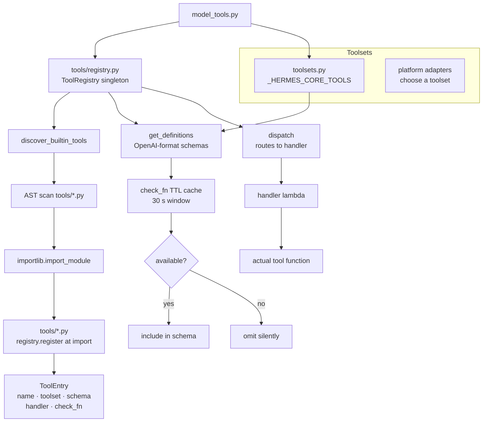
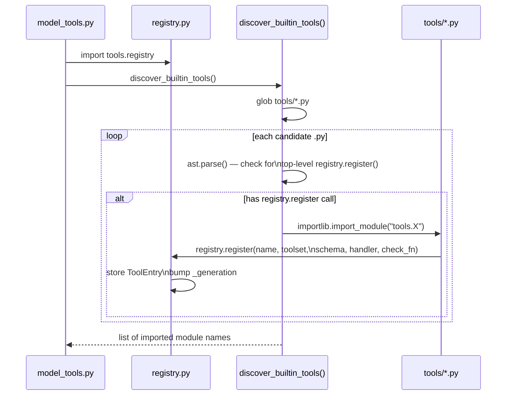
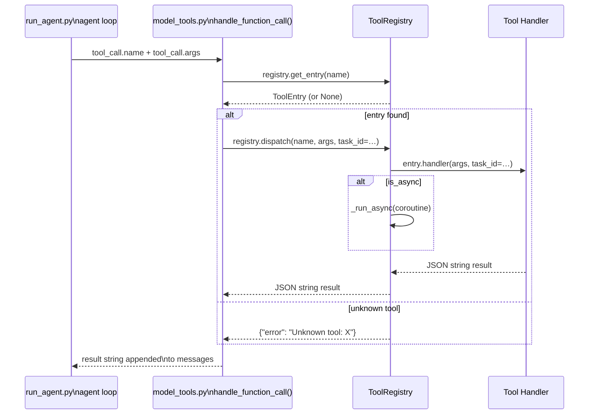
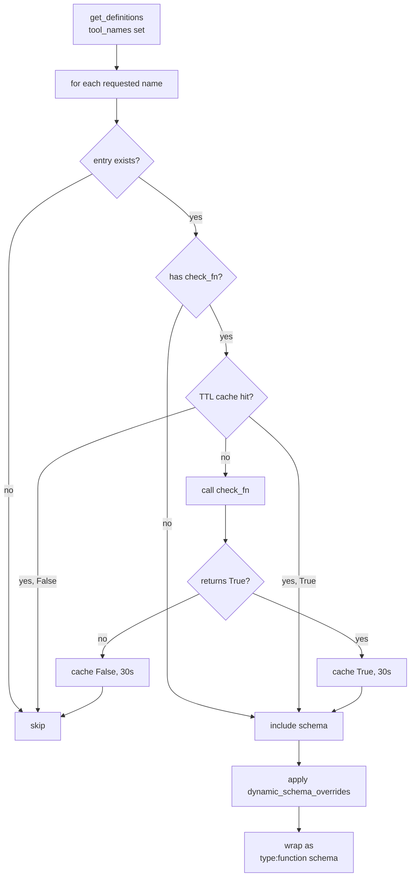

<details>
<summary>Relevant source files</summary>

- [tools/registry.py](../tools/registry.py)
- [tools/terminal_tool.py](../tools/terminal_tool.py)
- [tools/file_tools.py](../tools/file_tools.py)
- [tools/delegate_tool.py](../tools/delegate_tool.py)
- [tools/web_tools.py](../tools/web_tools.py)
- [tools/browser_tool.py](../tools/browser_tool.py)
- [tools/code_execution_tool.py](../tools/code_execution_tool.py)
- [tools/memory_tool.py](../tools/memory_tool.py)
- [tools/clarify_tool.py](../tools/clarify_tool.py)
- [tools/mcp_tool.py](../tools/mcp_tool.py)
- [tools/vision_tools.py](../tools/vision_tools.py)
- [tools/tts_tool.py](../tools/tts_tool.py)
- [tools/image_generation_tool.py](../tools/image_generation_tool.py)
- [tools/todo_tool.py](../tools/todo_tool.py)
- [tools/skills_tool.py](../tools/skills_tool.py)
- [tools/kanban_tools.py](../tools/kanban_tools.py)
- [tools/cronjob_tools.py](../tools/cronjob_tools.py)
- [tools/path_security.py](../tools/path_security.py)
- [tools/approval.py](../tools/approval.py)
- [tools/computer_use_tool.py](../tools/computer_use_tool.py)
- [toolsets.py](../toolsets.py)

</details>

# Tools

The Tools component is hermes-agent's complete built-in tool library. It covers every capability the LLM agent can exercise at runtime: file I/O, terminal execution, web browsing, code sandboxing, multi-agent delegation, persistent memory, image generation, speech synthesis, scheduled jobs, and more. All tools self-register into a central `ToolRegistry` at module import time so that `model_tools.py` never needs to maintain its own catalog — it just queries the registry for schemas and dispatches calls through it.

The design emphasizes **zero circular imports**, **runtime availability gating** (tools that need Docker or an API key are omitted from the schema when unavailable), and **security guards** at every boundary (path traversal checks, prompt-injection scanning, dangerous-command approval flows, and environment variable scrubbing in sandboxes).

## Architecture Diagram



## Key Concepts

- **`ToolRegistry` singleton** — the single source of truth for all tool metadata. Imported with zero external dependencies so it can sit at the base of the import chain without creating cycles. Sources: [tools/registry.py:148](../tools/registry.py#L148)

- **Auto-discovery via AST** — `discover_builtin_tools()` uses Python's `ast` module to scan `tools/*.py` for top-level `registry.register(...)` calls. Only modules that actually register tools are imported, preventing false positives from helper modules. Sources: [tools/registry.py:56](../tools/registry.py#L56)

- **`check_fn` / availability gating** — every tool can supply a zero-argument callable that returns `True` when the tool is usable (e.g. checks that Docker is running, Modal SDK is installed, an API key is set). The result is TTL-cached for 30 seconds so expensive probes don't run on every `get_definitions()` call. Sources: [tools/registry.py:121](../tools/registry.py#L121)

- **`ToolEntry`** — a `__slots__` dataclass holding all metadata for one tool: `name`, `toolset`, `schema`, `handler`, `check_fn`, `requires_env`, `is_async`, `description`, `emoji`, `max_result_size_chars`, `dynamic_schema_overrides`. Sources: [tools/registry.py:79](../tools/registry.py#L79)

- **`dynamic_schema_overrides`** — an optional zero-arg callable applied at `get_definitions()` time to patch the static schema with runtime values (e.g. `delegate_task`'s description reflects the current `delegation.max_concurrent_children` limit so the model is never given stale limits). Sources: [tools/registry.py:105](../tools/registry.py#L105)

- **Shadow protection** — `registry.register()` rejects attempts by one toolset to overwrite a tool from a different toolset. MCP-to-MCP overwrites are allowed (legitimate server refresh), but built-in vs. plugin collisions are blocked with a logged error. Sources: [tools/registry.py:418](../tools/registry.py#L418)

- **Toolsets** — named groups of tool names (e.g. `"web"`, `"file"`, `"terminal"`). Defined in `toolsets.py`. `_HERMES_CORE_TOOLS` is the default bundle for every platform. Platform adapters pick a base toolset and can add/remove tools via config. Sources: [toolsets.py:32](../toolsets.py#L32)

- **`path_security.py`** — shared helpers used by file, skills, and cron tools to prevent directory traversal. `validate_within_dir()` resolves symlinks and calls `relative_to()` to ensure a user-supplied path cannot escape its allowed root. Sources: [tools/path_security.py:22](../tools/path_security.py#L22)

## Component Structure

| Category | File(s) | Tool Names | Notes |
|---|---|---|---|
| **Registry** | `registry.py` | — | `ToolRegistry`, `ToolEntry`, `discover_builtin_tools()`, `check_fn` TTL cache |
| **Terminal** | `terminal_tool.py` | `terminal`, `process` | Local, Docker, Modal, SSH, Singularity, Vercel Sandbox backends; background tasks; interrupt polling |
| **File I/O** | `file_tools.py` | `read_file`, `write_file`, `patch`, `search_files` | 100 KB read cap; binary extension blocking; device path blocklist; sensitive-text redaction |
| **Web / Search** | `web_tools.py` | `web_search`, `web_extract`, `web_crawl` | Pluggable backends: Exa, Firecrawl, Parallel, Tavily; LLM-powered content compression |
| **Browser** | `browser_tool.py`, `browser_cdp_tool.py`, `browser_dialog_tool.py` | `browser_navigate`, `browser_snapshot`, `browser_click`, `browser_type`, `browser_scroll`, `browser_back`, `browser_press`, `browser_get_images`, `browser_vision`, `browser_console`, `browser_cdp`, `browser_dialog` | Local Chromium, Browserbase, Browser Use; ariaSnapshot accessibility tree; session-isolated per `task_id` |
| **Code Execution** | `code_execution_tool.py` | `execute_code` | Programmatic Tool Calling (PTC); UDS + file-based RPC; env-var scrubbing; sandbox allowed tools allowlist |
| **Delegation** | `delegate_tool.py` | `delegate_task` | Single-task and parallel batch modes; `leaf` vs `orchestrator` roles; `DELEGATE_BLOCKED_TOOLS`; approval callback injection into worker threads |
| **Memory** | `memory_tool.py` | `memory` | File-backed `MEMORY.md` + `USER.md`; per-file locking; prompt-injection scanning on content; frozen snapshot at session start |
| **Clarify** | `clarify_tool.py` | `clarify` | Platform-callback pattern; up to 4 choices + free-text fallback; always available (no external deps) |
| **MCP** | `mcp_tool.py` | dynamic (`mcp-*`) | Stdio, HTTP/StreamableHTTP, SSE transports; dedicated background event loop; sampling support; credential stripping in errors |
| **Vision** | `vision_tools.py` | `vision_analyze` | URL download + base64; 50 MB cap; routes through `agent/auxiliary_client.py` (supports OpenRouter, Anthropic, Codex, custom endpoints) |
| **TTS** | `tts_tool.py` | `text_to_speech` | Edge TTS, ElevenLabs, OpenAI, MiniMax, Mistral, Gemini, xAI, NeuTTS, KittenTTS, Piper, custom command providers |
| **Image Generation** | `image_generation_tool.py` | `image_generate` | FAL.ai backend; multi-model catalog (`FLUX`, `ideogram`, `recraft`, `qwen`, ...); lazy `fal_client` import |
| **Todo** | `todo_tool.py` | `todo` | In-memory `TodoStore` on `AIAgent` instance; survives context compression via re-injection |
| **Skills** | `skills_tool.py`, `skills_hub.py`, `skill_manager_tool.py` | `skills_list`, `skill_view`, `skill_manage` | Progressive disclosure (metadata → full instructions → linked files); YAML frontmatter; platform gating |
| **Kanban** | `kanban_tools.py` | `kanban_show`, `kanban_list`, `kanban_complete`, `kanban_block`, `kanban_heartbeat`, `kanban_comment`, `kanban_create`, `kanban_link`, `kanban_unblock` | Gated to `HERMES_KANBAN_TASK` env or explicit kanban toolset in config; worker vs. orchestrator tool split |
| **Cron** | `cronjob_tools.py` | `cronjob` | Single action-oriented tool; cron prompt injection scanning; delegates to `cron/jobs.py` |
| **Approval** | `approval.py` | — (used by terminal/computer_use) | Per-session state via `contextvars`; dangerous pattern detection; smart approval via auxiliary LLM; plugin hooks (`pre_approval_request`, `post_approval_response`) |
| **Computer Use** | `computer_use_tool.py`, `computer_use/` | `computer_use` | macOS only; shim-registers from `computer_use/` package; background mode (no cursor hijack) |
| **Security** | `path_security.py`, `url_safety.py`, `website_policy.py` | — | Shared validation helpers; symlink-safe path containment; URL allowlist/blocklist |

## Core Flows

### Tool Discovery and Registration

This flow runs once at process startup when `model_tools.py` is first imported.



Sources: [tools/registry.py:56](../tools/registry.py#L56), [tools/registry.py:395](../tools/registry.py#L395)

### Tool Call Dispatch

This flow runs for every tool call during an agent conversation turn.



Sources: [tools/registry.py:590](../tools/registry.py#L590), [model_tools.py](../model_tools.py)

### Schema Filtering (check_fn)

Before sending tool schemas to the model, `get_definitions()` filters out unavailable tools:



Sources: [tools/registry.py:121](../tools/registry.py#L121), [tools/registry.py:540](../tools/registry.py#L540)

## Public API / Key Interfaces

### `registry.register()`

Called at module-level (import time) by every tool file:

```python
from tools.registry import registry

registry.register(
    name="my_tool",             # unique tool name exposed to the LLM
    toolset="my_toolset",       # logical group (must appear in toolsets.py to be activated)
    schema={                    # OpenAI function-calling schema (without the type:function wrapper)
        "name": "my_tool",
        "description": "What the tool does",
        "parameters": {
            "type": "object",
            "properties": {
                "param": {"type": "string", "description": "..."}
            },
            "required": ["param"],
        },
    },
    handler=lambda args, **kw: my_tool_fn(
        param=args.get("param", ""),
        task_id=kw.get("task_id"),
    ),
    check_fn=check_my_requirements,     # optional — returns bool; TTL-cached 30 s
    requires_env=["MY_API_KEY"],        # informational; shown in `hermes tools`
    is_async=False,                     # True if handler returns a coroutine
    description="Short description",    # falls back to schema["description"]
    emoji="🔧",                         # shown in activity feed
    max_result_size_chars=50_000,       # optional result size cap
    dynamic_schema_overrides=None,      # optional zero-arg callable → dict of schema overrides
)
```

Sources: [tools/registry.py:395](../tools/registry.py#L395)

### `ToolEntry` fields

| Field | Type | Purpose |
|---|---|---|
| `name` | `str` | Unique tool identifier |
| `toolset` | `str` | Logical group membership |
| `schema` | `dict` | OpenAI-format function schema |
| `handler` | `Callable` | `(args: dict, **kw) -> str` — must return JSON string |
| `check_fn` | `Callable \| None` | `() -> bool` — availability gate; TTL-cached 30 s |
| `requires_env` | `list[str]` | API key names required; informational only |
| `is_async` | `bool` | `True` if handler is a coroutine function |
| `description` | `str` | Human-readable description for UI |
| `emoji` | `str` | Emoji for activity feed display |
| `max_result_size_chars` | `int \| None` | Per-tool result truncation cap |
| `dynamic_schema_overrides` | `Callable \| None` | Zero-arg callable → dict; applied at `get_definitions()` time |

Sources: [tools/registry.py:79](../tools/registry.py#L79)

### Handler Return Contract

Every handler **must** return a JSON string. The registry's `dispatch()` method wraps any unhandled exception in `{"error": "..."}` so the model always receives valid JSON.

```python
# Good: structured success result
return json.dumps({"success": True, "data": result})

# Good: structured error (use tool_error() helper)
from tools.registry import tool_error
return tool_error("File not found: /path/to/file")

# Bad: plain string — breaks model parsing
return "ok"
```

Sources: [tools/registry.py:590](../tools/registry.py#L590)

### `discover_builtin_tools()`

```python
def discover_builtin_tools(tools_dir: Optional[Path] = None) -> List[str]:
    """Import built-in self-registering tool modules and return their module names."""
```

- Skips `__init__.py`, `registry.py`, and `mcp_tool.py` (MCP has its own discovery path).
- Uses `ast.parse()` to inspect only module-body statements — helper modules that call `registry.register()` inside a function body are **not** imported automatically.
- Returns the list of successfully imported module names (failures are logged as warnings, not raised).

Sources: [tools/registry.py:56](../tools/registry.py#L56)

### `_HERMES_CORE_TOOLS` and Toolsets

```python
# toolsets.py — the default tool bundle for CLI and messaging platforms
_HERMES_CORE_TOOLS = [
    "web_search", "web_extract",
    "terminal", "process",
    "read_file", "write_file", "patch", "search_files",
    "vision_analyze", "image_generate",
    "skills_list", "skill_view", "skill_manage",
    "browser_navigate", "browser_snapshot", ...
    "text_to_speech",
    "todo", "memory",
    "session_search",
    "clarify",
    "execute_code", "delegate_task",
    "cronjob",
    "send_message",
    "kanban_show", "kanban_list", ...
    "computer_use",
]
```

A tool that is registered in the registry but **not** listed in a toolset (or `_HERMES_CORE_TOOLS`) is never exposed to the model.

Sources: [toolsets.py:32](../toolsets.py#L32)

## Configuration

### config.yaml Keys

| Key | Default | Affects |
|---|---|---|
| `file_read_max_chars` | `100000` | Max characters returned by `read_file` per call |
| `code_execution.timeout` | `300` | Sandbox execution timeout (seconds) |
| `code_execution.max_tool_calls` | `50` | Max tool calls inside a sandbox run |
| `delegation.max_concurrent_children` | `3` | Parallel batch workers in `delegate_task` |
| `delegation.max_spawn_depth` | `2` | Max nesting depth of orchestrators |
| `delegation.child_timeout_seconds` | varies | Child agent hard timeout |
| `delegation.subagent_auto_approve` | `false` | Auto-approve dangerous commands in subagents |
| `delegation.orchestrator_enabled` | `true` | Allow `orchestrator` role to spawn further children |
| `image_gen.model` | — | Active FAL model for `image_generate` |
| `web.backend` | — | Web tool backend (`exa`, `firecrawl`, `tavily`, `parallel`) |
| `tts.provider` | — | Active TTS provider |
| `mcp_servers` | `{}` | MCP server definitions (stdio / HTTP / SSE) |
| `auxiliary.vision.download_timeout` | `30.0` | HTTP download timeout for `vision_analyze` |
| `tools.<platform>.enabled` | — | Override enabled tools per platform |
| `tools.<platform>.disabled` | — | Override disabled tools per platform |

### Environment Variables

| Variable | Tool | Purpose |
|---|---|---|
| `TERMINAL_ENV` | `terminal` | Execution backend: `local`, `docker`, `modal`, `vercel_sandbox` |
| `HERMES_KANBAN_TASK` | `kanban_*` | Set by dispatcher to enable kanban worker tools |
| `FAL_KEY` | `image_generate` | FAL.ai API key |
| `ELEVENLABS_API_KEY` | `text_to_speech` | ElevenLabs TTS |
| `OPENAI_API_KEY` | `text_to_speech`, `execute_code` | OpenAI TTS / sandbox |
| `MISTRAL_API_KEY` | `text_to_speech` | Mistral Voxtral TTS |
| `GEMINI_API_KEY` | `text_to_speech`, `vision_analyze` | Gemini TTS / vision |
| `BROWSERBASE_API_KEY` | `browser_navigate` | Browserbase cloud browser |
| `BROWSER_USE_API_KEY` | `browser_navigate` | Browser Use cloud browser |
| `WEB_TOOLS_DEBUG` | `web_search` | Enable detailed web tool debug logging |
| `VISION_TOOLS_DEBUG` | `vision_analyze` | Enable vision tool debug logging |
| `HERMES_VISION_DOWNLOAD_TIMEOUT` | `vision_analyze` | Override image download timeout |

## Dependencies

| Dependency | Used By | Why |
|---|---|---|
| `agent/auxiliary_client.py` | `vision_tools.py`, `browser_tool.py` | Routes LLM calls for vision analysis and browser content summarization through the configured auxiliary model (OpenRouter, Anthropic, Codex, etc.) |
| `agent/file_safety.py` | `file_tools.py` | Provides read-block rules for sensitive paths (e.g. credential files) |
| `agent/redact.py` | `file_tools.py` | Strips API keys and tokens from file contents before returning them |
| `hermes_constants.py` | `memory_tool.py`, `skills_tool.py`, `tts_tool.py` | `get_hermes_home()` for profile-scoped state paths |
| `hermes_cli/config.py` | most tools | `load_config()` / `cfg_get()` for runtime configuration; `get_env_value()` for credential resolution |
| `cron/jobs.py` | `cronjob_tools.py` | Job store and schedule parsing |
| `toolsets.py` | `delegate_tool.py`, `model_tools.py` | Resolves tool bundles for child agent instances |
| `tools/interrupt.py` | `terminal_tool.py` | Shared interrupt event polled during long-running commands |
| `tools/path_security.py` | `file_tools.py`, `skills_tool.py`, `cronjob_tools.py` | Shared path traversal prevention |

## Extension Points

### Adding a Built-in Core Tool

Built-in tools require changes in **two files**:

**Step 1 — Create `tools/your_tool.py`:**

```python
import json
from tools.registry import registry, tool_error

def check_requirements() -> bool:
    """Return True when the tool's external dependencies are available."""
    import os
    return bool(os.getenv("MY_API_KEY"))

def my_tool_fn(param: str, task_id: str = None) -> str:
    """Implementation — must return a JSON string."""
    try:
        result = do_something(param)
        return json.dumps({"success": True, "data": result})
    except Exception as e:
        return tool_error(str(e))

registry.register(
    name="my_tool",
    toolset="my_toolset",         # must also be added to toolsets.py
    schema={
        "name": "my_tool",
        "description": "Short description for the model.",
        "parameters": {
            "type": "object",
            "properties": {
                "param": {"type": "string", "description": "The input parameter."},
            },
            "required": ["param"],
        },
    },
    handler=lambda args, **kw: my_tool_fn(
        param=args.get("param", ""),
        task_id=kw.get("task_id"),
    ),
    check_fn=check_requirements,
    requires_env=["MY_API_KEY"],
    emoji="🔧",
)
```

**Step 2 — Wire into `toolsets.py`:**

Add the tool name to `_HERMES_CORE_TOOLS` (available everywhere) or to a specific toolset dict entry. Auto-discovery imports the module and registers the schema, but the tool is **only exposed to an agent** if its name appears in the active toolset.

```python
# toolsets.py
_HERMES_CORE_TOOLS = [
    ...
    "my_tool",   # add here for all platforms
]
```

Sources: [tools/registry.py:395](../tools/registry.py#L395), [toolsets.py:32](../toolsets.py#L32)

### Adding a Plugin Tool

For tools that should not ship in core hermes, use the plugin system instead. No core file changes are needed:

```python
# ~/.hermes/plugins/my-plugin/__init__.py

def register(ctx):
    ctx.register_tool(
        name="my_plugin_tool",
        toolset="my_plugin",
        schema={...},
        handler=lambda args, **kw: my_handler(args),
        check_fn=lambda: True,
    )
```

Plugin tools are discovered automatically via `hermes_cli/plugins.py`'s `PluginManager` and registered into the same `ToolRegistry` instance as built-in tools.

### Dynamic Schema Overrides

Use `dynamic_schema_overrides` when the tool description must reflect runtime configuration that changes between sessions:

```python
def _my_tool_schema_overrides():
    from hermes_cli.config import load_config
    cfg = load_config()
    limit = cfg.get("my_section", {}).get("my_limit", 10)
    return {"description": f"Does X. Current limit: {limit} items."}

registry.register(
    name="my_tool",
    ...
    dynamic_schema_overrides=_my_tool_schema_overrides,
)
```

The callable is invoked on every `get_definitions()` call; `model_tools.py` memoizes the full definitions list against `config.yaml` mtime+size so config changes automatically invalidate the cache.

Sources: [tools/registry.py:105](../tools/registry.py#L105)

### Delegation and Sandboxing Constraints

The `delegate_task` tool enforces `DELEGATE_BLOCKED_TOOLS` for all child agents regardless of toolset:

```python
DELEGATE_BLOCKED_TOOLS = frozenset([
    "delegate_task",   # no recursive delegation for leaf agents
    "clarify",         # no user interaction from background workers
    "memory",          # no shared MEMORY.md writes
    "send_message",    # no cross-platform side effects
    "execute_code",    # leaf agents should reason step-by-step
])
```

Similarly, `execute_code` (the Python sandbox) only exposes a fixed allowlist of tools via its RPC stub:

```python
SANDBOX_ALLOWED_TOOLS = frozenset([
    "web_search", "web_extract",
    "read_file", "write_file", "search_files",
    "patch", "terminal",
])
```

Sources: [tools/delegate_tool.py:43](../tools/delegate_tool.py#L43), [tools/code_execution_tool.py:58](../tools/code_execution_tool.py#L58)
